= JBoss Tools 4.1 and Red Hat JBoss Developer Studio 7 go GA
:page-layout: blog
:page-author: fbricon
:page-tags: [jbosstools, jbds, mobile]

On behalf of the JBoss Tools and Developer Studio team, I'm extremely proud to announce the general availability of the JBoss Tools 4.1.0.Final and Red Hat JBoss Developer Studio 7.0.0.GA releases.

JBoss Tools is a set of plugins for Eclipse that complements, enhances and goes beyond the support that exists for JBoss and related technologies in the default Eclipse distribution.

Red Hat JBoss Developer Studio is a fully bundled Eclipse distribution which not only includes the majority of JBoss Tools but also all its needed dependencies and 3rd party plugins allowing for an easy one-click and no-fuss installation.

If you are into doing your own bleeding edge Eclipse plugin assembly, JBoss Tools is for you; if you are more into having something that "Just Works" then JBoss Developer Studio is the way to go.

== Installation

JBoss Developer Studio is available with a http://devstudio.jboss.com/earlyaccess[one-download-installer] with everything bundled and configured out of the box.

You can also install JBoss Developer Studio or JBoss Tools from Eclipse Marketplace via "Help > Eclipse Marketplace..."

When installing from Eclipse Marketplace we recommend using a fresh http://www.eclipse.org/downloads/packages/eclipse-ide-java-ee-developers/keplerr[Eclipse 4.3 JEE Bundle] since then you'll have most of the dependencies pre-installed.

[NOTE]
====
SOA tooling for BPEL, Drools, Guvnor, jBPM, ESB, Modeshape, pi4soa, Savara, SwitchYard & Teiid, in future referred collectively as the JBoss Tools or JBoss Developer Studio Integration Stack (JBT-IS or JBDS-IS), are not yet available for this release. They will become available separately later. If you wish to use these today we recommend you continue to use JBoss Tools 3.3 or JBoss Developer Studio 5.0, or try one installing the latest unsupported nightly build from this update site:

http://download.jboss.org/jbosstools/updates/integration/kepler/integration-stack/aggregate/4.1.0/
====

== Performance and stability improvements

JBoss Tools 4.1.0 and JBDS 7.0 are built on top of Eclipse Kepler (e4.3), which brought noticeable performance and stability improvements over the previous Juno version (e4.2). But we also improved the performance in some of our own features (Central, JAX-RS tooling, Web Service testing).

We worked really hard to fix more than https://issues.jboss.org/issues/?jql=(project%20%3D%20JBIDE%20AND%20fixVersion%20in%20(%224.1.0.CR1%22%2C%20%224.1.0.Beta2%22%2C%20%224.1.0.Beta1%22%2C%20%224.1.0.Alpha2%22%2C%20%224.1.0.Alpha1%22%2C%20%224.1.0.Final%22)%20OR%20project%20%3D%20JBDS%20AND%20fixVersion%20in%20(%227.0.0.CR1%22%2C%20%227.0.0.Beta2%22%2C%20%227.0.0.Beta1%22%2C%20%227.0.0.Alpha2%22%2C%20%227.0.0.Alpha1%22%2C%20%227.0.0.GA%22%2C%20%227.0.0.Final%22))%20AND%20resolution%20not%20in%20(Unresolved)%20ORDER%20BY%20fixVersion%20DESC[1600 bugs and feature enhancements] into this release.

We have so much good stuff this time around, it's hard to cram everything into a (readable) blog post, so I'll just present the major features we have here, introduced since JBoss Tools 4.0 and JBDS 6.0. But make sure to read the complete http://docs.jboss.org/tools/whatsnew/[New and Noteworthy] for a more detailed and complete overview.

TL;DR: The recurring theme of this release is "HTML5 and mobile development". Burr Sutter made a screencast highlighting several of the new features available in this release :

video::67480300[vimeo, 425, 350]

== LiveReload

Probably the coolest new features we have, the new LiveReload server allows you to have your browser automatically refresh when you save your html, javascript and css files.You can just focus on content and functionality and instantly see and use the changes in your browser. If it is hard to imagine how it works, https://twitter.com/xcoulon[Xavier Coulon] made a video showing how to activate and use it (on the right).

video::NGaHu4z_BLc[youtube, 425, 350]

You should install a LiveReload plugin/extension into your browser as documented in our http://docs.jboss.org/tools/whatsnew/livereload/livereload-news-1.0.0.Alpha2.html[What's New and Noteworthy]. If you can't, don't worry, keep reading.

LiveReload supports local (i.e. file:// based urls) or content served out from an application server. In the latter case, the browser will reload once the files are published on the application server, especially useful when editing JSF content like xhtml.

You can right-click on files in the Project Explorer view or on modules deployed to a server, to load your Browser with a LiveReload enabled page. This action will setup the LiveReload server for you if it does not already exist :

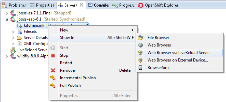

Our server implements the http://feedback.livereload.com/knowledgebase/articles/86174-livereload-protocol[existing defacto protocol] used by the original LiveReload and related plug-ins, meaning any browser, script and tool that works with live reload today should work with our Eclipse implementation of it.

It's really nice to have instant feedback for HTML5/JS based applications. But wait, it's getting even better.

=== Proxying and Open in external Device

If your browser does not have the LiveReload plugin, like Safari or you're using a mobile device, you would normally manually add a livereload.js loading snippet in every web page. That can be tedious and requires changes to files you might not want to commit to your source repository. It's alright. Please meet our "LiveReload Proxying" :

image:images/LiveReload_open_in_web_browser_via_qrcode-dialog.png[]

It is enabled by checking "Inject the livereload.js script in HTML pages" in the LiveReload Server configuration. This allows you to proxy your file:// urls and have them served out on localhost:35729/<projectname>/<filepath> (or any other port if you choose so in the LiveReload Server configuration) .

[NOTE]
====
For security reasons, remote connections are disabled by default, so if you want mobile devices to be able to load the page, just enable "Allow Remote Connections".
====

Now, typing a complex, long url on a mobile device can be tedious, so in order to make your life even easier, we've added a "Show In > Web Browser on External device..." menu. This will display a QR code for the LiveReload enabled url. Simply use a QR reader application and have the webpage load on your device. Watch your pages reload as you make the modifications in your IDE, it's close to black magic!

== HTML5/JQuery Mobile Palette

To further improve your HTML5 / mobile development experience, we've added a new HTML5 palette with initial support for JQuery Mobile widgets. This palette will show up when you edit HTML5 files (files with +<!DOCTYPE HTML>+ doc type). If it does not show up, it is probably using HTML4 or XHTML content types.

The JQuery Mobile palette features a dialog preview when you click or drag one of the buttons for a component, it lets you see and customize what will be inserted :

image:images/lf.png[] 
image:images/set.png[]

Alexey Kazakov http://www.screenr.com/embed/7M57[recorded a video] to show it in action.

== BrowserSim goodies

BrowserSim is a mobile web browser simulator, used to test your web pages on mobile devices with a realistic mobile device skin.

Now guess what? your mobile application development experience just scored 11. In this release, we've added a bunch of really exciting features, available with a right-click on the device bezel :

- synched browsing : open the same web page in 2 different but synchronized browsers. You can test horizontal and landscape modes at the same time or view how layout behaves on different devices simultaneously.
- screenshot : easily take screenshots to share your awesome design or nasty bug you want someone to hunt down.
- debugging facilities : use Firebug Lite for easy local debugging, or debug remotely using any Weinre compatible server to debug/inspect the application running in BrowserSim.
- new skins galore

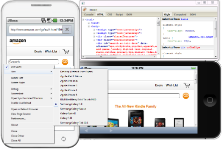

[NOTE]
====
Please note BrowserSim must be launched with a 32bits JRE (you can now select it in JBossTools > BrowserSim / Cordova preferences) and Safari must be installed on your machine.
====

== Windows 64-bit Visual Page Editor

A long standing issue for our Visual Page Editor was the lack of proper Windows 64-bit XULRunner integration.

https://community.jboss.org/people/carsten.pfeiffer[Carsten Pfeiffer] did an awesome contribution and made this happen. If you're using Windows 64 bit, and if you follow the https://community.jboss.org/docs/DOC-10862[JBoss Tools Visual Editor FAQ link], you will be told to try to install XULRunner from http://download.jboss.org/jbosstools/builds/staging/xulrunner-1.9.2_win64/all/repo/

Hopefully you should see the following, before and after installing the proper XulRunner version :

image:images/missing-xulrunner.png[]
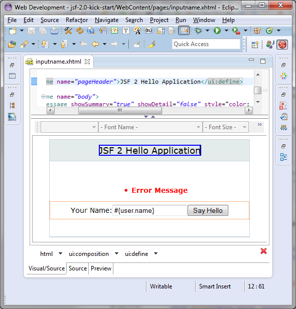

We would love to hear if this works for you on Windows 64-bit or if you still see problems. You can give your feedback on https://issues.jboss.org/browse/JBIDE-2720[this bug].

 
== Hybrid Mobile via Apache Cordova (Experimental)

If real, cross-platform Mobile application development is your thing, we now have experimental support for developing Hybrid mobile applications with Apache Cordova.

You can create an "Hybrid Mobile" project and test and develop it using the Android SDK and XCode for iOS testing.

image:images/runConfigs.png[]

[NOTE]
====
This is only available as Experimental in JBoss Tools, not part of Developer Studio (yet)
====

== CordovaSim (Experimental)

To help testing hybrid mobile development we've extended our BrowerSim to use Ripple to provide a way to do portable testing (meaning you do not necessarily need Android or XCode installed to do development)

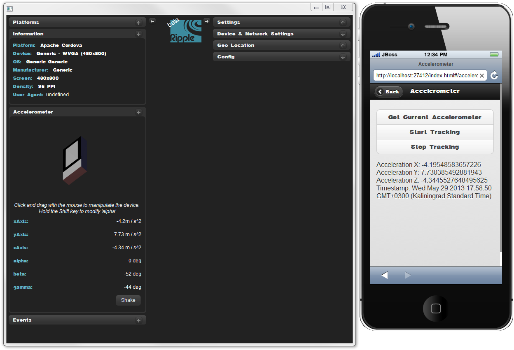

[NOTE]
====
This is only available as Experimental in JBoss Tools, not part of Developer Studio (yet)
====
 
== Forge integration

The majority of the feedback we got for the awesome integration of Forge into Eclipse was that many preferred to use a wizard over only having access to a "command line style" UI.

We listened to you and added new wizards, to give an Eclipse front-end to the following Forge features:

- Generate Entities from existing tables
- Generate REST Endpoint from Entities
- Scaffold UI (JSF or AngularJS based) from Entities

You will find these wizards - which are Technology Preview as of this release - under "File > New > JBoss Tools":

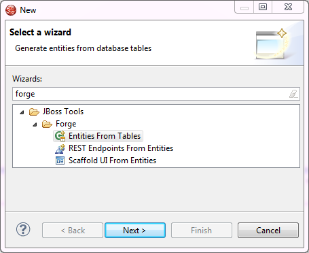

Make sure you read a detailed description of these wizard in http://docs.jboss.org/tools/whatsnew/forge/forge-news-4.1.0.Beta2.html[Forge What's New]. Oh and to make it all work, we now embed the Forge 1.3.3.Final runtime.

Please note these wizards are considered *Technology Preview*, thus, even though they're included, are not supported in JBoss Developer Studio.

The long term goal is to get a closer integration between Forge and Eclipse. This is a current work in progress with Forge 2, which is now available as an _experimental_ download for JBoss Tools

== Arquillian (Experimental)

Arquillian Eclipse is a new JBoss Tools component that makes Java EE integration testing using http://arquillian.org/[Arquillian] easier. The Arquillian support can be added/removed by right-clicking the project and selecting Configure>Add/Remove Arquillian support.

The project has to be a Maven (m2e) project. The "Add Arquillian Support" action adds the Arquillian nature to the project as well as arquillian artifacts (bom, dependencies, required plugins, profiles ...) to the project's pom.xml. The Remove Arquillian Support removes the Arquillian nature, but doesn't change the project's pom.xml.

A new "Arquillian JUnit Test Case" wizard, based on the JUnit Test Case wizard, adds the following to a created class:

- @RunWith(Arquillian.class) annotation
- the deployment method

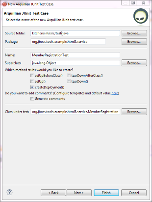
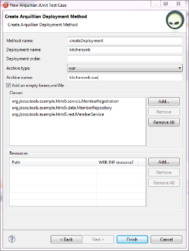

Enabling Arquillian support also brings you validation, navigation across arquillian resources, launch configuration... You'll most certainly want to read a more complete overview of the Arquillian support http://docs.jboss.org/tools/whatsnew/arquillian/arquillian-news-4.1.0.Beta1.html[here].

[NOTE] 
====
This is only available as Experimental in JBoss Tools, not part of Developer Studio (yet)
====

== OpenShift

OpenShift Tools received a good deal of improvements, usability wise. Improved UI, more explicit labels where needed, but more importantly:

=== Git output streaming

Ever since we added OpenShift support to Eclipse we've had the problem that EGit did not allow streaming of console output when performing a push.

image:images/publishing-to-openshift.png[]

This mean that when doing a long running push Eclipse would just have a blank console and show "Push in progress".

In Kepler, EGit now includes our contribution of allowing this meaning Git users and OpenShift users can and will get streaming of the console output. You can now see what is going on.

=== Restart OpenShift Application

We've added "Restart" to the UI, allowing you to trigger a node restart for your application in case something bad has happened or you changed a configuration that requires a full node restart.

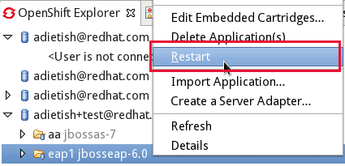

=== Create application from a remote repository

Opening the advanced section of the New OpenShift Appliction wizard, you can now create an application directly seeded from a remote git repository (github for instance) instead of forcing you to use git recursive merges locally.

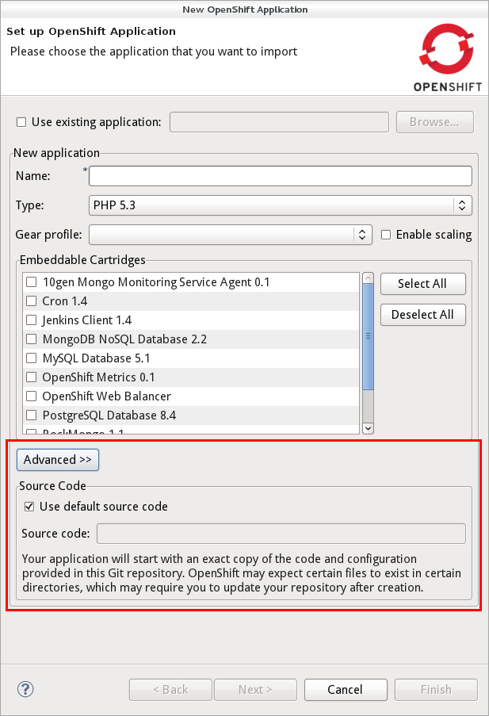

=== Configure OpenShift markers

OpenShift is using markers to enable or disable features. These markers are hidden files added to the <project>/.openshift/markers directory. You can now add/remove/edit these markers by invoking a wizard from the OpenShift > Configure Markers... menu in th Project- or Package-Explorer.

image:images/configure-markers-wizard.png[]

=== Application creation logs

When creating applications you want to know about the credentials that OpenShift initially set for you. This is especially helpful and required when you create a jenkins where you get its url and username/password presented. We now display what OpenShift did for you if there's anything to be noticed for any type of application and/or cartridge.

== JBoss Central

JBoss Central, the welcome screen of JBDS / JBoss Tools has a new design. We've tried to make it easier for you to get started building new applications, providing more samples, displaying descriptions of what each wizard gives you.

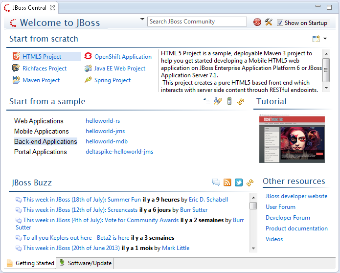

You can also access wizards for features you haven't installed yet, such as the OpenShift Application. You'll be prompted to install the required OpenShift Tools feature if you haven't installed it already.

In the software/update tab, you'll find we have added VJet, a promising new JavaScript editor, which should help you build, you know, HTML5 and mobile applications.

== Servers and runtimes

=== New server adapters

- JBoss EAP 6.1, freely available to developers (you can get it from the JBoss AS download page), now has its own server adapter.
- WildFly now also has its own dedicated server adapter. Please note it's still considered experimental as WildFly itself is not stabilized to this day. We recommend using the latest Alpha-3 release, which fixes some file locking issue on windows and now support JSP development mode.

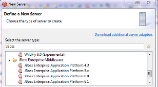

=== Better server identification

Servers derived from JBoss AS 7.x (JPP, SOA-P, GateIn), are now properly identified, making searching runtimes easier to setup. We now reuse the stacks.yml descriptor provided by the JBoss Developer Framework to provide downloads of different runtimes and thus providing a consistent experience, as part of the JBoss Way initiative.

=== Better server management

Server tools now uses the AS 7.x/EAP/WildFly management api, allowing for faster and more reliable (re)starts of servers, as well as better module management (individual module restart, status information).

=== Tomcat runtime detection (JBoss Tools only)

A new Tomcat runtime feature detection allows you to automatically detect and create tomcat-based servers, after scanning a specified server directory.

== Maven Integration++

=== m2e 1.4.0 and m2e-wtp 1.0.0

- JBDS comes with m2e 1.4.0 which brings some performance enhancements, as well as a very convenient Alt-F5 shortcut, to update project configuration, when it's gone out-of-synch.
- we contributed the JBoss JPA/JSF/JAX-RS configurators to the http://www.eclipse.org/m2e-wtp/[m2e-wtp project at eclipse.org], which just graduated from the Eclipse Incubator into version 1.0.0, adding support to Java EE 7. 

In this Kepler release the configuration of these configurators moved under the Preferences > Maven > Java EE Integration.

=== Automatic Source Lookup for the masses

Ever tasted m2e's awesome automatic source download but were frustrated when going back to work on legacy, non-maven projects? Then rejoice, we now enable automatic source lookup for *all*, *non-maven* java projects.

The automatic Source Lookup feature is based on Maven/m2e. As such, downloaded sources will be stored under your local Maven repository.

Since JDT doesn't support variables in source attachments (such as M2_REPO), source attachments use absolute (non-portable) paths. It's ok when the jar is part of a Classpath Library, since the path is stored in your own workspace. But it can become a problem if your jar dependency is listed in your project's .classpath descriptor, potentially shared with other developers. For this reason, by default, you'll be warned when a compatible source has been found :

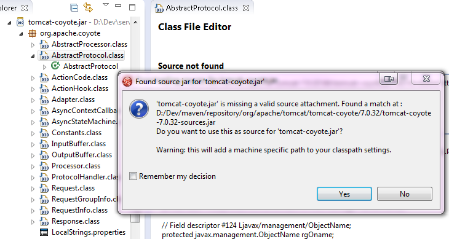

The good news is the source lookup mechanism is capable of fixing bad source attachements, even for Maven enabled projects. If the attached source doesn't exist (ex. you wiped out your maven local repository or shared hard-coded source attachments in your scm) or doesn't contain the right source files, it will try to download the proper source.

=== Maven repository edition

Maven Repositories defined in profiles in your settings.xml (Window > Preferences > JBoss Tools > Maven Integration > Configure Maven Repositories...) can now be edited with the "Edit Repository..." button :

image:images/edit-maven-repositories.png[]

=== And much more...

There's not enough room here to list all the great things the team managed to pull. Better JAX-RS tooling performance, JSF 2.2 and updated Deltaspike support, improved web service tester (now using JBoss Wise). So, again, make sure you take a look at the news and screenshots in our http://docs.jboss.org/tools/whatsnew[What's New] page.

== Giving Feedback

Please don't hesitate to use our forum to ask questions, or, if you have ideas to better improve JBoss Tools / JBDS, or found a bug, then open an issue in our https://jira.jboss.org/jira/browse/JBIDE[issue tracker].

== What's Next ?

First, some of us are gonna take a tiny bit of rest in the coming weeks. Then we'll work on a service release, mainly focused on bug fixes, to accompany the Eclipse Kepler SR1 release in september. Hopefully, new features should see the light of day by the end of the year.

Have fun!

Fred Bricon +
https://twitter.com/fbricon
