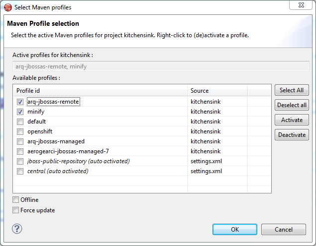

= Web resource optimization and Maven Profiles
//:imagesdir: /blog/images
:page-layout: blog
:page-author: fbricon
:page-tags: [jbosstools, jbds, maven, optimization, wro4j]

Some time ago, I described how to perform https://community.jboss.org/en/tools/blog/2012/01/17/css-and-js-minification-using-eclipse-maven-and-wro4j[CSS and JS minification using Eclipse, Maven] and http://code.google.com/p/wro4j/[WRO4J], thanks to https://github.com/jbosstools/m2e-wro4j[m2e-wro4j].

In this article, we'll deploy a Java EE 6 Restful application with an HTML5 front-end on a Wildfly application server. We'll see how, using m2e-wro4j, m2e-wtp and the JBoss Tools Maven Profile Management UI, you can easily switch between minified and regular build profiles.

== Setup your Eclipse-based IDE
First you'll need to install a couple things into an Eclipse Java EE installation. I recommend you use Red Hat JBoss Developer Studio, as it comes with m2e, m2e-wtp, the Maven Profile Manager, the Wildfly server adapter and JBoss Central out-of-the-box, but any Eclipse based installation (Kepler) will do, provided you install the proper plugins.

[cols="1^.<,1^"]
|===
|Red Hat JBoss Developer Studio | Eclipse Java EE

a| * You can download and install Red Hat JBoss Developer Studio 7.1.0 from https://devstudio.jboss.com/earlyaccess/[here]
* or install it over an existing Eclipse (Kepler) installation from the https://marketplace.eclipse.org/content/red-hat-jboss-developer-studio-kepler[Eclipse Marketplace]

a| * Download and install https://www.eclipse.org/downloads/packages/eclipse-ide-java-ee-developers/keplersr1[Eclipse Java EE Kepler SR1]
* JBoss Tools 4.1.1 can be installed from 
** https://marketplace.eclipse.org/content/jboss-tools-kepler[the Eclipse Marketplace] 
** or this p2 repository : http://download.jboss.org/jbosstools/updates/stable/kepler/

Make sure you install the following JBoss Tools features :

* Maven Profiles Management
* JBossAS Server
* JBoss Central

|===

m2e-wro4j can then be installed from JBoss Central's _Software/Update_ tab :

image::images/m2e-wro4j-installation.png[]

Alternatively, you can find and install m2e-wro4j from the https://marketplace.eclipse.org/content/m2e-wro4j[Eclipse Marketplace] too.

Also make sure you have a http://wildfly.org/downloads/[Wildfly] server installed on your machine.

== About m2e-wro4j 
The m2e-wro4j connector allows wro4j-maven-plugin to be invoked when .js, .css, .coffee, .less, .sass, .scss, .json, .template or pom.xml files are modified. 

Given the following configuration :
[source,xml]
----
<plugin>
    <groupId>ro.isdc.wro4j</groupId>
    <artifactId>wro4j-maven-plugin</artifactId>
    <version>${version.ro.isdc.wro4j}</version>
    <executions>
        <execution>
            <phase>compile</phase>
            <goals>
                <goal>run</goal>
            </goals>
        </execution>
    </executions>
    <configuration>
        <targetGroups>app.min,m.screen.min,d.screen.min</targetGroups>
        <cssDestinationFolder>${project.build.directory}/${project.build.finalName}/css/</cssDestinationFolder>
        <jsDestinationFolder>${project.build.directory}/${project.build.finalName}/js/</jsDestinationFolder>
        <wroManagerFactory>ro.isdc.wro.maven.plugin.manager.factory.ConfigurableWroManagerFactory</wroManagerFactory>
    </configuration>
</plugin>
----

When m2e-wtp is present, m2e-wro4j automatically translates ${project.build.directory}/${project.build.finalName}/* output directories (the default values used by wro4j-maven-plugin) to _${project.build.directory}/m2e-wtp/web-resources/_. This gives you on-the-fly redeployment of optimized resources on WTP controlled servers.

[NOTE] 
====
In order to use wro4j-maven-plugin, you need a wro.xxx descriptor (that would be src/main/webapp/WEB-INF/wro.xml by default) and a wro.properties. Read https://code.google.com/p/wro4j/wiki/MavenPlugin for more details.
====

== Create an HTML 5 project
Now let's get to work. From the JBoss Central _Getting Started_ tab, click on the HTML 5 project icon to create a Maven based web application with a JAX-RS back-end and an HTML 5 front-end.

I used *kitchensink* as a project name.

This project already has some _wro4j-maven-plugin_ configuration we can use. All we need is to make the switch between regular and minified versions of the build more user friendly.

== Enable minification
First, we need to remove one xml snippet from the pom.xml which prevents _wro4j-maven-plugin_ from running during Eclipse builds, thus cancelling m2e-wro4j's efforts. Go to the _minify_ profile and delete :
[source,xml]
----
<pluginManagement>
    <plugins>
        <!--This plugin's configuration is used to store Eclipse m2e settings only. It has no influence on the Maven build itself.-->
        <plugin>
            <groupId>org.eclipse.m2e</groupId>
            <artifactId>lifecycle-mapping</artifactId>
            <version>${version.org.eclipse.m2e}</version>
            <configuration>
                <lifecycleMappingMetadata>
                    <pluginExecutions>
                        <pluginExecution>
                            <pluginExecutionFilter>
                                <groupId>ro.isdc.wro4j</groupId>
                                <artifactId>
                                    wro4j-maven-plugin
                                </artifactId>
                                <version>${version.ro.isdc.wro4j}</version>
                                <goals>
                                    <goal>run</goal>
                                </goals>
                            </pluginExecutionFilter>
                            <action>
                                <ignore></ignore>
                            </action>
                        </pluginExecution>
                    </pluginExecutions>
                </lifecycleMappingMetadata>
            </configuration>
        </plugin>
    </plugins>
</pluginManagement>

----

In order to use the minified versions of javascript and css files in the app, the original index.html file requires you to (un)comment several lines like :

[source,javascript]
----
yep: {
    //assign labeled callbacks for later execution after script loads.
    //we are on mobile device so load appropriate CSS
    "jqmcss": "css/jquery.mobile-1.3.1.min.css",
    // For minification, uncomment this line
    //"mcss": "css/m.screen.min.css"
    // For minification, comment out this line
    "mcss": "css/m.screen.css"
},
nope: {
    //we are on desktop
    // For minification, uncomment this line
    //"scss": "css/d.screen.min.css"
    // For minification, comment out this line
    "scss": "css/d.screen.css"
},
----

This is clearly not practical if you want to be able to quickly switch between minified and original versions of your files.

Fortunately, we can take advantage of some Maven black magic, also known as http://maven.apache.org/plugins/maven-war-plugin/examples/adding-filtering-webresources.html[web resource filtering], to dynamically use the proper (non-minified) version of these files, depending on the profile we're building with.

We have 3 things to do :

1. define a maven property for the minified file extension currently in use
2. enable web resource filtering in the maven-war-plugin configuration
3. modify index.html so it uses the aforementioned maven property 

==== Setup the maven property
In the main _<properties>_ block, at the top of your pom.xml, add the following property :
[source,xml]
----
<!-- By default, the original filename will be used -->
<min.ext></min.ext>
----

Now add a _<properties>_ block to the _minify_ profile :
[source,xml]
----
<properties>
  <min.ext>.min</min.ext>
</properties>

----

==== Enable web resource filtering
Modify the default maven-war-plugin configuration to enable filtering on html files :

[source,xml]
----
<plugin>
  <artifactId>maven-war-plugin</artifactId>
  <version>${version.war.plugin}</version>
  <configuration>
    <!-- Java EE 6 doesn't require web.xml, Maven needs to catch up! -->
    <failOnMissingWebXml>false</failOnMissingWebXml>
    <webResources>
      <webResource>
        <directory>src/main/webapp</directory>
        <filtering>true</filtering>
        <includes><include>*.html</include></includes>
      </webResource>
    </webResources>
  </configuration>
</plugin>
----

==== Use the maven property
In *index.html*, replace at least the following occurrences :

[width="30%",options="header"]
|===
|from | to
| js/app.js | js/app${min.ext}.js
| css/m.screen.css | css/m.screen{min.ext}.css
| css/d.screen.css | css/d.screen{min.ext}.css
|===
                
You can also apply similar changes to _lodash_ and _jquery_ if you want.

At this point, you should see the filtered _target/m2e-wtp/web-resources/index.html_ references the original resources, as the minified extension enabled by default is an empty string.

== Switch between minified and regular profiles
Let's see what happens when enabling the _minify_ profile. *Ctrl+Alt+P* is a shortcut bringing up the Maven Profile Management UI. Just check/uncheck profiles to enable/disable them :

Once the _minify_ profile is active, you'll see that :

* _css/m.screen.min.css_, _css/d.screen.min.css_,_js/app.min.js_ are generated under target/m2e-wtp/web-resources/
* _target/m2e-wtp/web-resources/index.html_ now references the minified versions of the resources
 
image::images/minified-resources.png[]

==== Deploy the application on WildFly

* Right click on your project and select *Run As > Run on Server ...*
* Create a new Wildfly Server if necessary, pointing at your locally installed server
* Once the server is created and deployed, a browser window should open :

image::images/deployed-application1.png[]
 
If you're on a desktop, modify the color of the *h1* class in _src/main/webapp/css/d.screen.css_ and save. This will trigger *wro4j-maven-plugin:run* which will regenerate the minified version under _target/m2e-wtp/web-resources/css/d.screen.min.css_, which in turn will be deployed on Wildfly by the server adapter. 

Reloading the page (after the build is complete) will show the changes directly :

image::images/deployed-application2.png[]

Now you can switch back to using the regular, non-minified version by hitting *Ctrl+Alt+P* in the workbench, unselect the _minify_ profile and wait for the build to complete.
After you reload your browser page, you'll notice, if you look at the source page, the minified versions are not referenced anymore.

[NOTE]
====
The minified files still exist under _target/m2e-wtp/web-resources/_ and are deployed as such. They're unused, so they're harmless, but you'd need to perform a clean build to remove them, if necessary.
====

== Your feedback is important
 
Issues with m2e-wro4j can be opened at https://github.com/jbosstools/m2e-wro4j/issues. 

Issues wwith the Maven Profile Manager can be opened at https://issues.jboss.org/browse/JBIDE/component/12312576
 
As always, for all your WRO4J or wro4j-maven-plugin specific issues, I strongly encourage you to :

* read the WRO4J getting started page and the https://code.google.com/p/wro4j/wiki/MavenPlugin[Maven plugin documentation]
* ask the http://groups.google.com/group/wro4j[google group] directly
 
Have fun!

Fred Bricon
https://twitter.com/fbricon