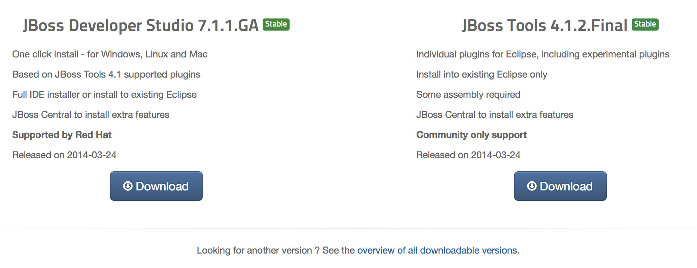
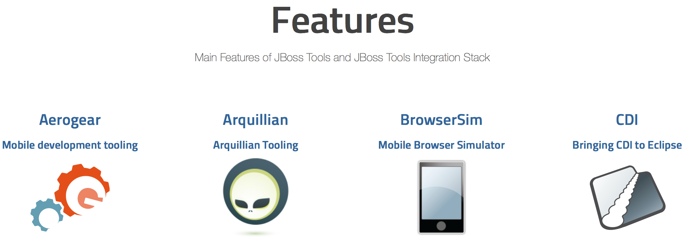
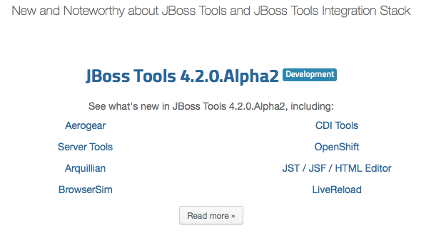

= jboss.org/tools is dead, long live tools.jboss.org!
:page-layout: blog
:page-author: maxandersen
:page-tags: [jbosstools, website, jbosscentral]

We have been working for a while on doing a refresh of our website, and today we are happy to announce http://tools.jboss.org[tools.jboss.org].

== Goals 

We had a few goals for the website:

. Make it simple and clear how to download the plugins
. Explain what features are in the tools
. Include New and noteworthy 
. Make it easier to update/fix the content

and I think we reached all of them. 

=== Make it simple and clear how to download the plugins

Our old download page had grown organically over the last 7 years and, despite all good intentions, we had ended up with a download
page with way too many options presented by default. With the new site, we went for simplicity first, and so the Downloads page
now simply presents you with two options: Download either latest stable JBoss Tools or Developer Studio. 

If you want other versions, combinations, add-ons etc. you can follow
the link:/downloads/overview.html[Overview] link which will give all the
dirty details.

=== Explain what features are in the tools

For this we created the link:/features[Features] page. This page gives an overview over all of the various projects and technologies we
support and if you click on the images you get more information about each feature. 

Try it out - you might be surprised how much we actually do.

=== Include New and noteworthy

For *every* release/milestone, we get the JBoss Tools team to write up what is New and noteworthy for their components. We use that when doing blogs and sharing with the whole community what changes are coming up. In the past, that was a very tedious process of getting multiple people to submit changes to a bunch of html files that then needed to be manually cleaned up and published. It was a chore, and it took longer and longer as we added or updated more and more features.

That is now a story of the past - in the new site, component developers just add a single document for their release and the magic of publishing the site does all the right wiring. Removing all the chore *and* reducing the actual lines of code needed substantially. Asciidoc for the win.

You can go look at what is new and improved over at link:/documentation/whatsnew[What is new] - it currently gives you a sneak preview of upcoming JBoss Tools 4.2.0 Beta1.

=== Make it easier to update/fix the content

The old website was "hidden" behind a magnolia CMS system. It has served us well and it does what it is supposed to do. In the age of github and pull-requests though it was more a burden than a help. The new system uses a simple https://github.com/jbosstools/jbosstools-website[github repo] which uses http://awestruct.org[Awestruct] to render the page automatically via https://travis-ci.org/jbosstools/jbosstools-website[Travis] when we push to certain branches.

The content is primarily Asciidoc making it so the content is very compact - no additional boiler plate markup to worry about and best of all, you do not need to even run awestruct locally to get an idea of the rendering. Github's rendering of asciidoc is close enough to make it trivial for anyone with a github account to help do fixes to this site.

If you find some errors (we left some in for you to find) just open a PR on https://github.com/jbosstools/jbosstools-website :)

=== Thanks

The design and launch of this website have been long under way - we started 1+ year ago but we are finally here :)

The primary person to thank for this is Xavier Coulon who helped on the initial design of the site and then fought, battled and sometimes cried over having to implement and play with Ruby and Haml. But he persevered and today we are here with his great help!

But he and I were not alone in this; we got help from a bunch of other people to write and update content, give feedback, find bugs and help setup the infrastructure. Here they are in random importance, but ordered alphabetically:

* Alexey Kazakov - for contributing to link:/features[Features]
* Andre Dietisheim - for contributing to link:/features[Features]
* Aslak Knutsen - for inspiration and help with Awestruct
* Barry LaFond - for contributing to link:/features[Features]
* Bob Brodt - for contributing to link:/features[Features]
* Bob McWhirter - for reacting at weird hours on #awestruct and for not caring how his name is spelled
* Brian Fitzpatrick - for contributing to link:/features[Features]
* Cheyenne Weaver - for design help
* Dan Allen - for help with asciidoc and especially for including the video support we made
* Daniel Florian - for contributing to link:/features[Features]
* Fred Bricon - for contributing to link:/features[Features]
* Gorkem Ercan - for contributing to link:/features[Features]
* Ilya Buziuk - for contributing to link:/features[Features]
* James Cobb - for design help and bugfixing
* Jason Porter - for awestruct fixes and especially finding that nasty performance bug we had made
* Koen Aers - for contributing to link:/features[Features]
* Kris Verlaenen - for contributing to link:/features[Features]
* Lars Heinemann - for contributing to link:/features[Features]
* Mark Newton - for enabling the infrastructure
* Michelle Murray - for bugfixes!
* Nick Boldt - for helping setup downloads and bugfixing!
* Paul Leacu - for contributing to link:/features[Features]
* Pete Muir - for review!
* Rob Cernich - for contributing to link:/features[Features]
* Rob Stryker - for contributing to link:/features[Features]
* Rysiek Kozmik - for help with jboss.org theme
* Snjezana Peco - for contributing to link:/features[Features]
* Vineet Reynolds - for contributing to link:/features[Features]
* Vladimir Vasilev - for setting up redirects to ensure we didn't break the internet!

In case I missed someone - let me know or submit a PR on https://github.com/jbosstools/jbosstools-website

I hope you like it and please leave a comment below to test the new commenting system too :)

Have fun!

Max Rydahl Andersen +
http://twitter.com/maxandersen[@maxandersen]
