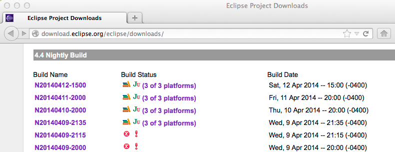
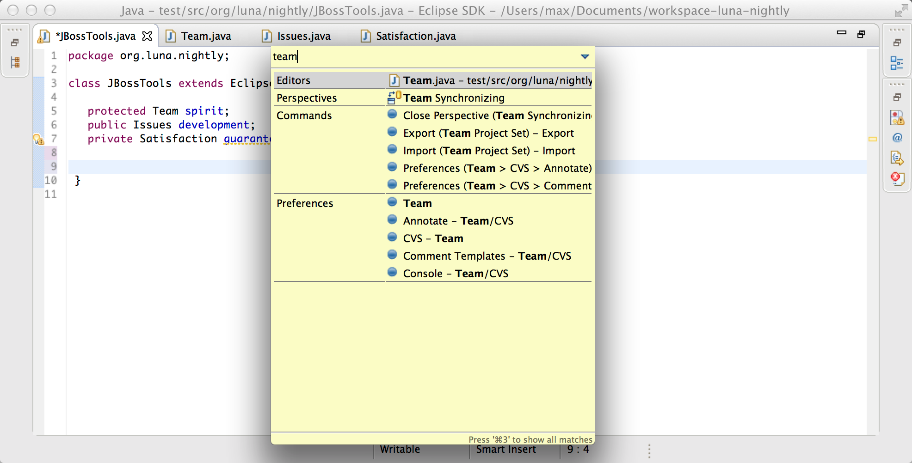

= Death to the toolbar in Luna nightly
:page-layout: blog
:page-author: maxandersen
:page-tags: [luna, eclipse, betteride, jbosscentral]

This morning I wanted to go try out the latest Eclipse Luna nightly.

It is actually very easy to do.

You simply goto http://download.eclipse.org/eclipse/downloads/[Eclipse Downloads].

Scroll to the bottom where you should fine the last two weeks worth of
nightly downloads. Take the newest one where the tests completed
indicate the build should be mostly working.

== The annoying bug in Kepler

Why was I trying out the latest nightly anyway ? Well, I heard https://twitter.com/maxandersen/status/453234954487730176[a rumor
from Lars Vogel] that one of my least favorite "improvemnts" in Kepler
have now been properly fixed.

It turns out it is true, the Quick access feature no longer requires the toolbar!

You could do this is in Eclipse Kepler too but when using the Quick Access feature via kbd:[Cmd+3] (or kbd:[Ctrl+3] on Linux/Windows) 
the toolbar would pop up again disturbing your toolbar free Zen state.

With this fix we can finally get back to utilizing the full screen with what matters - the content I want to see, not what a toolbar want me to push.

== Still a few things to fix

While testing this I https://bugs.eclipse.org/bugs/show_bug.cgi?id=432684[did] https://bugs.eclipse.org/bugs/show_bug.cgi?id=432685[find] a https://bugs.eclipse.org/bugs/show_bug.cgi?id=432686[few] https://bugs.eclipse.org/bugs/show_bug.cgi?id=432688[bugs], but that is all good. This helps the Eclipse Platform team to know about the issues and makes it more likely the issues will be fixed. Maybe someone even comes up with a patch.

I can only encourage you to try out the nightlies of both Eclipse and link:/downloads/jbosstools/luna/4.2.0.Nightly.html[JBoss Tools] to give early feedback.

It is how we all get a better IDE and hey, you might find that your biggest annoyance have been fixed!

Have fun!

Max Rydahl Andersen +
http://twitter.com/maxandersen[@maxandersen]

