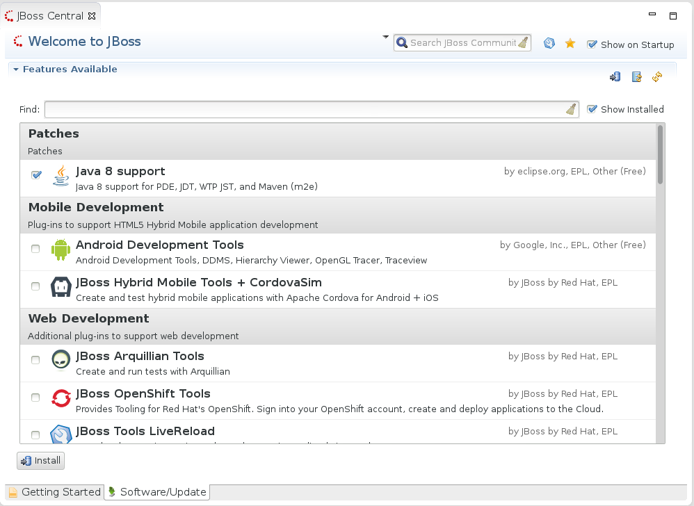

= Easy install of Java 8 for Eclipse in JBoss Tools
:page-layout: blog
:page-author: maxandersen
:page-tags: [java8, jbosscentral]

A few weeks back Eclipse launched their http://www.eclipse.org/downloads/java8/[Java 8 Support for Eclipse Kepler].

Its a great page with links to various resources about Java 8 and how to install the various components into Eclipse.

The four components you want to install if you are doing web/java development for Eclipse are the ones covering:

 * Java core (JDT)
 * Java Web Tools (WTP)
 * Maven (m2e)
 * OSGI (PDE)

For now those need to be installed individually. 

We wanted to make that even simpler.

Thus today we deployed our Java 8 packaged install and updatesite which does not require you to do four different installs.

There are two ways to use this. Using JBoss Central or the composite updatesite.

== Using JBoss Central

 * Open JBoss Central
 * Click Software/Update

 * Choose Java 8 
 * Click Install

You will then be shown a screen where you can choose to install all or select a subset. 

If you have JBoss Tools installed the recommended way is that you install them all since then you get the best Java 8 coverage possible in Eclipse.

== Using plain old updatesite

If you do not want to use JBoss Central you can also use this updatesite directly:

   http://download.jboss.org/jbosstools/updates/requirements/kepler/java8/

== Limitations

We know that Java 8 support is not fully working for WildFly 8 server adapter in our Kepler based JBoss Tools version - if you want to use
that try out our recent builds of link::/downloads/jbosstools/luna[JBoss Tools for Luna] where this is being supported.

But otherwise you can now build and run Java 8 projects with JBoss Tools for Eclipse Kepler today.

Max Rydahl Andersen +
https://twitter.com/maxandersen[@maxandersen]

