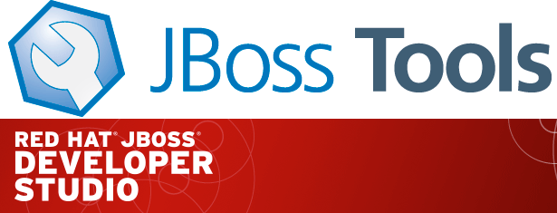

= JBoss Tools Integration Stack 4.1.5.Final / JBoss Developer Studio Integration Stack 7.0.2.GA
:page-layout: blog
:page-author: pleacu
:page-tags: [release, jbosstools, devstudio, jbosscentral]

*Maintenance updates of your favorite integration tools!*

The Integration Stack for JBoss Tools Developer Studio is a set of plugins for Eclipse that provides tooling for the following frameworks:

* link:/features/bpel.html[BPEL Designer] - Orchestrating your business processes.
* link:/features/bpmn2.html[BPMN2 Modeler] - A graphical modeling tool which allows creation and editing of Business Process Modeling Notation diagrams using graphiti.
* link:/features/drools.html[Drools] - A Business Logic integration Platform which provides a unified and integrated platform for Rules, Workflow and Event Processing.
* link:http://www.jboss.org/jbossesb"[JBoss ESB] - An enterprise service bus for connecting enterprise applications and services.
* link:/features/apachecamel.html[Fuse Apache Camel Tooling] - A graphical tool for integrating software components that works with Apache ServiceMix, Apache ActiveMQ, Apache Camel and the FuseSource distributions.
* link:http://docs.jboss.com/jbpm/v3.2/userguide/html_single/"[jBPM3] - A flexible Business Process Management (BPM) Suite - JBoss Enterprise SOA Platform 5.3.x compatible version.
* link:/features/modeshape.html[Modeshape] - A distributed, hierarchical, transactional and consistent data store with support for queries, full-text search, events, versioning, references, and flexible and dynamic schemas. It is very fast, highly available, extremely scalable, and it is 100% open source.
* link:http://www.jboss.org/savara[Savara] (JBoss Tools only) - A tool for ensuring artifacts defined at different stages of the software development lifecycle are valid against each other, and remain valid through the evolution of the system.
* link:/features/switchyard.html[SwitchYard] - A lightweight service delivery framework providing full lifecycle support for developing, deploying, and managing service-oriented applications.
* link:/features/teiiddesigner.html[Teiid Designer] - A visual tool that enables rapid, model-driven definition, integration, management and testing of data services without programming using the link:http://www.jboss.org/teiid.html[Teiid] runtime framework.

All of these components have been verified to work with the same dependencies as JBoss Tools 4.1 and Developer Studio 7, so installation is easy.

== Installation

To install the Integration Stack tools, first install JBoss Developer Studio from the link:https://www.jboss.org/products/devstudio.html[all-in-one installer], bundled and configured out of the box with everything you need to get started. Alternatively, if you already have eclipse-jee-kepler installed, you can install link:https://marketplace.eclipse.org/content/red-hat-jboss-developer-studio-kepler[JBoss Developer Studio] or link:https://marketplace.eclipse.org/content/jboss-tools-kepler[JBoss Tools] from the Eclipse Marketplace via Help > Eclipse Marketplace...

image:/blog/images/jbtis-b1.png[]

Once Developer Studio is installed, restart Eclipse and select the Software/Update tab in the JBoss Central view and look for the JBoss Developer Studio Integration Stack installation section.  Select the items you'd like to install:

image:/blog/images/jbtis-b2.png[]

If you want to try out Savara you will need to use the JBoss Tools Integration Stack URL instead: 

link:http://download.jboss.org/jbosstools/updates/stable/kepler/integration-stack[]

Note: If you installed into your own Eclipse you should bump up the launch resource parameters:

[source,xml]
-------------------------------------------------------------------------------
--launcher.XXMaxPermSize 256m --launcher.appendVmargs -vmargs -Dosgi.requiredJavaVersion=1.6 -XX:MaxPermSize=256m -Xms512m -Xmx1024m
-------------------------------------------------------------------------------

== What's Been Updated?

Fix release versions of Fuse Tooling 7.2.1, jBPM/Drools 6.0.3, SwitchYard 1.1.6 and Teiid Designer 8.3.3.  Look for specific bug fixes in the link:https://devstudio.jboss.com/updates/7.0/integration-stack/release-notes/Release_Notes_7.0.2.html[Release Notes].

== Keep up to date with the JBoss Tools home

Don't miss the new Features tab for up to date information on your favorite Integration Stack component: link:features[]

