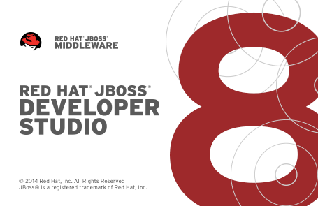
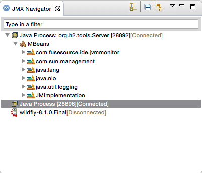
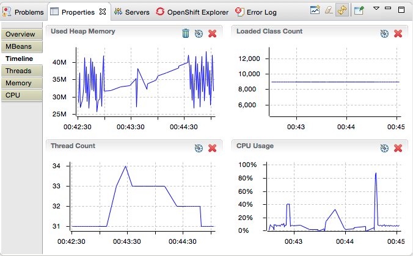
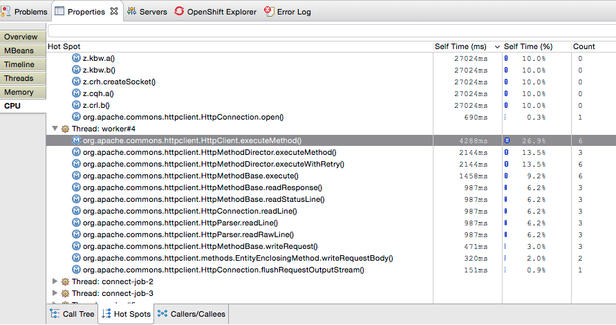

= Beta2 for Luna - JavaScript, Monitoring and Early Access!
:page-layout: blog
:page-author: maxandersen
:page-tags: [release, jbosstools, devstudio, jbosscentral]

It is time to get some more Eclipse Love out in the world - we start by shipping JBoss Tools 4.2 Beta2 and Red Hat JBoss Developer Studio 8 Beta2 for Eclipse Luna.

Nice ain't it ? 

== Installation

JBoss Developer Studio comes with everything pre-bundled in its installer. Simply download it from our https://www.jboss.org/products/devstudio.html[JBoss Products page]run it like this:
 
    java -jar jbdevstudio-<installername>.jar   

JBoss Tools or Bring-Your-Own-Eclipse (BYOE) JBoss Developer Studio requires a bit more:

This release requires at least Eclipse 4.4 (Luna) M7 but we recommend
using the
http://www.eclipse.org/downloads/packages/eclipse-ide-java-ee-developers/lunam6[Eclipse
4.4 JEE Bundle] since then you get most of the dependencies preinstalled.

Once you have installed Eclipse, you either find us on Eclipse Marketplace under "JBoss Tools (Luna)" or "JBoss Developer Studio (Luna)".

For JBoss Tools you can also use our update site directly if you are up for it.

    http://download.jboss.org/jbosstools/updates/development/luna/
 
Note: Integration Stack tooling will become available from JBoss Central at an later date.

== What is new ? 

This Beta 2 contains quite some new additions that I believe you will like!

=== Early Access in JBoss Central

Too allow users of JBoss Developer Studio to try out plugins more easily which have not yet reached supported level we've added a notion
of Early Access to JBoss Central.

image:/documentation/whatsnew/central/images/central-earlyaccess.png[JBoss Central Early Access]

For now we've moved Eclipse VJET into this area and made Arquillian Tools and AngularJS available for Developer Studio users.

The "Early Access" features are from an isolated updatesite that only gets added if you press "Show Early Access" and when you unselect
"Early Access" we will remove/disable those updatesites thus you will not receive anymore updates of those features.

Try it out!

=== Local Java Process Monitoring via JMX Navigator on steroids!

The view before called 'MBeans Explorer' is now called 'JMX Navigator' and it now can do much more than before.

First of, it will automatically list locally detected Java Virtual Machines which you can connect to and browse their internal state via JMX MBeans.

Once you have this view open you can browse the MBeans, but with a little bit of magic you can also get various performance metrics displayed.

You can even get profiling info such as hotspots, memory usage etc.:

Basically, JBoss Tools now comes with a built-in Java profiler out of the box.

This functionallity originally comes from Fuse IDE which adopted http://jvmmonitor.org[jvmmonitor] which we have now moved into JBoss Tools core to unify our access to JMX and Java processes. 

=== JBoss Modules Classpath Container

Until now JBoss Tools core have used basic file patterns to find apropriate jars for your classpath and for introspecting the JBoss servers.
With JBoss Modules where there can be multiple versions and several layers of patching this kind of simple file pattern searchingis not sufficient.

Thus now our WildFly/JBoss EAP based servers understand the notion of JBoss Modules and will locate the proper module.

image:/documentation/whatsnew/server/images/JBIDE-9479.png[]

It even will detect if your `manifest.mf` has `Dependencies` and add them to the list of jboss modules to the classpath Eclipse will use for compiling.

=== VPE is dead long live VPE!

VPE has been refactored to use the new HTML Preview feature.

This means we will use your system native browser to preview HTML5 based pages (XHTML/JSF will still use the old XULRunner based browser if possible).

image:/documentation/whatsnew/vpe/images/4.2.0.Beta2/html-preview-vpe.png[Visual Page Editor]

This new preview has much better Javascript support and just looks better.

If you do not like the split editor view you can also open it as a separate view which will show the HTML representation of editors that
uses the WTP based XML DOM model (i.e. our html editor and wtp xml editors).

The preview support navigating from source to elements and from elements to source allowing you to easily navigate back and forth.

=== Better JavaScript and AngularJS support

To improvie Eclipse JSDT default JavaScript we've done many fixes to it that are available in stock Eclipse, but for JBoss Tools we've started to try use Tern behind the scenes
via Angello Zerr's https://github.com/angelozerr/angularjs-eclipse[angularjs-eclipse] and https://github.com/angelozerr/tern.javap[tern-java] projects.

In JBoss Tools Tern is now automatically enabled on Javascript based projects intended to give you much stronger and better content assist in additon to what Eclipse JSDT provides.
AngularJS is available from JBoss Central under "Early Access" to give a try if you are an Angular user.

image:/documentation/whatsnew/jst/images/4.2.0.Beta2/angular.png[Angular JS Support]

Please note though that in Beta2 on Windows 64 bit you will need to http://nodejs.org/download/[Download and Install node.js] to have it working - in the next release we will have this handled out of the box. Windows 32-bit, Linux and OSX users shuold be able to see it enabled on any javascript project.

We are really interested in hearing if these improvements to JavaScript and Angular support is working for you!

=== OpenShift Quickstarts

The OpenShift wizard now supports OpenShift's notion of quickstarts or instant apps.

image:/documentation/whatsnew/openshift/images/new-quickstart.png[OpenShift Quickstarts]

This means it is now possible to just use OpenShift Wizard in eclipse to use one of the many custom defined quickstarts without having to use the browser.

Examples of interesting JBoss server related quickstarts are WildFly 8.1, AeroGear Push server and CapeDwarf.

=== OpenShift Snapshots

On request OpenShift now support saving and restoring your OpenShift instances via Snapshots.

image:/documentation/whatsnew/openshift/images/context-menu-snapshot.png[Save/Restore snapshots]
 
== ...and more

There is more over at link:/documentation/whatsnew/jbosstools/4.2.0.Beta2.html[What's New].

Let us know what you think in the comments below!

Hope you enjoy it and remember...

Have fun!

Max Rydahl Andersen +
http://twitter.com/maxandersen[@maxandersen]

