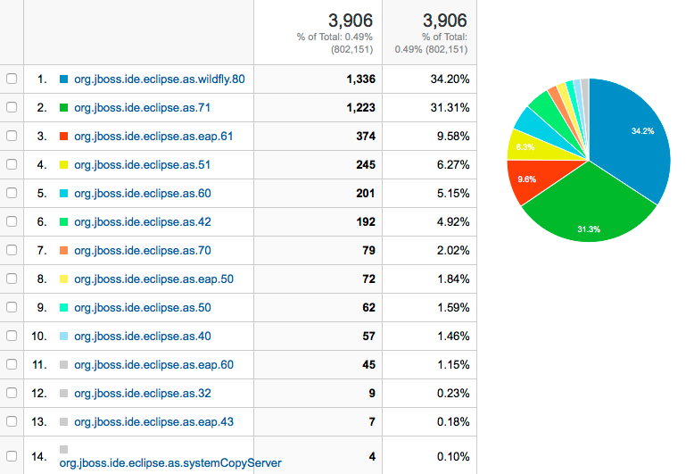
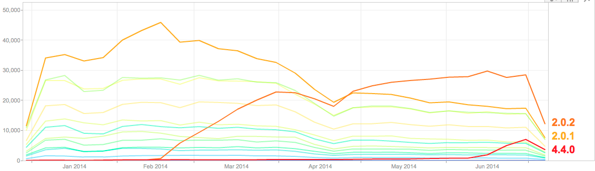

= Fun stats about WildFly and Luna
:page-layout: blog
:page-author: maxandersen
:page-tags: [wildfly, luna, jbosscentral]
:experimental:

In our recent milestone releases of JBoss Tools 4.2 we've started gathering additional data from those
who are have agreed sending back anonymous usage data to us (Thank you!).

Reminder: As always, this is *my* personal interpretation of the data and again it is *early days* for the data collection.
These numbers are just for the last month of beta testers thus do take these absolute numbers with a grain of salt!

In any case I find the numbers interesting and thought I would share since there are some lessons to be learned.

== JBoss Server Usage

One of the data points are which JBoss servers users create.

Mind you we don't collect the *exact* version of the server installed, just which server adapter users are using - i.e. EAP 6.1 also covers
EAP 6.2 and 6.3, WildFly 8 covers 8.0 and 8.1 etc.

The numbers above shows the last two weeks of server creation by our
beta users. Not surprisingly majority of users are using the
community version of the latest JBoss servers (AS 7.1 and WildFly 8),
and it's great to see the third most used server is the free for
development/enterprise supported EAP 6.1/6.2/6.3.

== Oldie but goodie

What I find funny is that there are still users using the latest/greatest
development tools, but who runs JBoss AS 3.2 - this was last released back
in 2006! Talk about dedication :)

== Importance of Multiple runtime support

What the list shows to me is the importance of development tools need to support multiple versions because
even though most are using latest/greatest runtime there are still a great bunch of users that will be using older
versions of runtimes. Many developers tend to forget or blissfully ignore this.

I'm convinced as users move to our release that gathers these data we will start see even higher numbers of "older" runtime usage.

== Deploy Only Server

What is a bit disconcerting is how few seem to know about our Deploy only server (in this list noted as `systemCopyServer` ).
This server allows you to use Eclipse's support for incremental deployments to any directory locally or remotely available.
Really useful for deploying to a non-JBoss server, a remote PHP or just a plain html app.

You should try it out!

menu:File[New,Server, Basic, Deploy Only]

Combine this with our LiveReload support and you get a great and fast workflow!

== Uptake of Eclipse versions

Another data item we have insight to is the uptake of Eclipse versions.

The graph above is our recorded startups of Eclipse Java EE installs
since January pr. week. Be aware the versions listed are the EPP versions, not
Eclipse release train versions - I'll do the mapping for you below.

Two things to note: the "Drop" at the end is just the effect of the
numbers ending middle of the month, the "Dip" in mid April I'm not
sure what is but we see it across all our Google analytics thus I
expect it was an Google Analytics anomoly. The numbers have since
stabilized, that said...lets interpret!

This graph shows how Eclipse Kepler SR1 release (2.0.1) usage is dropping as users upgrade to Kepler SR2 release (2.0.2) - this
are most likely the effect of users using Eclipse built-in update mechanism to upgrade.

What also can be seen is that the latest stable release (4.4.0) uptake is
gaining faster than total Eclipse version usage (the faint lines are
even older eclipse versions). Meaning total usage of JBoss Tools is up/stable. Eclipse isn't dead yet :)

I wish Google Analytics had a way to show this graph cumulative instead of per line...anyone up for a data extraction and visualization project ?
I'll give you access to the data to play with.

== Uptake of Eclipse Luna

Finally, my personal main interest was to see what the uptake of Eclipse Luna is.

You can see what effect a GA release of Eclipse has. The red line is Eclipse Luna going from a
couple of hundreds starts to now 7.000 starts pr. week since its release - but do notice that there is no corresponding drop (yet) in
Kepler. Looks like most are installing Luna next to their Kepler installs (my theory at least ;)

This mimicks previous years uptake patterns and once everyone gets back from vacation and Luna SR1 release comes out it should
be close to the level of Eclipse Kepler installs. Good to see users continue to picking up latest greatest features *and* bugfixes!

I'll go look at the numbers again in a few months to see if the trend continues.

If there is some additonal data you are interested or questions about the above let me know in comments and I'll try include/answer it!

Have fun!

Max Rydahl Andersen +
http://twitter.com/maxandersen[@maxandersen]
