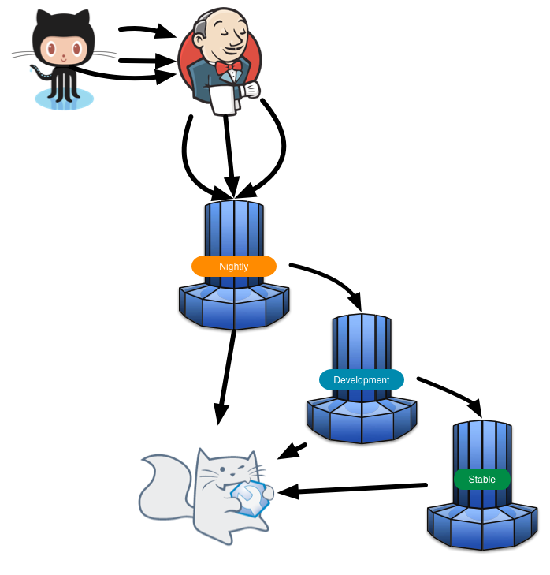

= Changes to nightly update site url
:page-layout: blog
:page-author: maxandersen
:page-tags: [updatesite, jbosscentral]

A few days ago we released link:2014-07-28-beta3-for-luna[JBoss Tools 4.2 Beta3] for Eclipse Luna.

In that update was also a change to our update site urls that we recommend for testing our Nightly builds.

In the past if you used `http://download.jboss.org/jbosstools/updates/nightly/core/master/` we recommend 
you start using the following instead:

Nightly Update Site: `http://download.jboss.org/jbosstools/updates/nightly/luna/` 

Note the 'luna' segment in the URL above indicates this site targets Eclipse 4.4 (Luna). Once we begin building on Eclipse 4.5 (Mars), there will be a new URL with a 'mars' segment.

== Why the change ? 

To understand why we are changing it its good to try understand how our builds for JBoss Tools is setup
to have commits in builds be picked up by Jenkins which then publishes the result to our nightly build update sites.

The following picture is a simplification of the process and how the bits moves through the various sites and gets link:/cat[community tested].

We have ~40 repositories with more or less independent plugin sets in our Github link:https://github.com/jbosstools[jbosstools] organization.
When these change we build an update site for each of them and when one is built the content gets aggregated into an "uber" jbosstools update site.

In the beginning this was not a big problem but over the years with more traffic and more frequent builds users risk having 
update errors because during their update the build from which they were updating could be overwritten with a newer one.

To remedy this we now offer a *composite* of a all the latest nightly builds instead. 
This means that parsing the site's metadata will be slightly slower but after that the download speed will be the same,
and you should now rarely encounter the above issue.

Another advantage is that with this site you can now revert to an earlier nightly build, in case that works better.

Thus, in short - if you are willing to test our JBoss Tools nightly builds - please use this as your update site:

`http://download.jboss.org/jbosstools/updates/nightly/luna/`

== Talking about nightly builds...

If you are trying out latest nightly builds why not signup as part of link:../cat[JBoss Tools CAT] member and help by giving us feedback to know if we are going in the right direction ? 

To do this http://bit.ly/jbosstoolscatsignup[start here].

Have fun!

Max Rydahl Andersen +
http://twitter.com/maxandersen[@maxandersen]

