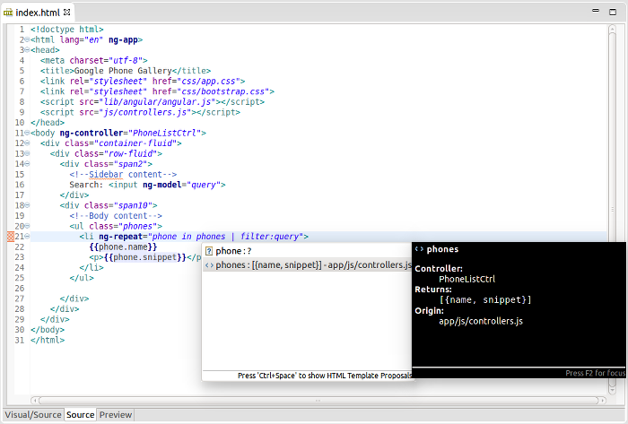

= CR1 for Luna - Ionic, Forge, Hibernate, Server
:page-layout: blog
:page-author: fbricon
:page-tags: [release, jbosstools, devstudio, jbosscentral]

Happy to announce link:/downloads/jbosstools/luna/4.2.0.CR1.html[JBoss Tools 4.2 CR1] and link:/downloads/devstudio/luna/8.0.0.CR1.html[Red Hat JBoss Developer Studio 8 CR1] for Eclipse Luna is now available.

image::images/devstudio8_splash.png[JBoss Developer Studio 8 Splashscreen]

== Installation

JBoss Developer Studio comes with everything pre-bundled in its installer. Simply link:/downloads/devstudio/luna/8.0.0.CR1.html[download it] and install it like this:

    java -jar jboss-devstudio-{version}-installer-{standalone|eap}.jar

JBoss Tools or JBoss Developer Studio Bring-Your-Own-Eclipse (BYOE) requires a bit more:

This release requires at least Eclipse 4.4 (Luna) but we recommend
using the
http://www.eclipse.org/downloads/packages/eclipse-ide-java-ee-developers/lunar[Eclipse
4.4 JEE Bundle] since then you get most of the dependencies preinstalled.

Once you have installed Eclipse, you either find us on Eclipse Marketplace under "JBoss Tools (Luna)" or "JBoss Developer Studio (Luna)".

For JBoss Tools you can also use our update site directly if you are up for it.

    http://download.jboss.org/jbosstools/updates/development/luna/

Note: Integration Stack tooling will become available from JBoss Central at a later date.

== What is new ?

This release is mainly a big set of bug fixes but we managed to slip in a bunch of new features too.

=== Hotcode replace aware server adapter

Ever been annoyed by Eclipse's "Hot Code Replace Failed" dialog and how it only offers you to Continue, Terminate or fully restart your running VM ?

Ever wonder why Eclipse couldn't just restart your deployed modules and let you continue working without have to wait for a restart of
the application server + your own application ?

If you can answer yes to the above, then you will be happy to hear we now support this.

image::/documentation/whatsnew/server/images/JBIDE-18094a.png[]

Now, if you run a server in Debug mode and a hot code replace fails due to some class or jar changes,
the dialog above will appear, giving you the option to restart the modules, terminate the server, restart the server, or just continue as if nothing happened.

But beyond this, it also offer you the option to "Remember this choice for this server", allowing you to click "Restart modules" once and then all subsequent hot code replace
failures will automatically trigger a restart of just the modules.

This is probably my personal most wanted feature improvement in years - sorry for it to take so long but please do enjoy it now.

=== Hibernate Tools "rewired"

To support the latest Hibernate 4.3 and JPA 2.1 releases, we had to "rewire" large part of Hibernate Tools' internals.
In the past Hibernate 3.6 was hardwired to be used for loading users mapping configurations for the UI - that is no longer the case.
The configured version for your console configuration is now used everywhere instead of only for codegeneration.

I'll spare you from the details here but just outline that the rewiring has been completed and we now support
Hibernate 4.3 and JPA 2.1. But beyond that, previous versions should be much more stable now too!

If you do find discrepancies in this area, please let us know by opening a https://jira.jboss.org/jira/browse/JBIDE[bug report].

=== New AngularJS Forge wizard

JBoss Central now features a new AngularJS with Forge project wizard to let you kickstart new JavaEE based applications almost from scratch, using the powerful http://forge.jboss.org/[JBoss Forge] scaffolding capabilities.

You will be asked to install Forge Tools, if it is not already installed. The wizard will also recommend you to install the AngularJS tooling.

Once you create the project skeleton from the new wizard, a cheatsheet will open and will guide you through the different steps necessary to use JBoss Forge and scaffold REST endpoints and a UI layer based on AngularJS.

Please be aware that if you enable "Early Access" on JBoss Central you will get even better AngularJS suport (see below).

=== Updated AngularJS tooling

AngularJS IDE https://github.com/angelozerr/angularjs-eclipse/wiki/New-and-Noteworthy-0.5.0[v.0.5.0] is now
available in JBoss Central Early Access (go to the software/updates page in JBoss Central and click on
the Early Access checkbox). Biggest change here is that the Angular JS editor is no longer needed and has been removed.
 Instead, content assist, code highlighting and easy navigation for AngularJS are now available from the standard and JBoss Tools HTML editors.

=== More Ionic goodies for mobile development
More widget components have been added to the http://www.ionicframework.com[Ionic] Palette for HTML5 files. See the link:/documentation/whatsnew/jbosstools/4.2.0.CR1.html#ionic[New and Noteworthy] page for a complete list of newly available widgets.

When an Ionic widget is added to an HTML file, the links to Ionic JS/CSS CDN resources may also be created automatically.

Content assist (Ctrl+Space) for <ion-*> tags and their attributes is now supported by the JBoss Tools HTML editor.

=== Pom properties activated m2e configurators

JBoss project configurators for m2e now support an activation property in the <properties> section of pom.xml. Expected values are true/false and override the workspace-wide preferences found under `Preferences > JBoss Tools > JBoss Maven Integration`.

Available properties are :

- `<m2e.cdi.activation>true</m2e.cdi.activation>` for the CDI Project configurator,
- `<m2e.seam.activation>true</m2e.seam.activation>` for the Seam Project configurator,
- `<m2e.hibernate.activation>true</m2e.hibernate.activation>` for the Hibernate Project configurator,
- `<m2e.portlet.activation>true</m2e.portlet.activation>` for the Portlet Project configurator.

Using these are good if you find our automatic detection is too eager or too weak in finding that you need the
plugins setup for CDI, Seam, Hibernate or Portlet features.

The pom.xml editor also provides matching XML templates for these properties, when doing `ctrl+space` in the <properties> section.

== ...and more

There are more improvements covered in the more details: link:/documentation/whatsnew/jbosstools/4.2.0.CR1.html[What's New].

== What is Next

The next release is set to be the last candidate release, so please, do try this one out and give feedback to make sure you'll have a good experience with JBoss Tools on Eclipse Luna!

Let us know what you think in the comments below!

Hope you enjoy it and remember...

Have fun!

Max Rydahl Andersen & Fred Bricon +
http://twitter.com/maxandersen[@maxandersen]
http://twitter.com/fbricon[@fbricon]
