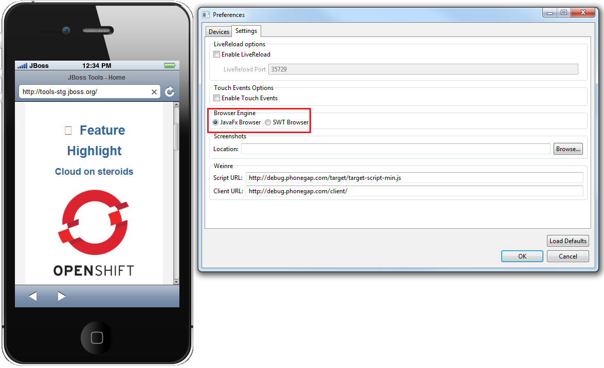
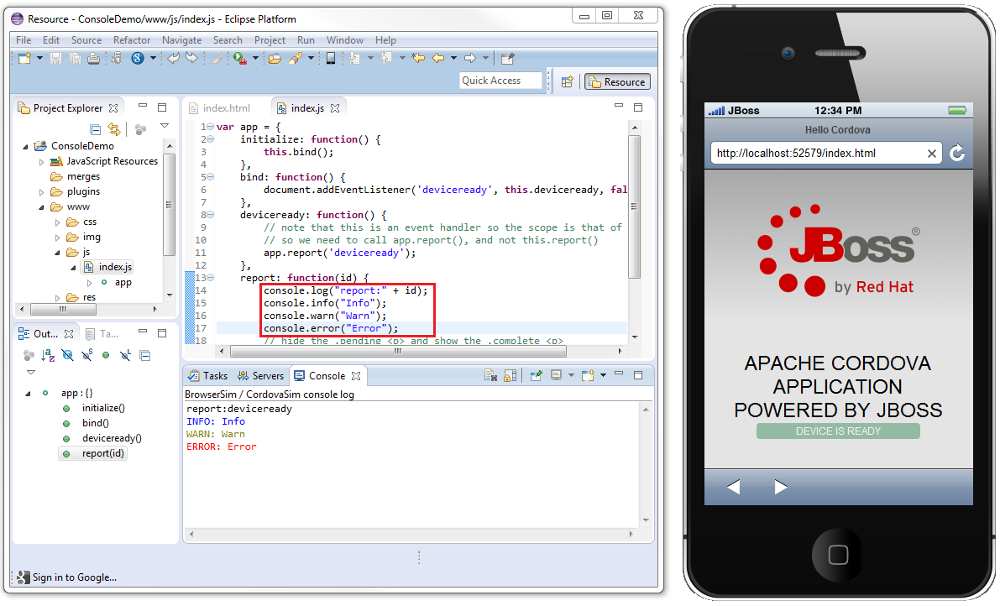
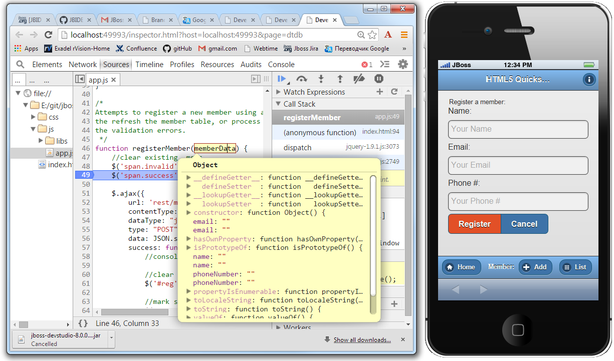

= Brand new BrowserSim / CordovaSim features  
:page-layout: blog
:page-author: ibuziuk
:page-tags: [browsersim, cordovasim, release, jbosstools, devstudio]

In this article, I'm happy to introduce you new BrowserSim / CordovaSim features, which are available in the new http://tools.jboss.org/downloads/devstudio/luna/8.0.0.GA.html[JBoss Developer Studio 8.0.0.GA]. Basically, I want to focus on:
[square]
* JavaFx web engine
* Eclipse console logging
* Dev Tools Debugger

== JavaFx web engine
BrowserSim and CordovaSim have a new *JavaFx* web engine as an alternative to *SWT WebKit*. In the original there was only one web engine - SWT WebKit. Unfortunately, it has several drawbacks. For example, using SWT WebKit on Windows requires http://support.apple.com/kb/DL1531[Apple Safari] installation (provides SWT WebKit engine), which is pretty obsolete for now - *May 9, 2012* is the date of the last update. Moreover, SWT WebKit doesn’t support Debugger API. Due to these limitations it was decided to add JavaFX web engine support. Web engine can be changed in *Menu -> Preferences -> Settings Tab -> Browser Engine*.

NOTE: If you want to use JavaFX web engine, you need to run BrowserSim / CordovaSim against http://www.oracle.com/technetwork/java/javase/downloads/index.html[Oracle JDK] version 7 or higher (version 8 is recommended)

== Eclipse console logging
Eclipse console logging is available for both *SWT Webkit* and *JavaFx* web engines. Now the output of the main javascript console functions (*console.log*, *console.info*, *console.warn*, *console.error*) is displayed in the Eclipse console.

== Dev Tools Debugger
Dev Tools Debugger is available only for *JavaFx* web engine. One can connect the debugger to the BrowserSim / CordovaSim (*Right click -> Debug -> Dev Tools...*) and step through the code, introspect variables and so forth. 

== Demo 
Here is a short demo https://vimeo.com/109909395[video] with the new features:

video::109909395[vimeo, width=640, height=400]

NOTE: All this features are also available for https://github.com/jbosstools/jbosstools-aerogear/tree/master/cordovasim[CordovaSim]

== BrowserSim standalone
For one who doesn't use Eclipse / JBoss Developer Studio there is a standalone mode of BrowserSim. However, only *SWT WebKit* web engine is supported (we are planning to add *JavaFx* support in the next releases - https://issues.jboss.org/browse/JBIDE-18703[JBIDE-18703]). More details about BrowserSim standalone can be found in the following http://tools.jboss.org/blog/2014-10-30-standalone-browsersim-is-back.html[blog].

== BrowserSim FAQ
BrowserSim FAQ can be found http://tools.jboss.org/documentation/faq/browsersim.html[here]. If you wasn't able to find the answer, just post your question in the comments to this blog.

== Known issues
[square]
* *Dev Tools Debugger* doesn't work properly with the Oracle *JDK 8u20*. I do hope it will be fixed in the upcoming JDK releases  - https://javafx-jira.kenai.com/browse/RT-38918[RT-38918], https://issues.jboss.org/browse/JBIDE-18526[JBIDE-18526]
* JavaFx which is shipped with Oracle JDK 7 has no *localStorage* support. Fortunately, it is fixed in JDK 8 - https://javafx-jira.kenai.com/browse/RT-29584[RT-29584] 
* JavaFx which is shipped with Oracle JDK 7 has no *WebSocket* support, which is vital for *LiveReload* functionality. So, *LiveReload* doesn't work with Oracle JDK 7 for JavaFx web engine. Fortunately, it is fixed in JDK 8 - https://javafx-jira.kenai.com/browse/RT-14947[RT-14947] 
* JavaFx HTML 5 Date and time inputs do not function properly - https://javafx-jira.kenai.com/browse/RT-34974[RT-34974], https://issues.jboss.org/browse/JBIDE-17054[JBIDE-17054]
   
== Conclusion
We are trying our best to make our tools as good as possible. User feedback is what we are seeking for now. We look forward to hearing your comments, remarks and proposals. Please, comment below about features you would you like to have in the upcoming releases!  +
Have fun!

Ilya Buziuk +
https://twitter.com/ilyabuziuk[@ilyabuziuk]
