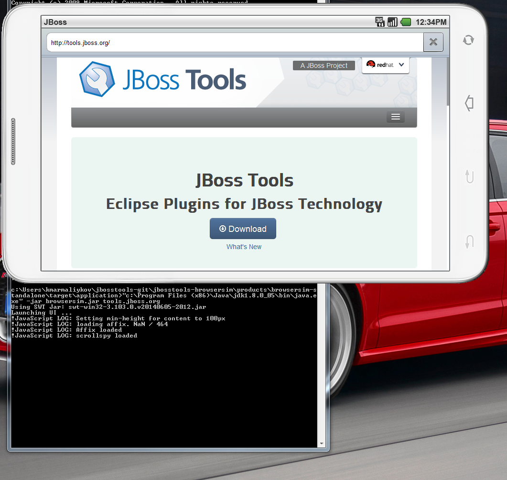

= Standalone BrowserSim is back!
:page-layout: blog
:page-author: kmarmaliykov
:page-tags: [browsersim]

In this article I'm happy to say that standalone BrowserSim is back. 

Standalone BrowserSim allows to use BrowserSim without firing up Eclipse. Unfortunately, only SWT.WEBKIT engine is available in standalone BrowserSim, so it will require `Safari` on Windows or `WebKitGTK 1.2.0` on Linux to be installed. Nevertheless, all BrowserSim features available there. 

You can read about BrowserSim features link:/features/browsersim.html[here]. For more information about BrowserSim see link:/documentation/faq/browsersim.html[Browsersim FAQ]. 

== How can I try it?

Standalone BrowserSim is available on the artifacts tab on the downloads page. You can try link:/downloads/jbosstools/luna/4.2.0.Final.html#zips[stable] or if you want latest greatest
link:/downloads/jbosstools/luna/4.2.0.Nightly.html#zips[nightly] builds are available too.

You can also build your own standalone BrowserSim from source. To do it:
	
	* ensure you have Java (1.6+), Ant (1.5+) and Maven (3.1+) installed.
	* execute the following commands:
+
----------
$ git clone https://github.com/jbosstools/jbosstools-browsersim
$ cd products
$ mvn clean package
$ cd browsersim-standalone/target/application
----------

You can run browsersim.jar using the following command:
	
	* Windows, Linux:

		java -jar browsersim.jar [$start_page]
			
	* Mac OS:

		java -XstartOnFirstThread -jar browsersim.jar [$start_page]

TIP: To run standalone Browsersim on Linux with specific GTK version add `SWT_GTK3=1` (GTK 3) / `SWT_GTK3=0` (GTK 2) before the run command.

