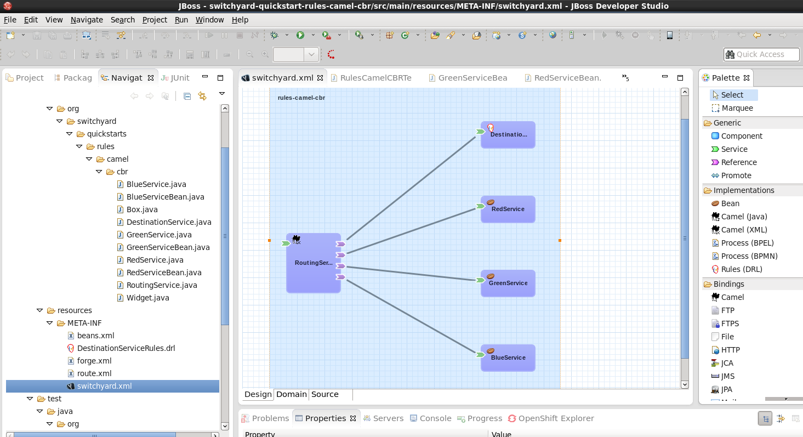

= SwitchYard Service Debugger
:page-layout: blog
:page-author: ldimaggi
:page-tags: [switchyard, jbosscentral]

This post introduces the new service debugger for JBoss SwitchYard and provides the reader with an overview of SwitchYard’s capabilities, as demonstrated in its example “quickstart” programs.

== Introduction

One of the most useful (and by the way, also one of the coolest) features of JBoss SwitchYard (http://switchyard.jboss.org/) is its graphical process editor. The editor enables you to create composite service definitions through a graphical interface, instead of having to directly edit cumbersome raw XML. For example:

The big blue box in the center window is called the canvas. Here's where you can see the graphical representation of the service definition. With SwitchYard, it’s all about the services. With the SwitchYard editor, you can create the services, and not just edit Java source code.

What’s always been missing has been a corresponding tool for debugging SwitchYard Services. This gap is now being filled by the SwitchYard Debugger.

== The SwitchYard Debugger

A debugger such as GDB provides you with the ability to interrupt a program’s execution through breakpoints so that you can examine code and data. In SwitchYard, however, you’re not just dealing with Java classes, you 're creating (and debugging) services. The SwitchYard debugger lets you add a breakpoint to any service or reference to a service. The debugger supports these actions:

* Breakpoints can be configured to stop at various points in the execution chain, including service entry or transaction setup (entry, teardown, fault).
* If you add a breakpoint on a service, the breakpoint will trigger for any reference or composite service invoking that service. In contrast, if you add a breakpoint on a service reference, it will only break when that reference is invoked.
* You can also set breakpoints on a composite service to debug validators and transformers (both inbound and outbound). You would do this if you want to see what's going through a particular transformer or validator which may be used by a number of interactions.
* If you configure a breakpoint to break on transactions, it will break into the SwitchYard TransactionHandler.handleMessage() method. This generates a stack trace that includes SwitchYard details (for example, an Exchange) that are visible in the SwitchYard context view, so that you can examine elements such as message contents and context properties.

In contrast to a Java debugger, the SwitchYard debugger enables you to invoke breakpoints during steps (such as transformation) during the execution of the service, right in the service bus:

* Breakpoints on component services and composite references (in other words, providers) will break anytime they are invoked, regardless of who is calling them.
* Breakpoints on composite services and component references (in other words, consumers) will break whenever they call out.
* So, if you're having a problem with a service, putting a breakpoint in the service, will allow you to see what's going in or out. If you're having a problem with a component or endpoint, putting a breakpoint on a consumer will allow you to see what's going in/out, and where it's going.
* With regard to the locations within a service (for example, transformation), if you have a specific problem, such as if you're seeing policy exceptions or transactions aren't working the way you expect, you can set it to break during the policy phase or the transaction phase to see just what's going on (which policies are required, which are provided).

The best way to understand the new debugger is to see it in action. We'll do this by using the debugger with SwichYard "quickStart" example programs. Let's get started!

== Getting SwitchYard

Before we can see the debugger in action, we have to install the SwitchYard runtime and its corresponding Eclipse tooling. Luckily, downloading and installing JBoss software* is quick and painless (and free!)

The steps to install the SwitchYard runtime are:

* Install the WildFly 8.0 server - Download and unzip this file: http://download.jboss.org/wildfly/8.0.0.Final/wildfly-8.0.0.Final.zip
* Install SwitchYard onto the installed WildFly server - Download and unzip this file over the installed WildFly server - http://downloads.jboss.org/switchyard/releases/v2.0.Alpha2/switchyard-2.0.0.Alpha2-WildFly.zip

The steps to install SwitchYard’s Eclipse tooling are:

* Install Eclipse Luna - Download the compressed file from http://www.eclipse.org/downloads/packages/release/Luna
* Install JBoss Tools version 4.2.1 from the Eclipse Marketplace
* Install the SwitchYard tooling from http://download.jboss.org/jbosstools/updates/development/luna/integration-stack/aggregate/4.2.0.Alpha1/
* Create a new runtime definition for WildFly 8.0 in Eclipse

(We’re using the latest versions of the software available when this post is being written.)

== The Quickstarts

One of the helpful features included with JBoss projects are example programs referred to as “quickstarts.” As the name implies, the goal of these examples is to help users get started quickly in learning technologies provided by JBoss projects. As we mentioned earlier in this post, the approach that we’ll take is to introduce a bugs into quickstarts, and then use the debugger to locate these bugs.

To introduce SwitchYard applications to new users, we’ll examine the first quickstart that we’ll use in some detail. If you are already familiar with SwitchYard applications, you can skip over this section of the post.

Let's start by using the debugger to interrupt a running service in a quickStart and enable us to examine the data in a message being processed by the service. After this, we'll take things one step further and introduce a bug into a service and then use the debugger to find the cause of the bug and work around it.

== Looking under the Hood of a Quickstart

Before we examine how the debugger can be used with a quickStart we'll take a look at how quickstarts are implemented and how to use the SwitchYard editor.

The first quickstart that we’ll run makes use of Apache Camel to implement content based routing to route messages to selected services. This quickstart is aptly named: rules-camel-cbr. Before we run the quickstart, let’s take a quick look at how it works.

To understand how the quickstart is constructed and how it works, we'll examine it by looking at these 3 elements:

* The quickstart's service based design. We'll look at this through the SwitchYard visual editor.
* SwitchYard's integration of camel routes with the quickstart's services.
* The support for testing that SwitchYard provides.

Let's start by looking at the design of the quickstart application and its services.

To import the quickstart into our JBDS workspace, navigate to File->Import->Maven->Existing Maven Projects:

Browse to the quickstarts directory under the directory into which you installed SwitchYard, select the quickstart and it is imported.

== The SwitchYard Service Editor

The SwitchYard graphical application editor enables you to create services and references to services, configure gateway bindings for all the protocols that SwitchYard supports, configure message transformers (to convert messages from one format to another), create skeletons of the classes, interfaces, and unit tests for your services.

The service definitions that you create in the editor are stored in a file named switchyard.xml. In the quickstart, this file is located in the src/main/resources/META-INF directory. All the quickstarts that we’ll use in this post follow this same pattern. Let's open this file in the editor and take a look around.

To open the file in the editor, simple double-click on the switchyard.xml file's icon. When the editor opens, here's what we see:

image::images/debugger_5.png"[height="218" width="400"]

The big blue box in the center window is called the canvas. Here's where you can see the graphical representation of the service definitions:

image::images/debugger_6.png"[height="400" width="390"]

At this point, we should take a moment to understand the graphical symbols that are used in the service definitions.

The visual elements defined in switchyard.xml conform to the OASIS Service Component Architecture Assembly Model Specification (http://docs.oasis-open.org/opencsa/sca-assembly/sca-assembly-spec-v1.1.html). The Service Component Architecture (SCA) model provides standards for building SOA applications.

A green chevron represents a service definition. The corresponding purple chevron represents a reference to a service. The blue rectangles are service components. These are containers that can hold implementations or one or more services through references.

Why was this standard selected as the lingua franca of SwitchYard configuration? What advantages does using this standard give us? There are multiple levels of advantages: 

* The SwitchYard team is using a modular approach that makes it easier to define and maintain a service's configuration. A switchyard.xml can contain binding info in the same file as the service implementation, but SCA also supports recursive composition, so that one service with just implementation details, can be included inside another. We’ll take a look at the SCA files and pictures that Switchyard tooling makes easy to create and maintain.
* SwitchYard also wanted to make service interface (or the service "contract")  information more explicit, and therefore easier to find.
* Finally, the SwitchYard team had a choice.  They could create a new configuration syntax, or they could try to use something that already existed, was an accepted open standard, and was supported by a vibrant community. (They chose the latter.) Also, SCA is a well-known model for service-oriented applications. But, it's important to not get too hung-up over the underlying configuration model. The capabilities that the model makes possible, such as modularity, are more important. And, another reason to not worry too much about the configuration model is that SwitchYard provides you with tools such as Forge scripting (and someday soon a SCA editor) to make it easier to create and maintain services' configurations.

The set of fundamental service definition symbols is defined in the OASIS Service Component Architecture Assembly Model Specification here: http://docs.oasis-open.org/opencsa/sca-assembly/sca-assembly-1.1-spec-CD-01.html#_Toc193601722

The other symbols relate to the SwitchYard-specific service implementations and bindings. For example, the RoutingService is implemented as a Camel XML service, the DestinationService is implemented as a JBoss Drools service, and the Red, Blue, and Green services are implemented as Java Bean services.

The full range of options supported by SwitchYard is displayed in the Palette view:

image::images/debugger_7.png"[height="400" width="135"]

(Yes, it's a long list. You have to scroll to see all the options.)

One thing to keep is that while this service definitions are persisted in an .xml file, and while you are able to view the contents of that file, you should not attempt to edit the raw XML in that file. The editor has built in protections to ensure that you do not create an invalid configuration. These protections are not in effect if you edit the raw XML directly. Accordingly, while we'll examine both the information available to you in the graphical editor and the switchyard.xml file, we'll focus on using the editor.

Let's start by examining the application service design as presented by the editor, in the context of the application logic flow, then we'll look a bit deeper into how you can create and manage the application design through the editor.

What happens in the quickstart is a three step process:

* First, the incoming message is routed, by the RoutingService to the DestinationService
* Second, the DestinationService uses JBossDrools to determine the correct destination for that message, based on the content in the message
* Third, the RoutingServer then routes the message to the correct final destination (the Red, Green, or Blue service

How is this all accomplished? Let's look at the RoutingService definition. Select the RoutingService in the diagram, open the Properties view and you'll see this:

image::images/debugger_8.png"[height="48" width="400"]

Remember that this service is a Camel XML service. The implementation of that route is defined in the route.xml file. The route definitions take the form of a Spring DSL. (See http://camel.apache.org/spring-xml-extensions.html for more details.)

The contents of this file are pretty self-explanatory as the destination color determines the ultimate destination. For example:
....
<from uri="switchyard://RoutingService"/>
<to uri="switchyard://DestinationService"/>
  <choice>
    <when>
        <simple>${body.destination} == 'Red'</simple>
    <to uri="switchyard://RedService"/>
....

== SwitchYard and Routing With Camel (with help from JBoss Drools)

What happens when the quickstart processes a message is:

First, the incoming message is routed, by the RoutingService to the DestinationService.

As seen in route.xml:
....
    <from uri="switchyard://RoutingService"/>
    <to uri="switchyard://DestinationService”/>
....

Let's look at the DestinationService definition. Select the DestinationService in the diagram, open the Properties view and you'll see this:

image::images/debugger_9.png"[height="118" width="400"]

Then, the DestinationService service uses an MVEL statement to find the Widget class's ID, and rules defined in JBoss Drools (remember that this service is implemented as a JBoss Drools service) to set the Destination value:

As seen in DestinationServiceRules.drl:
....
rule "Red Destination"
    when
        $widget : Widget(id matches "FF0000-.*")
    then
        $widget.getBox().setDestination("Red");
end
....

Then, the route logic continues in a structure to route the message to the correct destination:

OK. We have the Destination value set in each widget. But, how does the widget get routed to the correct destination?

Camel provides a Java DSL (Domain Specific Language) to implement routes. In the DSL, a camel route contains a source ("from") and a destination ("to). These reference the RoutingService and DestinationService interfaces that we just saw in the SwitchYard editor. 

In the case of the quickstart, the route definitions take the form of a Spring DSL. The route is self-explanatory, even if you do not have experience with Camel. The destination service is selected based on the content; Red, Green, or Blue.

== Test Support in SwitchYard

There's just one more thing we have to look at before we run the quickstart - how to start the chain reaction of tasks that the quickstart will perform.

Testing server-side applications such as those built with SwitchYard can be difficult. Since this is server-side software, you have to install and run a server, the application has to be deployed to that server, and then you have to construct a client to access the application on the server. You can end up in a situation where you have to build either a throwaway test client, or a reusable test framework.  Either way, you have to invest time and effort into building something other than your application. 

Luckily, JBoss SwitchYard provides a built in framework that makes testing your applications fast and easy. This QuickStart makes use of the SwitchYardRunner class. SwitchYardRunner is a JUnit Runner class, but more than that, it starts up an embedded SwitchYard runtime. When this embedded runtime starts, your application is packaged up as a SwitchYard application that is deployed to the test instance.

To make use of SwitchYard's test support, all you have to do is to annotate the test with the SwitchYardRunner JUnit test Runner class. This class will startup an embedded SwitchYard runtime, one for each test method, and then package up the test into a SwitchYard application and deploy that application to the runtime.

In addition to the SwitchYardRunner class, SwitchYard also makes testing easy by providing the  TestMixIn feature. TestMixIns enable to turn on additional test support, based on the specific needs of your application.  This quickstart makes use of the CDIMixIn to register its bean services. Some of the other TestMixIns support testing http services, JBoss Smooks transformations, and JMS services.

== Building, Deploying, and Running the Quickstart

OK, enough talk. Let's run the quickstart. 

First, deploy the quickstart to a SwitchYard server. In JBDS, this is a simple task. It can be done with the server either started or stopped, but let’s start the server first so that you more easily spot the server logging messages when the quickstart is deployed.

To start the server, select it in the “servers” view, and press the start button. 

image::images/debugger_10.png"[height="57" width="400"]

The server console window will open, and you should see something like this:
....
21:21:59,145 INFO  [org.jboss.as] (Controller Boot Thread) JBAS015961: Http management interface listening on http://127.0.0.1:9990/management
21:21:59,146 INFO  [org.jboss.as] (Controller Boot Thread) JBAS015951: Admin console listening on http://127.0.0.1:9990
21:21:59,146 INFO  [org.jboss.as] (Controller Boot Thread) JBAS015874: WildFly 8.0.0.Final "WildFly" started in 4060ms
....

Then, to deploy the quickstart, select the server in the “servers” view again, right-click, select “Add/Remove Applications” and select the quickstart. 

Switch back to the console view and you should see something like this:

INFO  [org.jboss.as.server] (DeploymentScanner-threads - 1) JBAS018559: Deployed "switchyard-quickstart-rules-camel-cbr.jar" (runtime-name : "switchyard-quickstart-rules-camel-cbr.jar")

To run the client test program, select the rules-camel-cbr/src/test/java/org/switchyard/quickstarts/rules/camel/cbr/RulesCamelCBRTest.java Java source file, and run it as a JUnit test. 

Switch back to the server console, and you’ll see the quick start’s output!
....
INFO  [org.switchyard.quickstarts.rules.camel.cbr.RedServiceBean] Red service processing boxed widget with id: FF0000-ABC-123
INFO  [org.switchyard.quickstarts.rules.camel.cbr.GreenServiceBean] Green service processing boxed widget with id: 00FF00-DEF-456
INFO  [org.switchyard.quickstarts.rules.camel.cbr.BlueServiceBean] Blue service processing boxed widget with id: 0000FF-GHI-789
....

And the green bar appears!

image::images/debugger_12.png"[height="78" width="640"]

Now, we'll use the debugger to interrupt a running service in a QuickStart and enable us to examine the data in a message being processed by the service. After this, we'll take things one step further and introduce a bug into a service and then use the debugger to find that bug.  

== Setting a Breakpoint in the Debugger

Let’s start by setting a breakpoint on the Blue service. We’ll use this breakpoint to enable us to view the contents of the message received by the service. For the purposes of our first example, we’ll use the Blue service.

To set a breakpoint in the SwitchYard editor, first position the cursor over the service’s green chevron icon. A small palette of icons is displayed:

To set a breakpoint on the service, select the eyeglasses icon. The presence of this icon on a service definition as seen in the SwitchYard editor indicates that a breakpoint is set:

Notes that as we are adding a breakpoint on the service, the breakpoint will trigger for any reference or composite service invoking that service. In contrast, if you add a breakpoint on a service reference, it will only break when that reference is invoked.

To view and modify the breakpoint’s properties, open the Debug perspective and look in the breakpoints view:

And then right-click on the breakpoint, to view and edit the breakpoint’s properties:

For our example, we’ll use the default properties. We’re mainly concerned with the breakpoint being triggered at service entry.

Now that our breakpoint has been defined, let’s run the RulesCamelCBRTest program again.

To run the test with the debugger, right-click on RulesCamelCBRTest, select Debug As->JUnit Test:

When the breakpoint is reached, the program is suspended. If we look in the Variables view in the Debug perspective, we can see the incoming message and the values that controlled the content-based routing of a message to the Blue service:

Now that we’ve seen the quickstart run correctly, it’s time to introduce a bug, and then use the debugger to find it. For this illustration, we’ll use a different quickstart.

== Giving a Quickstart a Bug

Remember the scene in the movie “Independence Day,” when Will Smith uploads a software virus into the evil aliens’ spaceship? Let’s do something similar and add a bug into a quickstart, and then use the debugger to find the bug and even fix it.  

Some of the types of bugs that you have to deal with in a services and message based system involve when there are problems in the content in the messages, and how the services are (or are not) able to handle those problems.  What sorts of bad things can happen to good messages? Missing a field, wrong namespace, malformed XML, errors in the headers, etc. The debugger makes it possible to tweak a message to debug a problem, without having to redeploy the service.

The quickstart that we’ll look at is “validate-xml.” This quickstart demonstrates the SwitchYard XML validator. The quickstart deploys a service that accepts a message and returns an object that is transformed with XLST. The incoming message is checked for XML validity, so that malformed messages are caught. Before we can run the quickstart, it must be deployed in the same manner as the rules-camel-cbr quickstart that we looked at earlier in this article.

The quickstart’s application diagram is very simple as only one service (“OrderService”) is implemented. This service only accepts a message and returns an object that is processed by the XLST transformer, but it’s adequate for our purposes. The diagram looks like this:

The test application that we want to run is: validate-xml/src/test/java/org/switchyard/quickstarts/validate/xml/WebServiceTest.java

This application executes separate two Junit tests. First, it verifies that a properly formatted SOAP message can be transformed and validated, and then it verifies that an intentionally malformed SOAP message (that is, a message that contains invalid XML) is caught.

Before we look at causing and catching a bug, let’s examine the message tansformation that is performed by this quickstart. The transformation is performed with the order.xslt file in the quickstart. It’s a simple transformation in that it transforms incoming messages that look like this:

....
<soapenv:Envelope xmlns:soapenv="http://schemas.xmlsoap.org/soap/envelope/">
  <soapenv:Header/>
  <soapenv:Body>
  <orders:order xmlns:orders="urn:switchyard-quickstart:validate-xml:0.1.0">
     <orderId>PO-19838-XYZ</orderId>
     <itemId>BUTTER</itemId>
     <quantity>200</quantity>
  </orders:order>
  </soapenv:Body>
</soapenv:Envelope>
....

Into objects that look like this:

....
<SOAP-ENV:Envelope xmlns:SOAP-ENV="http://schemas.xmlsoap.org/soap/envelope/">
  <SOAP-ENV:Header/>
  <SOAP-ENV:Body>
  <orders:orderAck xmlns:orders="urn:switchyard-quickstart:validate-xml:0.1.0">
     <orderId>PO-19838-XYZ</orderId>
     <accepted>true</accepted>
     <status>Order Accepted</status>
  </orders:orderAck>
  </SOAP-ENV:Body>
</SOAP-ENV:Envelope>
....

The change simply indicates whether the incoming order was accepted.

If we set our breakpoint on the “OrderService” service:

And then run/debug the WebServiceTest, we can view the message, before and after its transformation, in the debugger. Here’s the message before transformation:

And here’s the message after its transformation:

The second test in the WebServiceTest intentionally sends a message that includes an invalid XML element.

The invalid SOAP message looks like this:

....
<soapenv:Envelope xmlns:soapenv="http://schemas.xmlsoap.org/soap/envelope/">
  <soapenv:Header/>
  <soapenv:Body>
  <orders:order xmlns:orders="urn:switchyard-quickstart:validate-xml:0.1.0">
     <orderId>PO-19838-XYZ</orderId>
     <itemId>BUTTER</itemId>
     <quantity>200</quantity>
     <invalid-element>This element is not allowed by XML Schema.</invalid-element>
  </orders:order>
  </soapenv:Body>
</soapenv:Envelope>
....

Yes, it’s easy to spot the invalid XML.   ;-)

Let’s expand on this test application a bit and alter it to not gracefully trap the error resulting from the invalid XML. To do this, we’ll edit the invokeOrderWebServiceValidationFail() method and change this:
....
Assert.assertTrue("Unexpected response: " + response, response.contains("1 validation error(s)") && response.contains("invalid-element"));
....

To this:
....
Assert.assertFalse("Unexpected response: " + response, response.contains("1 validation error(s)") && response.contains("invalid-element"));
....

So that when we run the test, we see this JUnit error:
....
java.lang.AssertionError: Unexpected response: <soap:Envelope xmlns:soap="http://schemas.xmlsoap.org/soap/envelope/"><soap:Body><soap:Fault><faultcode>soap:Server</faultcode><faultstring>SWITCHYARD014000: Validator 'org.switchyard.validate.xml.internal.XmlValidator' failed: 1 validation error(s):
org.xml.sax.SAXParseException: cvc-complex-type.2.4.d: Invalid content was found starting with element 'invalid-element'. No child element is expected at this point.
</faultstring></soap:Fault></soap:Body></soap:Envelope>
....

Before we can debug the OrderService, we must set our breakpoint:

image::images/debugger_23.png[height="84" width="148"]

Then we edit the breakpoint's properties. For our example, we want the trigger to be set for the validation of incoming messages:

When we run/debug the WebServiceTest program, the breakpoint is reached and we can examine the message contents:

And, there's the invalid XML element. What makes the debugger especially useful is that we can now edit the message and remove the invalid XML:

And then allow the program to resume its operation. In this way, we can determine if the program has any other bugs before we correct the cause of the invalid XML, redeploy, etc.

== In Conclusion

We’ve taken an introductory look at the new SwitchYard debugger in this article. The debugger enables you to debug not just a class or method, but a Switchyard service. The debugger is configured through the SwitchYard graphical service/application editor and enables you to both monitor and control the operation of a service to make it easier for you to find those pesky bugs and is a great addition to the SwitchYard developer toolkit.

== Acknowledgements

The author would like to thank Rob Cernich for his input and reviews of the article as it was being written, Keith Babo for his background on the SwitchYard editor, and Jiri Sedlacek for his painstaking review of my sometimes suspect grammar. (Many thanks!)

== References

* JBoss SwitchYard - http://switchyard.jboss.org
* Discussion on JBoss SwitchYard Debugger - https://community.jboss.org/message/849326#849326
* OASIS Service Component Architecture Assembly Model Specification - http://docs.oasis-open.org/opencsa/sca-assembly/sca-assembly-spec-v1.1.html
* JBoss Tools Integration Stack (SwitchYard Tooling for Eclipse) - http://download.jboss.org/jbosstools/updates/development/luna/integration-stack/

