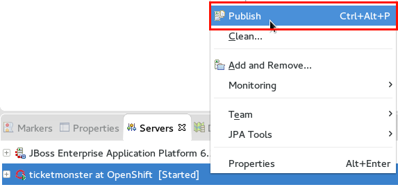
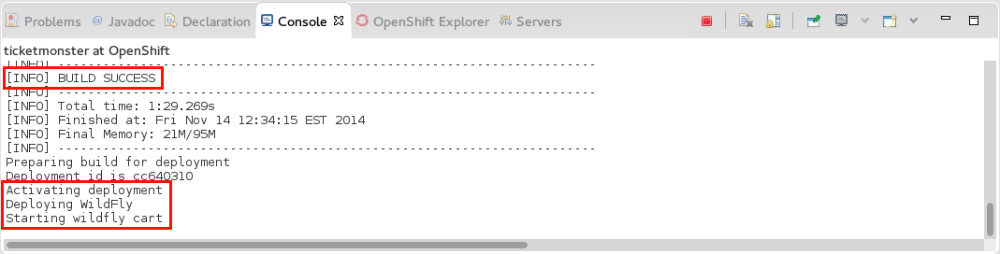
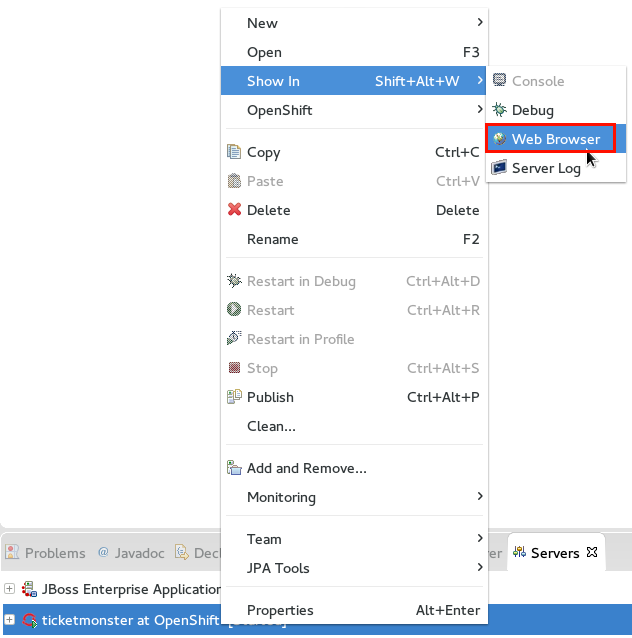

= A JRebel Ticket Monster on OpenShift
:page-layout: blog
:page-author: adietish
:page-tags: [openshift, jbossdeveloper, ticketmonster]

http://www.jboss.org/products/devstudio/overview/[JBoss Developer Studio] allows you publish and run your http://www.eclipse.org/home/index.php[Eclipse] projects on https://www.openshift.com/[OpenShift]. 
This post shows you how to get started using the http://www.jboss.org/ticket-monster/[JBoss Developer Ticket Monster] demo application. +
In a 2nd part I will show you how to change your code in Eclipse and have those changes instantly available on OpenShift using the http://zeroturnaround.com/software/jrebel/[JRebel] cartridge.

== Deploy and Run Ticket Monster on OpenShift

video::9FSFJVRh0f4[youtube]

== Get the code

The JBoss Developer project created the http://www.jboss.org/ticket-monster/[Ticket Monster] demo to showcase a modern https://angularjs.org/[angularjs] and JavaEE application. 
The code for this blog is at: 

  https://github.com/adietish/ticket-monster.git

CAUTION: The original code for the  Ticket Monster is available at https://github.com/jboss-developer/ticket-monster[Github]. + 
The webapp with its maven pom is located in the https://github.com/jboss-developer/ticket-monster/tree/WFLY8.1/demo[demo] folder. 
OpenShift on the other hand is expecting a pom in the root of the git repository. 
Without it OpenShift will not know how to build the code when you push it. 
To fix this I created a fork of the webapp where I put the content of the demo folder to the root of the git repository

. Copy this url to your clipboard and in your Eclipse, switch to the *Git perspective*. 
. Launch the *Clone Git Repository* wizard. It will popup with all the values already in place. Hit btn:[Next] 
. Pick the master branch and hit btn:[Finish] to get the repo cloned to your local machine. +
. Once the cloning is done the new repo will appear in the *Git Repositories* view.
. Import the project within it by using menu:Import Projects... in the context menu. 
. Back to the JBoss or Jave EE perspective you will spot the new project *ticket-monster* in your workspace. 

== OpenShift, create an Application for my project, please!

You are now ready to deploy it to OpenShift. 
Pick *menu:Configure[New/Import OpenShift Application]* from the context menu of the ticket-monster project.


The OpenShift application wizard that you now get prompts you to provide your OpenShift credentials. 
Either use an existing account from the combo or create a new one, providing server, username and password. +
In the next page we choose to create a new OpenShift application and pick the application type. 
We will use *WildFly 8* which you'll find by filtering the available choices with "wildfly". 
The latest version of OpenShift has it in the Basic Cartridges (previous versions - like the one used in the screencast - had it in the quickstarts). 


Once you picked it you can choose the application name in the next wizard page. +
The wizard suggests a name that is based on the project name. 
OpenShift doesn't allow non-alphanumeric characters for the name, you therefore have to correct it, remove the hyphen and get "ticketmonster". +
You may also select the domain (if you have several ones) and possibly adjust the gear size and have your application scaling. 


If you now hit *Finish* the wizard will create your OpenShift application, prepare your local project to run on OpenShift and create a server adapter for easy publishing. +
Once the wildfly cartridge is created on OpenShift, the tooling presents you the credentials to access the wildfly administrative console in a dialog. 
You should copy those for later usage:


In a last step the wizard informs you that it'll prepare your local ticket-monster project to run on OpenShift. 
Confirm these changes by hitting btn:[OK].


You are now ready to publish your ticket-monster projcet to OpenShift.

== Deploy your project!

Get to the "Servers" view, select the freshly created server adapter and tell it to menu:publish ticket-monster to OpenShift via its context menu.




The dialog prompts you to provide a commit message and select the files that you want to commit and publish. + 
Among the listed files is the *.gitignore*. 
Double clicking it shows you that it now includes Eclipse specific project settings. + 
The wizard also added OpenShift configurations in the *.openshift* folder.  +
Further interesting bits are a marker to have wildFly running on *java 8* (.openshift/markers/java8). 
OpenShift markers allow you to configure specific bits like enabling debugging (Enable JPDA marker), hot deployment (Hot Deploy marker) etc. 
You may choose among java 7 and java 8 via  marker files in .openshift/markers.
You can also spot a wildfly configuration file in .openshift/config/standalone.xml that you can modify to your needs.
Once you checked all files by clicking the btn:[Select All] button and provided a commit message, you're good to go. 
You can now publish your project to OpenShift by hitting *Commit and Publish* 

The tooling then informs that it will overwrite the current code in OpenShift by doing a push force. It asks you to confirm this. 


This is required since the wizard does not properly include the remote history in our local project/git repo. 
It clones the remote repo and then copies some of its content into the local project, it does not recursive merge since this is/was not fully reliable yet 
(see https://issues.jboss.org/browse/JBIDE-14890[JBIDE-14890] for further details).
It is therefore required to overwrite the remote content when you do the initial deployment. 
Once you hit *OK* the server adapter is pushing the local code to OpenShift.

Eclipse then shows you the *Console* with the output of the publishing operation. 
You can see how the maven build is triggered, WildFly is restarted and your project is then deployed. 



In order to verify that your server is fully you can have a look at the logs. 
Pick menu:OpenShift[Tail files...] from the OpenShift submenu in the context menu of your ticketmonster server adapter.
The upcoming wizard allows you to fine-tune the tail files options and include the gears that your application is running on.
You can stick to the default which are usually just fine.


A fully started Wildfly will output 'Wildfly 8.1.0.Final "Kenny" started' in the logs.


You're now ready to have a look at your running project. 
Pick menu:[Show In > Web Browser] from the context menu of your ticketmonster server adapter and see how the browser is pointed to your deployed webapp.




== Change locally, see OpenShift change instantly!

video::FZj0W60gtE8[youtube]

=== Install JRebel
We are now getting a step further and show you how we can change the application code locally and have those changes instantly available on OpenShift. +
To achieve this you need to install the http://zeroturnaround.com/software/jrebel/[JRebel] plugin into your JBoss Developer Studio. 
The Eclipse plugin is available from JBoss Central. 
Switch to the Software/Updates tab, search for JRebel, check it once it is listed and hit "Install/Update". 
Once you restarted Eclipse your have JRebel enabled in your IDE

image: ./images/install-jrebel.png[]
 
=== Enable JRebel for your Project
Open up the context menu of your project and enable the *JRebel Nature* for your project (menu:[JRebel > Add JRebel Nature]). 
In a 2nd step then enable *JRebel Remoting*.


You have to configure the local JRebel where to publish to. 
You therefore need the public URL of your ticket monster as it runs on OpenShift. 
You get this in the application details: pick menu:OpenShift[Details] and copy the *Public URL*.

image: ./images/application-public-url.png[]

Paste it to the JRebel Deployment URL(s) by picking *Advanced Properties* from the JRebel context menu of your ticket-monster project.

image: ./images/jrebel-deployment-url.png[]

=== Downgrade to Java 7

Wildfly is configured to run with Java 8 by default. With JRebel enabled the OpenShift small gear that you get for free tends to run out of memory.
It is therefore suggested that you downgrade to Java 7. 
You go to the context menu of your project and pick *menu:OpenShift[Configure Markers...], uncheck java8 and check Java 7.

image: ./images/java7-marker.png[]

=== Add the JRebel cartridge in OpenShift

The JRebel cartridge for OpenShift, available from https://github.com/openshift-cartridges/openshift-jrebel-cartridge[Github], makes it very easy to enable JRebel for any Java app on OpenShift. 
To add this cartridge to your application you get to the Servers view and choose menu: OpenShift[Edit Embedded Catridges...]. +
In the upcoming wizard you check the *Code Anything* cartridge and paste the following url:

  https://cartreflect-claytondev.rhcloud.com/reflect?github=openshift-cartridges/openshift-jrebel-cartridge

image: ./images/code-anything-cartridge.png[]

Once you hit btn:[Finish] the wizard will add the cartridge to your OpenShift application and enable JRebel for it.

=== Publish your project to OpenShift

You now have to push all your local changes to OpenShift (you added the JRebel nature and downgraded to java7). 
You have to tell the server adapter to publish:
Choose *Publish* in the context menu of your OpenShift server adapter. +
The upcoming commit- and publish-dialog shows your local changes:


You replaced the java8 with a java7 marker and added 2 xml files that configure JRebel. 
Once you add a commit message you're ready to hit *Commit and Publish*. +
If you now go to the *Console* view and pick the ticketmonster, you will see how OpenShift picks those changes and rebuilds your code.

image: ./images/ticketmonster-console.png[]	

You can inspect the server logs to make sure wildfly the procedure is all finished and widlfly fully restarted. 
In the Servers view, pick menu:OpenShift[Tail Files...], stick to the default options and hit btn:[Finish].


'WildFly 8.1.0.Final "Kenny" started' in the logs tells you that wildfly was successfully restarted. 
You are now ready to change code locally and have them picked up in OpenShift instantly.

=== Pick my local changes instantly, OpenShift!

We will change the ticket price and we will therefore first check the current price. 
Use menu:Show In[Browser] in the context menu of your server adapter which will open up the application in your browser. 
In your browser then hit hit *Buy tickets now*, *Book Ticket*, choose some venue, date, time and section. You will then see the current price:


Back in your JBoss Developer Studio let us now change the ticket price: + 
Open up the *TicketPrice* and get to the *getPrice()* method. Change it to the following:

```java

    public float getPrice() {
    //   return price;
    	return createFakePrice();
    }

    private float createFakePrice() {
		return 42f;
	}
```
When you *save* your Java editor, you will see the JRebel console popping up and show you how it is updating the java classes in OpenShift. 


Now get back to your browser and refresh the page. 
You will have to select the venue again in order to see the new ticket price: It is now at *$42*!


We did not have to publish our code to OpenShift via the server adapter. JRebel published our local changes on the fly!

