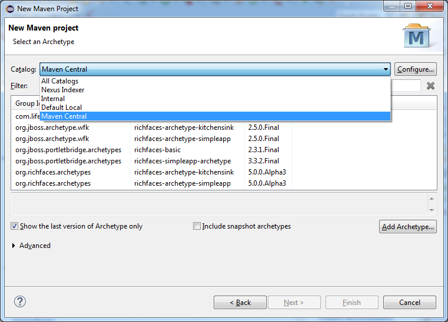
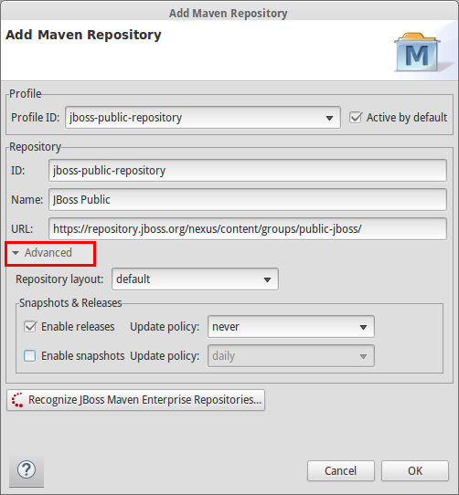

= Maven improvements in JBoss Tools 4.2 and JBDS 8.0
:page-layout: blog
:page-author: fbricon
:page-tags: [maven]

In JBoss Tools and JBoss Developer Studio, we're continuously working to augment the Maven integration experience in Eclipse. Some of the features we've been playing with, if deemed successful, will eventually be contributed back to m2e, like the https://bugs.eclipse.org/bugs/show_bug.cgi?id=428094[Maven Profile Management UI]. Others, more centered around JBoss technologies, will stay under the JBoss Tools umbrella.

JBoss Tools 4.2 and JBDS 8, based on Eclipse Luna, take advantage of all the nice improvements made to link:blog/2014-07-08-m2e-1_5-improvements.html[m2e 1.5.0] and then, add some more :

=== m2eclipse-egit integration

The _Import > Checkout Maven Projects from SCM_ wizard doesn't have any SCM provider by default, which can be pretty frustrating at times. With Git becoming the new de facto source control system, it only made sense to make https://github.com/tesla/m2eclipse-egit[m2eclipse-egit] the sensible default SCM provider for m2e.

m2eclipse-egit will now be automatically installed when a JBoss Maven integration feature is installed from the JBoss Tools update site.

It is installed by default with JBoss Developer Studio 8.0.0 as well.

=== Maven Central Archetype catalog

Since m2e 1.5.0 no longer downloads Nexus Indexes by default, a very small, outdated subset of Maven Archetypes is available out of the box.

To mitigate that, the JBoss Tools Maven integration feature now registers by default the Maven Central Archetype catalog,
providing more than 9600 archetypes to chose from, when creating a new Maven project. Accessing the complete list of archetypes
is even way, waayyyy faster (a couple seconds) than relying on the old Nexus index download.

=== Pom properties-controlled project configurators

JBoss project configurators for m2e now support an activation property in the <properties> section of pom.xml. Expected values are true/false and override the workspace-wide preferences found under `Preferences > JBoss Tools > JBoss Maven Integration`.

Available properties are :

- `<m2e.cdi.activation>true</m2e.cdi.activation>` for the CDI Project configurator,
- `<m2e.seam.activation>true</m2e.seam.activation>` for the Seam Project configurator,
- `<m2e.hibernate.activation>true</m2e.hibernate.activation>` for the Hibernate Project configurator,
- `<m2e.portlet.activation>true</m2e.portlet.activation>` for the Portlet Project configurator.

The pom.xml editor also provides matching XML templates for these properties, when doing `ctrl+space` in the <properties> section.

=== Maven Repository wizard improvements

The Configure Maven Repositories wizard, available under `Preferences > Jboss Tools > JBoss Maven Integration` saw a couple improvements as well :

==== Advanced options for maven repositories

You can now choose the repository layout, enable/disable snapshots or releases, and change the update policy in the `advanced` section :

==== Automatically identify local Maven repositories

When adding a new Maven repository, you can scan for JBoss Maven repositories unzipped locally, with the `Recognize JBoss Maven Enterprise Repositories...` button, in order to automatically add it to your .m2/settings.xml.

image::./images/recognize-maven-repo.png[]

The identification process now looks for a .maven-repository file at the root of the folder you selected. This file follows the http://en.wikipedia.org/wiki/.properties[`.properties`] file format and is expected to contain up to 3 attributes :

- `repository-id` : the repository id
- `name` : a (descriptive) repository name. _Optional, defaults to repository-id_
- `profile-id` : the profile id the repository will be activated from. _Optional, defaults to repository-id_

As a concrete example, the JBoss Mobile repository .maven-repository file would contain :

 repository-id=local-jboss-mobile
 name=JBoss Mobile Maven Repository
 profile-id=local-jboss-mobile

=== What's next?

Tired of seeing these "Project configuration is out-of-date" errors whenever you tweak your pom.xml? We're currently playing with a https://github.com/jbosstools/jbosstools-playground#auto-update-out-of-date-maven-project-configuration[plugin] that will automatically do the `Maven` > `Update project configuration` for you. You can try a very alpha version
from the following p2 repository : http://download.jboss.org/jbosstools/builds/staging/jbosstools-playground_master/all/repo/. Let us know if/how it works for you, so we can decide what to do next with it.

Enjoy and see you soon!

Fred Bricon +
https://twitter.com/fbricon[@fbricon]
