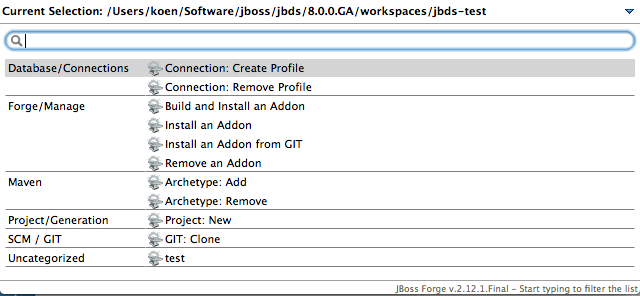
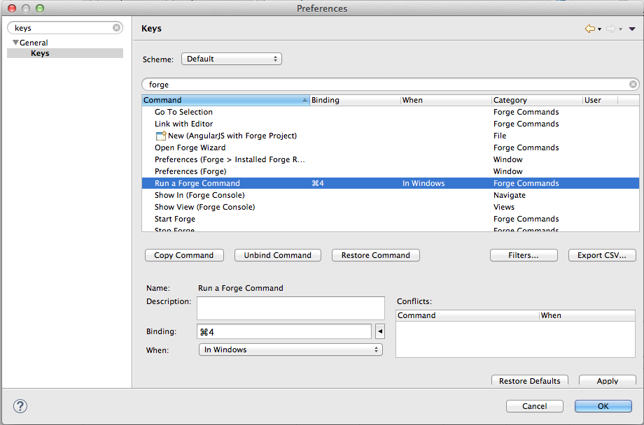
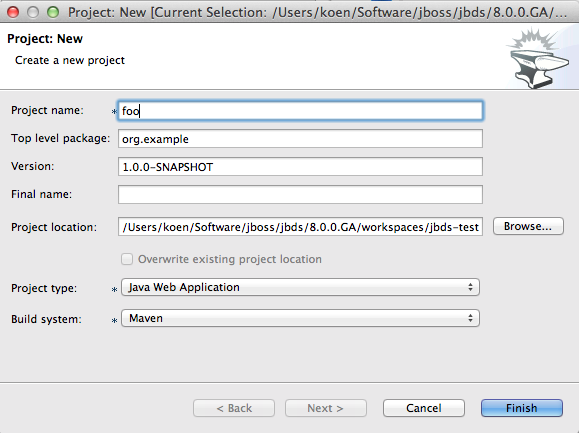
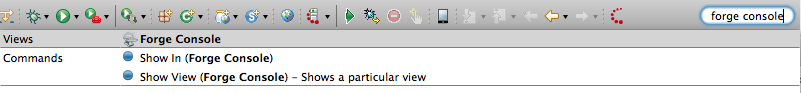
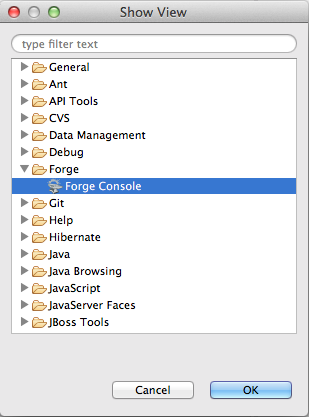
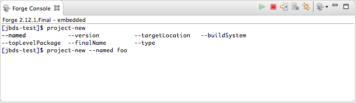
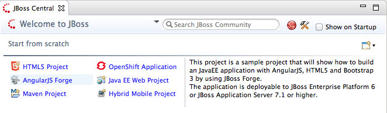
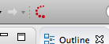
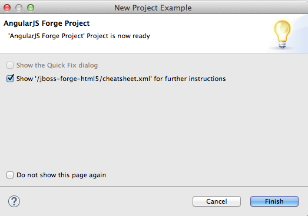
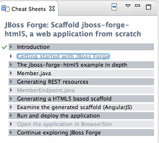

= Fabulous Forge Fun
:page-layout: blog
:page-author: kaers
:page-tags: [jbosscentral, forge, javaee, html5]

While JBoss Forge has been included in JBoss Tools and Developer Studio for a while now, the recent JBT 4.2 and JBDS 8.0 releases contain support for Forge 2.12.1. Forge has now become a matured component inside JBT and JBDS with a plethora of available commands that can be executed either using the convenient wizard style or using the integrated Forge console. 

== Wise Wizards

To use the wizards, you need to issue the Ctrl+4 key combination (or Cmd+4 on a Mac). It will bring up a popup containing all the commands that are available in the currently selected context. 

If this key combination does not work, chances are high that you are using a keyboard layout such as AZERTY. Don't panic, in this case it is just a matter of redefining the key combination to something that works on your hardware. Use the Eclipse preferences dialog (Window->Preferences or something similar) to do this.

Selecting the 'Project: new' entry of the popup will open the Forge wizard that allows you to create a new project.

== Core Console

If you are a console afficionado and typing and code completion is more your thing, you can use the integrated Forge console. One way to bring up the console is to type 'Forge Console' in the 'Quick Access' text field in the toolbar of your Eclipse workbench and then select the 'Forge Console' entry that is visible in the popup.

Another way would be to select 'Window->Show View->Forge Console' from the main menu bar. This will only be possible when you are using the 'JBoss' perspective. In another perspective, you can use 'Window->Show View->Other...' and then navigate to the 'Forge->Forge Console' entry.

In the console you can type Forge commands to perform the same tasks as if you were using the wizard-style approach.

== Chatty Cheatsheet

If you are new to Forge, this new feature will certainly help you on the way. And as a bonus it will also help you with learning to develop an HTML5 application with REST, CDI and AngularJS. You can open this brand new cheatsheet by importing the 'AngularJS Forge' example from the 'JBoss Central' page.

In case the 'JBoss Central' page is not open or you inadvertently closed it, no worries. You can always bring it back by clicking the 'JBoss Central' icon in your Eclipse toolbar.

After clicking the 'AngularJS Forge' example hyperlink, a wizard will guide you through the import process. Just accept all the defaults. When the wizard is done, a popup will ask you if you want to open the cheatsheet. 

Make sure you keep the open option checked when you click the 'Finish' button. Now the cheatsheet will reveal itself in all its glory.

There is no point in repeating here all the information that is available in the cheatsheet but in short, it will provide you with some general information and then guide you through the development, deployment and execution of a HTML5 application. You will see different examples of using Forge commands such as REST endpoint generation and scaffolding an AngularJS user interface. Check it out!

Happy Forging,
Koen Aers +
https://twitter.com/koentsje[@koentsje] 

