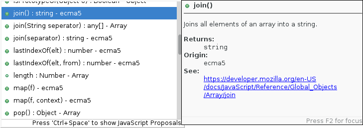
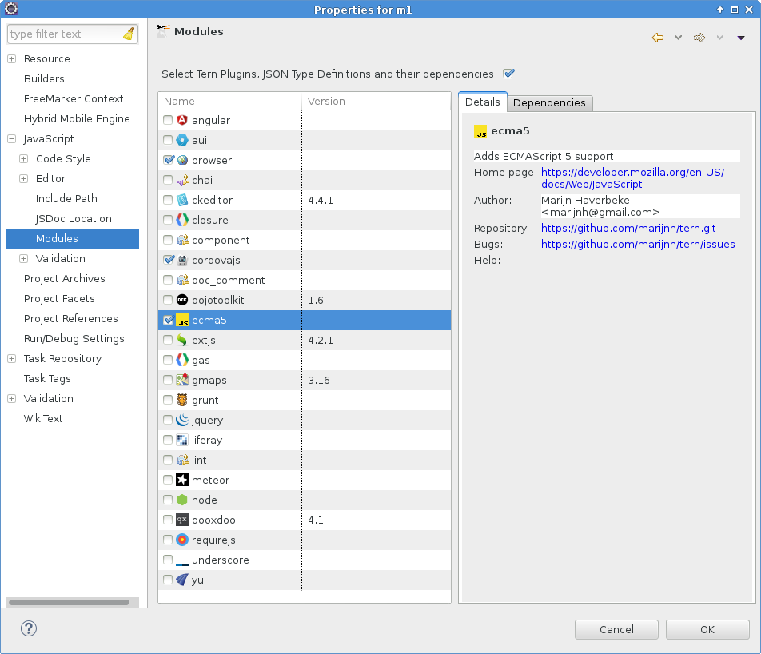
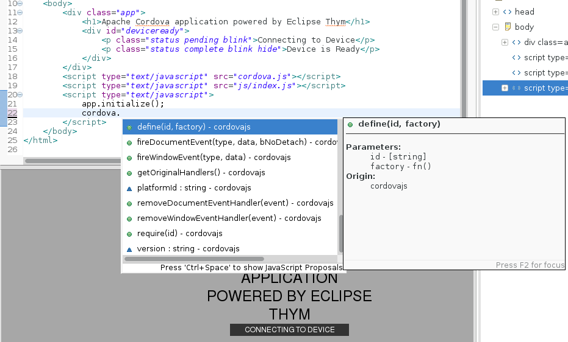

= What's New in JavaScript Tools
:page-layout: blog
:page-author: dgolovin
:page-tags: [javascript, cordova, angularjs, jbosscentral]

JavaScript is extremely popular nowadays and the fact
https://projects.eclipse.org/projects/webtools.jsdt[Eclipse JavaScript
Development Tools] supports JavaScript ECMA3 standard only didn't let
us sleep well, so we decided to do something about it.

First we got to work and fixed tons of issues in Eclipse JavaScript
Development Tools to make it usable, then when it esd good enough we
extended it with some good features to make it even better.
 
== Tern.java Adapter for JavaScript Facet

https://github.com/angelozerr/tern.java/blob/master/README.md[Tern.java]
is now working behind the scene to provide JavaScript code analysis
and content assist. Good news there is no need to configure it
manually. Just install Tern.java Adapter from JBoss Tools update site
and it configures projects with JavaScript facet automatically to
unleash all
https://github.com/angelozerr/tern.java/wiki/Tern-Eclipse-IDE[Tern IDE
features] for you.

== ECMA5 Support

HTML and JavaScript source editors now show JavaScript ECMA5 proposals
in content assist for projects with JavaScript facet.

== Popular JavaScript Frameworks Support 

You can also get content assist for many popular JavaScript Libraries
through Tern Modules. Manual configuration is required in Project
Preferences.

== CordovaJS Module for Tern.java

We provided CordovaJS Module for Tern to improve Cordova related
content assist in JavaScript source. Tern integration configure it for
Eclipse Thym Project automatically, so you don't need to do manual
configuration to see content assist for CordovaJS. Just create Thym
project, open index.htm and start using it.

== AngularJS Tools Early Access

JBoss Tools provides support for AngularJS through JBoss Tools Central Early Access. It installs full distribution of 
https://github.com/angelozerr/angularjs-eclipse/wiki/HTML-Features[AngularJS IDE] with many cool feature like:

* source code highlighting and navigation
* source code content assist
* AngularJS model view
* and more.

Read about all AngularJS IDE features https://github.com/angelozerr/angularjs-eclipse/wiki/HTML-Features[here].

/Denis Golovin
