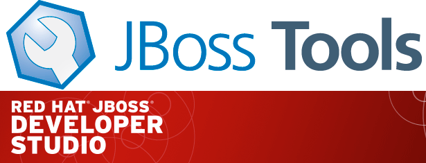

= JBoss Tools 4.2.1 and Red Hat JBoss Developer Studio 8.0.1
:page-layout: blog
:page-author: akazakov
:page-tags: [release, jbosstools, devstudio, jbosscentral]

Maintenance update of link:/downloads/jbosstools/luna/4.2.1.Final.html[JBoss Tools 4.2.1] and link:/downloads/devstudio/luna/8.0.1.GA.html[Red Hat JBoss Developer Studio 8.0.1] for Eclipse Luna is now available.

== Installation

=== JBoss Developer Studio 8.0.1

This is an updatesite-only update. If you have JBoss Developer Studio 8.0.0.GA already installed, just run:

    Help > Check for updates
    
=== JBoss Tools 4.2.1 and JBoss Developer Studio Bring-Your-Own-Eclipse (BYOE)

JBoss Tools and JBoss Developer Studio Bring-Your-Own-Eclipse (BYOE) require at least Eclipse 4.4 (Luna) but we recommend using the
http://www.eclipse.org/downloads/packages/eclipse-ide-java-ee-developers/lunasr1[Eclipse Luna SR1 Java EE Bundle] since then you get most of the dependencies preinstalled. Once you have installed Eclipse, you can find us on Eclipse Marketplace under "JBoss Tools (Luna)" or "JBoss Developer Studio (Luna)".

For JBoss Tools you can also use our update site directly if you are up for it.

    http://download.jboss.org/jbosstools/updates/stable/luna/

== What is new ?

This maintenance release includes mostly bug fixes but there are also a few new features which we would like to mention.

== BrowserSim and CordovaSim skins for iPhone 6 and 6 Plus

Brand new IPhone 6 / 6 plus skins are now available in BrowserSim and CordovaSim

== OpenShift Explorer: Start and Stop Applications

You can now start and stop your OpenShift-hosted application within Eclipse. 
OpenShift tools offers start- and stop-actions in the context menu of the server adapter and the application
in the OpenShift Explorer.

==  Arquillian validator for not public/static deployment method

The Arquillian validator creates a marker and a quick fix if a test contains a deployment method that is not public and/or static.

== CDI auto enablement for Java EE 7 projects

CDI (Contexts and Dependency Injection) support is now enabled automatically for Eclipse Web Tools faceted projects if they have any Java EE 7 facet.
For example if you create a project via New Dynamic Web Project Wizard and select Web facet v.3.1 you don't need to enable CDI support in project properties or to install CDI facet. CDI Tools will do it automatically.

== Updated Forge 2 Runtime 	

The included Forge 2 runtime is now 2.12.3.Final.

== What is Next

More maintenance updates for Eclipse Luna are planned and we continue to work on the major release for Eclipse Mars but it's all for 2015!

Happy Holidays and a joyful New Year!

Alexey Kazakov
