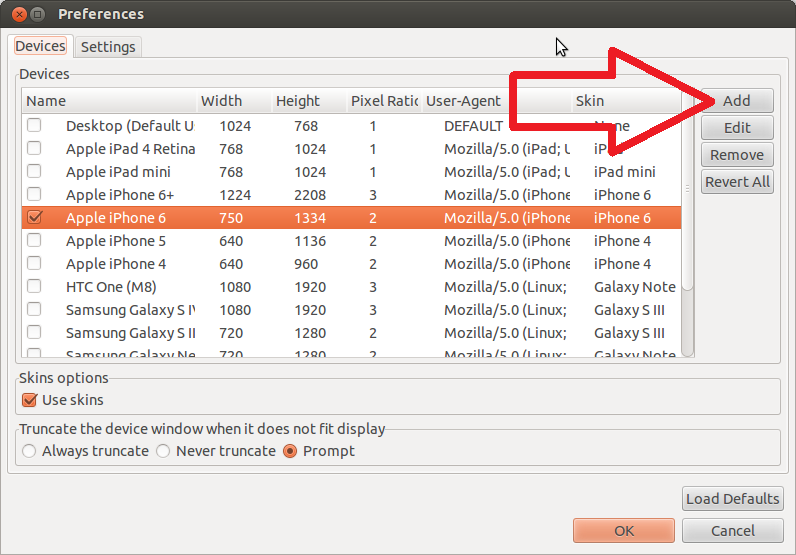
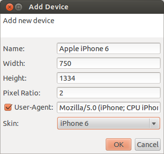

= How to add a custom device to BrowserSim?
:page-layout: blog
:page-author: ibuziuk
:page-tags: [browsersim, cordovasim, jbosstools, devstudio, jbosscentral]

Recently several people have asked me the following question:
[quote, BrowserSim user]
How can I test *Nexus 9* / *Moto G* / *LG G3* etc. via BrowserSim? There is no such device in the preference list.

Actually, it's extremely easy to do...

== Basic concepts
Firstly, let's introduce several fundamental concepts which we will need in the further discussion: 

* `Physical pixel` - the cell in the device's display matrix.
* `Display resolution` - the number of distinct physical pixels in each dimension that can be displayed. For instance, resolution *640 × 1136* means that the width of the display is 640 pixels and the height is 1136.
* `Pixel Ratio` - the value which determines how a device's screen resolution is interpreted by the CSS. Basically, CSS interprets a device's resolution by the formula: `Display Resolution / Pixel Ratio`. +
For example, *iPhone 5s* has the following parameters:
** Display Resolution: *640 x 1136*
** Pixel Ratio: *2*
** CSS Interpreted Resolution: *(640 / 2) x (1136 / 2) = 320 x 568* + 

NOTE: The reason why pixel ratio was created is due to the fact that screens of the modern phones have high resolution. So, if devices with high resolution had pixel ratio of *1* (i.e. *CSS Interpreted Resolution* = *Display Resolution*), then it would be almost impossible to browse on the Internet cause the content would be too small to see.

* `User-Agent` - HTTP header that identifies the client software. When you open a web page, your web browser includes a user-agent header in the request sent to the server that hosts the website. This string essentially introduces your browser to the server, describing which browser version you are using and relating other information about your computer or mobile device, such as the operating system and its version. The server can use this information to provide content that is tailored for your specific browser.

== How to add custom device?
Now let's move from theory to practice. Run BrowserSim, open preferences (*Right click -> Preferences...*) and push the *Add* button on the *Devices* tab :

The *Add Device* dialog will be shown:

Now all you need is to input correct data for your specific device and press the "OK" button - newly created device will be added to the preferences. Let's practice on the real sample - http://www.microsoft.com/en-us/mobile/phone/lumia928/specifications/[Microsoft Lumia 928]. This phone has the following parameters:

* *Display Width*: 768
* *Dispaly Height*: 1280
* *Pixel Ratio*: 2.4 
* *User-Agent*: Mozilla/5.0 (compatible; MSIE 10.0; Windows Phone 8.0; Trident/6.0; IEMobile/10.0; ARM; Touch; NOKIA; Lumia 928)

TIP: All device specific information can be easily found on the http://mydevice.io/devices/[web]

Unfortunatelly, there is no Microsoft Lumia skin yet, so you will have to select some other one. Of course this doesn't make the experience smooth and complete but you will be able to achieve the main aim: *test and reproduce layout issues for that device*. Although we are trying to update the list of skin / devices, we won't be able to cover every single case anyway. So, from time to time you will need to do it manually.  By the way, in the brand new http://tools.jboss.org/downloads/devstudio/luna/8.0.1.GA.html[8.0.1.GA] release we have added `IPhone 6 / 6 plus` devices: 

image::images/iphone-6-plus.png[IPhone 6 / 6 plus devices]

== BrowserSim standalone
For those who don't use Eclipse / JBoss Developer Studio there is a standalone mode of BrowserSim. More details about BrowserSim standalone can be found in the following http://tools.jboss.org/blog/2014-10-30-standalone-browsersim-is-back.html[blog].
   
== Conclusion
We are trying our best to make our tools as good as possible. User feedback is what we are seeking for now. We look forward to hearing your comments, remarks and proposals. +
Merry Xmas and Happy New Year! +
Have fun!

Ilya Buziuk +
https://twitter.com/ilyabuziuk[@ilyabuziuk]
