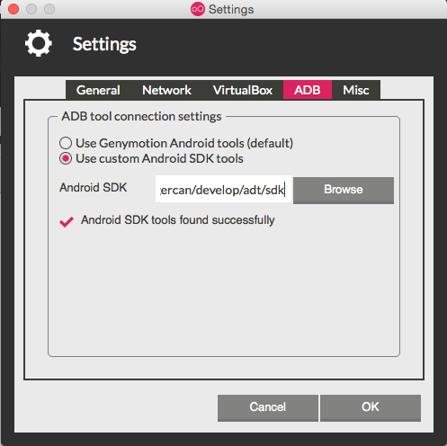

= Using Genymotion when developing Cordova Applications
:page-layout: blog
:page-author: gercan
:page-tags: [mobile, cordova, aerogear, android, jbosscentral]

http://www.genymotion.com[Genymotion] is an alternate Android emulator that is preferred by some developers for
its better performance and accurate device emulation. Although, we have not specifically tried to support
Genymotion as part of Hybrid Mobile tools, it is possible and easy to enable Genymotion for developing Cordova 
applications.

== Emulator or device ?
Hybrid mobile tools uses http://developer.android.com/tools/help/adb.html[ADB] to work with Android devices
and emulators. Fortunately, it is possible to use ADB to connect to Genymotion. which means that you 
still need the Android SDK installed for this to work. 

By default, Genymotion uses its own Android tools but you can change it to use the tools from the Android SDK.
After you start the Genymotion application, open settings using the btn:[Settings] from the menu bar. 
On the settings dialog switch to `ADB` tab. Select `Use custom Android SDK tools` option and specify
the location the `Android SDK` field. End result should look similar to the screen capture below.

Once Genymotion is configured to use ADB, start a virtual device from Genymotion application. ADB will
recognize it as a device, rather than an emulator. Hereafter, you can use `Run On Android Device` from the 
run menu on Hybrid Mobile projects to test Cordova applications on Genymotion. 

So what happens when you already have a real device connected on debug mode? Unfortunately, you can work with
only one device at a time, so you need to disconnect the device, to allow Genymotion to receive the application. You 
can follow https://bugs.eclipse.org/bugs/show_bug.cgi?id=455982[the issue on Eclipse Bugzilla] to find out when such use will be supported, and as usual, encourage for a quicker resolution.

Gorkem Ercan