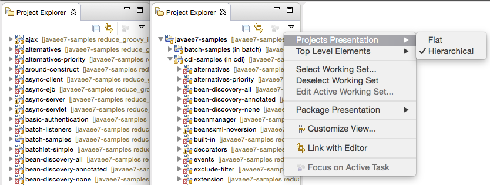

= JBoss Tools Alpha1 for Eclipse Mars
:page-layout: blog
:page-author: maxandersen
:page-tags: [release, jbosstools, devstudio, jbosscentral]

Happy to announce first Alpha build for Eclipse Mars M5.

Downloads available at link:/downloads/jbosstools/mars/4.3.0.Alpha1[JBoss Tools 4.3.0.Alpha1] or through Eclipse Marketplace.

== Installation

This version of JBoss Tools targets Eclipse Mars 4.5 (M5).

We recommend using the
http://www.eclipse.org/downloads/packages/eclipse-ide-java-ee-developers/marsm5[Eclipse
4.5 JEE Bundle] since then you get most of the dependencies
preinstalled.

Once you have installed Eclipse, you use our update site directly:

    http://download.jboss.org/jbosstools/mars/development/updates/core/
 
Note: Marketplace entry and Integration Stack tooling will become available from JBoss Central at an later date.

== What is new ? 

As always there is more than can be covered in a single blog but here are some of my favorites. You can see everything in the link:/documentation/whatsnew/jbosstools/4.3.0.Alpha1.html[What's New section for this release].

== Java EE 7 Batch and CDI Support

The initial work on providing a structured editor for Java EE 7 Batch
`job.xml` files are in. The editor is based on
https://eclipse.org/sapphire/[Eclipse Sapphire] and over time we want
to extend it for smarter content assist both in the structured editor
but also in the source view.

image::/documentation/whatsnew/batch/images/4.3.0.Alpha1/editor.png[Java EE 7 Batch Editor]

Furthermore for Java EE 7 we've now added auto enablement of CDI for Java EE 7 projects.
Meaning the tools also now honor Java EE 7 CDI spec about no longer requiring beans.xml for
activating CDI. 

== BrowserSim Standalone and iPhone 6 skins

BrowserSim adds skins and layout for iPhone 6 devices. 

image::/documentation/whatsnew/browsersim/images/4.3.0.Alpha1/iphone6.png[]

These skins and others are also available in BrowserSim Standalone
mode which allow you to run Browersim without depending on a full
Eclipse install.

You can use this "oneliner" to try it out:

```
curl -L -o bs.zip http://bit.ly/browsersim-3-7-ss-jar && unzip bs.zip && java -jar browsersim.jar tools.jboss.org
```

If you are on OSX you need this one:

```
curl -L -o bs.zip http://bit.ly/browsersim-3-7-ss-jar && unzip bs.zip && java -XstartOnFirstThread -jar browsersim.jar tools.jboss.org
```

== "Most popular" Palette

We've extended the HTML5 palette to include more easy add of html5 elements.

image::/documentation/whatsnew/jst/images/4.3.0.Alpha1/palette.png[]

This grew the palete to be rather big thus we came up with adding a 'Most popular' slot so you
always have easy access to the elements you used most often.

The following video shows how that works.

video::cmgU4eKzJDQ[youtube]

== Feed Henry support

If you are Feed Henry user we've now added support for easy importing and running of 
your Feed Henry Cordova applications.

image::/documentation/whatsnew/aerogear/images/1.2.0.Alpha1/importFeedHenryAppWiz.png[]

== Windows Phone support

Apache Cordova support now includes support for Windows Phone projects (requires you to run on Windows still though :)

image::/documentation/whatsnew/aerogear/images/1.2.0.Alpha1/WPExport.png

This also adds support for running Windows Phone Emulator.

== Hierarchical projects 

This feature is actually part of Eclipse M5 and not directly JBoss
Tools but I wanted to mention it because the feature is awesome and it
was contributed by us by the great work of Mickael Istria.

In Eclipse M5 the Project Explorer now have a "Projects Presentation"
in its view menu. Allowing you to switch from the traditional "Flat"
view to the new "Hiearchical". This new option lets you view the projects
as they are structured on the filesystem as opposed to one big flat list.



This is especially super helpful for those who have large multimodule Maven projects. Now you can get some sanity back.

== Next steps

While we wait for feedback on Alpha1, we are already working on what will become Alph2. Some of things that are moving here are:

. OpenShift v3 
. Docker Tooling 
. Better JavaScript content assist
. deprecate/remove visual JSF page editor, focusing on html5 preview.
. Making project imports in Eclipse simpler
. and more

We'll keep you posted!

Have fun!

Max Rydahl Andersen +
http://twitter.com/maxandersen[@maxandersen]


