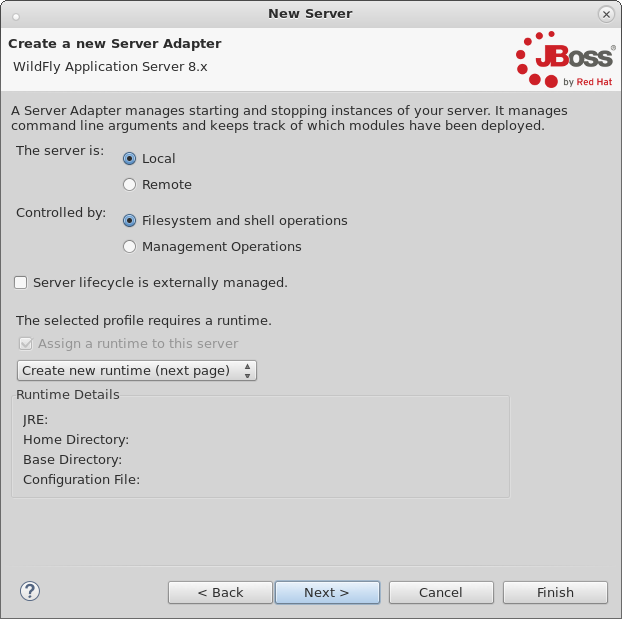
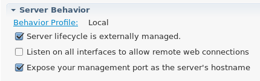
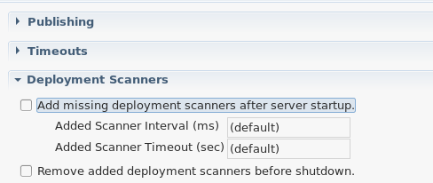
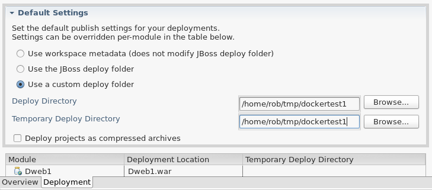

= Getting started with Docker and Wildfly
:page-layout: blog
:page-author: rstryker
:page-tags: [jbosstools, devstudio, server, docker, wildfly]

So you've heard the buzzwords and all the hype around link:http://www.docker.com[Docker],
but you haven't had the chance to play around with it yet or see if it fits your needs. 
You're already an avid user of JBossTools, and are fairly familiar with starting and stopping
your local or remote Wildfly installation, and deploying web applications to it. 

If this describes you, and you're interested in trying out Docker, then this blog is targeted to you. 

== Docker Installation

Docker's installation method differs based on your platform. You'll want to 
review link:https://docs.docker.com/installation/#installation[Docker's Installation] guides
for your respective platforms. 

== Running the default wildfly image

Wildfly has published their docker images for public consumption. These images are very standard, 
but a little restrictive for our needs. But, just to make sure your docker installation has worked, 
and that Wildfly can start without any errors, we can do the following:

 docker run -it jboss/wildfly

This command will run the Docker image for jboss/wildfly in its default state with no customizations. 
Once this is run, the command will not only start up your container, but also launch the server
in standalone mode, and connect a terminal to it so you can see the output. 

Assuming you see the console output, and the server runs with no errors, then you're 
generally set up and ready for the next step. 

To terminate the container, you can simply press `Ctrl+C`. If, for some reason, 
your image has frozen, and `Ctrl+C` isn't working, you can also run the following
commands to kill it forcefully. 

Let's see what containers are currently running:

....
[root@localhost jbds_wf_external]$ docker ps
CONTAINER ID        IMAGE                  COMMAND                CREATED             STATUS              PORTS                NAMES
a798d07859f8        jboss/wildfly:latest   "/opt/jboss/wildfly/   4 seconds ago       Up 3 seconds        8080/tcp, 9990/tcp   backstabbing_poitras   
....

To kill the container, we'd then execute `docker kill a798d07859f8`, replacing the given hash with your CONTAINER ID. 

== What's Missing

The default docker image is lacking a few things for our needs. 
First, we'd generally like our Wildfly installation to expose our 
management port if we
require any management actions or JMX introspection. 
We might also like SSH access to this machine, if we intend to treat it as a remote system
and deploy our applications over SCP. 
We might like to map in 
some local folders to the running container, if we'd prefer a more quick-and-dirty solution. 
We could also expose some of the ports from our container 
as if they were ports on our localhost. 

Depending on our usecase, we may do some or all of the above. 

== Externally Managed Local Server With Deployment Folder Mapping

For an externally managed server, where we won't be starting or 
stopping it from Eclipse, there's a few small changes we can make
in our command line to launch the image that can make the default
image much more useful for us. 

=== Viewing the Running Server's Welcome Page

At each launch of our container, the container is granted an IP address. 
If we were to run our container with the default command as shown above, 
we'd need to constantly change the IP address of our Server Adapter in JBossTools. 
To find out the IP of the container, we'd run the following:

....
[root@localhost docker]$ docker ps
CONTAINER ID        IMAGE                  COMMAND                CREATED             STATUS              PORTS                                            NAMES
f70149043400        jboss/wildfly:latest   "/opt/jboss/wildfly/   58 seconds ago      Up 58 seconds       0.0.0.0:8080->8080/tcp, 0.0.0.0:9990->9990/tcp   ecstatic_darwin     

[root@localhost docker]$ docker inspect -f '{{ .NetworkSettings.IPAddress }}' f70149043400
172.17.0.25
....

To see the Wildfly welcome page, we could open up any browser and browse to `http://172.17.0.25:8080`.  
But again, this IP address will change every launch.  To get this to work in tools, 
we'd need to constantly change our host in our 
Server Editor, which would quickly become tedious. These commands to get the IP address are also pretty tedious and verbose
and not at all convenient.  

To make this easier, we can map 
our container's ports to our localhost ports, exposing those from our container as if they were on localhost. 

 docker run -it -p 8080:8080 -p 9990:9990 jboss/wildfly

In this way, we can now open our browser to `http://localhost:8080` to see the Wildfly welcome page. 

=== Mapping a deployment folder

Since we're not exposing SSH in this example, and we're not using the Management profiles in JBossTools, 
we need a way for our server to pick up our deployments. The easiest way to do this is to map in a local folder 
from our host into our container. For this example, we'll make a temporary directory somewhere on our host, 
and tell our Docker container to treat that as the standalone/deployments folder inside the container. In this way, 
changes the container makes to the folder can be visible on the host, and vice versa. 

*Mapping Folders may cause IO errors for SELinux!*  To ensure your container can actually read and write to the folder, 
you'll need to run `setenforce 0` to disable SELinux, or, alternatively, give Docker the permissions and exceptions in SELinux. 

....
[root@localhost jbds_wf_external]$  mkdir /home/rob/tmp/dockertest1
[root@localhost jbds_wf_external]$  docker run -it -p 8080:8080 -p 9990:9990 \
-v /home/rob/tmp/dockertest1:/opt/jboss/wildfly/standalone/deployments/:rw  jboss/wildfly
....

If you were to now place a .war file inside `/home/rob/tmp/dockertest1`, it will be picked up by the deployment scanner, 
and visible in a web browser. 

=== Making your Server Adapter

The final step of this example is to create your Wildfly 8.2 server adapter in JBossTools, 
and to create and deploy a web application to your temporary folder, which in my case is
`/home/rob/tmp/dockertest1`

First, we'll open the `Servers View` and create a new `Wildfly 8.x` server adapter.
Since we're exposing our container's ports on our localhost, we can leave the host as 
`localhost`. Make sure your server is marked as `Local` and Controlled by `Filesystem and shell operations` 
as shown below. 

Since we're hacking a Local Filesystem server adapter to work for Docker, we'll still need a local
runtime in this example, so there's no real way to avoid that. 

=== Configuring your Server Adapter

Once your server is created, you'll find it in the `Servers View`, where we can double-click
it to open the `Server Editor`.  From here, we can make what configuration changes we'll need. 
First, we'll need to make sure the server is `Externally Managed`.  This means 
our attempts to start and stop it in Eclipse will be mostly ignored, since we're
expecting the user to handle that via Docker. 

Next, we'll need to disable the tooling for keeping deployment scanners in sync with
the locations JBossTools expects to be deploying. Since we've already mapped the folder
in via the Docker command line, we won't need any additions to the deployment scanners at all. 

And finally, on the `Deployment` tab of the Server Editor, we'll want to 
mark the default deploy folder to be a *Custom* location, and choose the folder
that we previously mapped in via Docker's command line, as shown below:

Once all this is done, we can save the editor, and our server adapter is configured properly. 

=== Make a Web Project

In this example, we can create a very simple web project by browsing to
`File -> New -> Dynamic Web Project`, Once the web project is created, we can
create a simple `index.html` in the `WebContent` folder. 

=== Starting the Server

Now that everything's set up in Eclipse, we can start our Docker container as we mentioned before:

 docker run -it -p 8080:8080 -p 9990:9990 -v /home/rob/tmp/dockertest1:/opt/jboss/wildfly/standalone/deployments/:rw  jboss/wildfly

=== Starting the Server Adapter

In Eclipse, we can now right-click our server, and select `Start`. This
shouldn't launch any commands, since we marked the server as `Externally Managed`. 
The server adapter is configured to check `localhost:8080` to see if the server is 
up or not, so it should quickly move to a state of `[Started, Synchronized]`. 

=== Deploying the Web Application

We can now right-click on our index.html project, and select 
`Run As -> Run On Server` and follow the on-screen directions to deploy
our web application.  We should then notice the Eclipse internal browser
pop up and display the content of our index.html files. 

== Conclusion

In this first example, we've seen how to install and configure the default
Wildfly Docker images. In future examples, we'll see how to extend those images
for Management or SSH/SCP usecases. 

 - Rob Stryker 
