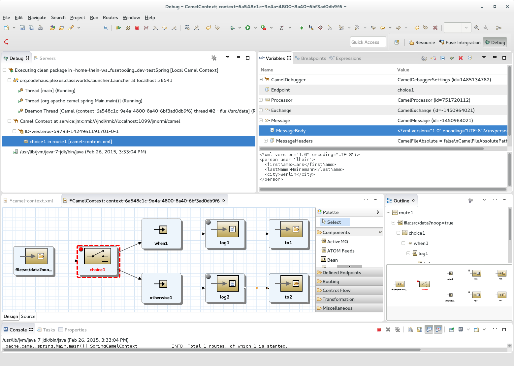
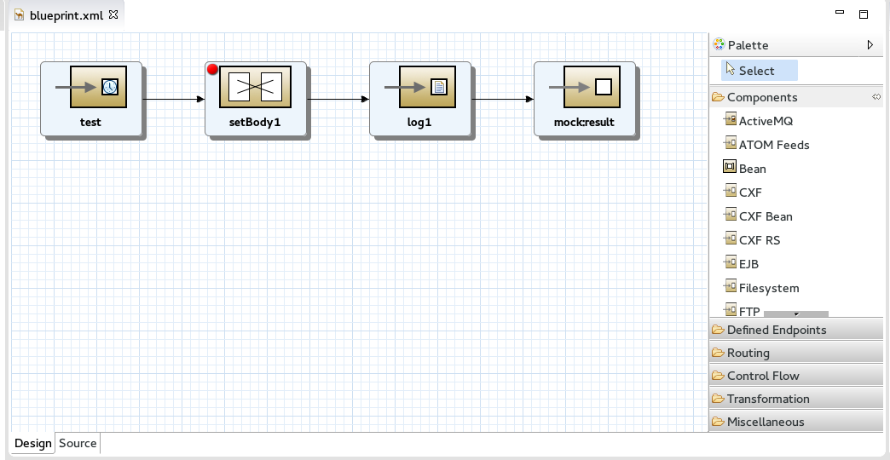
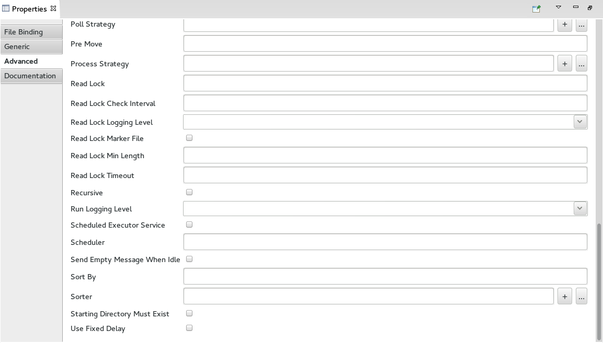
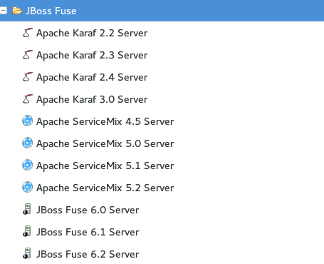
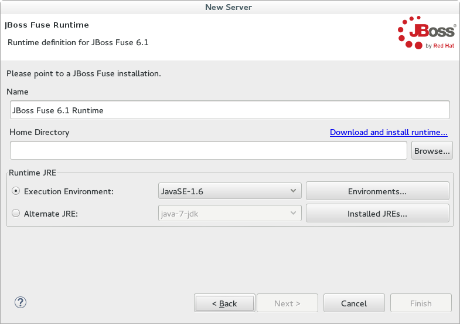

= Improved JBoss Fuse Tooling coming soon... 
:page-layout: blog
:page-author: lhein
:page-tags: [fuse, camel, jbosstools, devstudio, jbosscentral]

I am happy to announce some of the highlights of the upcoming release of the http://tools.jboss.org/features/apachecamel.html[Red Hat JBoss Fuse Tooling].
It will be available via early access in the JBoss Tools Integration Stack 4.2 / Developer Studio Integration Stack 8.0. 

== What is new?

There are a lot of improvements and bugfixes and I just want to pick the most important things for now. You can see a full list of changes in the *What’s New* section for the release.

== Apache Camel Debugger

You probably already used the tracing functionality for a running Camel Contexts, but now we are happy to finally give you a Camel Debugger. Using the Eclipse Debug Framework we created our own Camel Debugger which works fully through the design view of the Camel editor. Here you can set your breakpoints (static and conditional ones) and breakpoints hit are highlighted in your design view. Instead of using the "Run as -> Local Camel Context" menu you can now use the "Debug as -> Local Camel Context" to startup the Context in debug mode. Once a breakpoint is hit Eclipse will automatically change to the Eclipse Debug perspective.

Step through your routes, add watch expressions, change message content on the fly or simply monitor what your routes do with the messages. Add a conditional breakpoint if you only want to debug on a certain condition. You choose the condition language and you setup the condition in an easy to use expression builder.

== Palette and Properties

Over the past weeks we worked on improvements regarding the usability of our Camel Route Designer. The result of that work is that we introduced a new drawer to the palette of the designer which provides easy to use items for Apache Camel Components. In the past you had to know that the Endpoint palette entry was used to create a connector for a Camel component just by prepending the right protocol name to the endpoints uri attribute field. That still left you alone in adding the correct Maven dependency to your projects pom.xml. When you now drop a component connector to the route the pom.xml gets updated automatically so you don't need to care any longer.  

Starting with version 2.14 the Apache Camel developers started implementing a model to determine URI parameters and their meta data. We now use the provided functionality to give our users improved property pages for the Apache Camel Components. 

(the above image shows the properties for a file connector endpoint)

== Server Adapters

Our server adapters have been reworked and we now provide adapters for the latest version of http://servicemix.apache.org/[Apache ServiceMix], http://karaf.apache.org/[Apache Karaf] and http://www.jboss.org/products/fuse/overview/[JBoss Fuse]. 

The wizard pages for creating the servers have been reworked too and you are now able to download the binaries directly from within your Eclipse session.

Another thing to mention is that we replaced the old deployment options with a new way to deploy your applications to the servers using the servers view. You can select the server entry there and choose to Add or Remove modules to/from the server. The deployed projects from your local workspace will be visible as a child node under the server item. Depending on your settings for the server publishing options your application will be republished automatically when it gets out of sync / is changed locally.

 
*I hope you enjoy the new stuff. Have fun!*

*Lars Heinemann*

