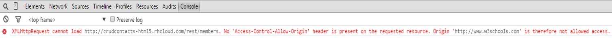
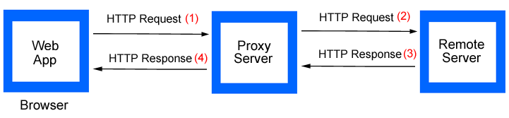
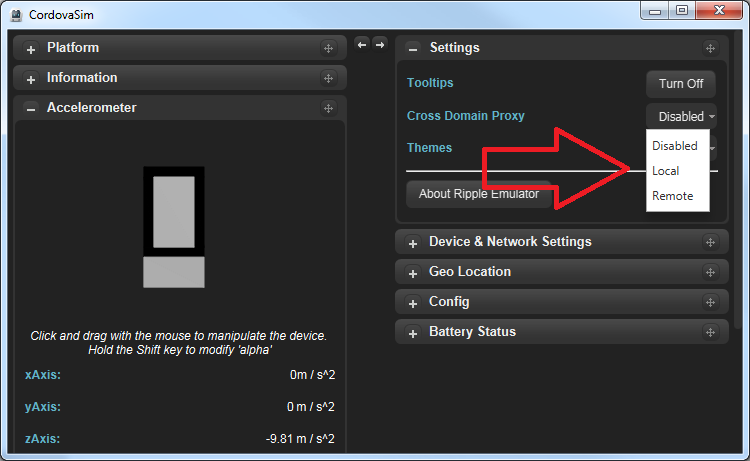

= How to handle Cross-domain AJAX in CordovaSim?
:page-layout: blog
:page-author: ibuziuk
:page-tags: [cordovasim, ripple, ajax, sop, xdr, jbosstools, devstudio, jbosscentral]

In this blog I would like to discuss probably the most important issue CordovaSim / https://github.com/apache/incubator-ripple[Ripple] users might face:

[quote, CordovaSim user]
 The $.ajax GET / POST / PUT / DELETE does not fire from inside of CordovaSim / Ripple - but it does via the IOS Simulator and from a real Android Device. How am I supposed to handle it?

Firstly, let's discuss the root of the problem...

== Same Origin Policy (SOP)
In computing, the http://en.wikipedia.org/wiki/Same-origin_policy[`Same Origin Policy`] is an important security concept for a number of browser-side programming languages, such as JavaScript. The policy permits scripts running on pages originating from the *same* site to access each other's methods and properties with no specific restrictions, but prevents access to most methods and properties across pages on *different* sites. Basically, if the web application sends request to the *same* server, then there will be no restrictions and everything will work like a charm. However, if the request is sent to *another* server (Cross-domain request - XDR), the browser will block it with the following error:  

== How to workaround Same Origin Policy (SOP)?
In the general case there are several ways to do it:

* `Proxy` - one can create a proxy and have it to fetch data from the remote server instead of sending request directly. To the browser it seems that web application exchanging the data on the same server:

* `http://en.wikipedia.org/wiki/JSONP[JSON with padding (JSONP)]` - this approach takes advantage of the fact that `<script>` tags are not subject to the Same-Origin policy. For instance, JavaScript libraries like jQuery can be included to the web page even if they are hosted on another server. More information about JSONP can be found in the following http://www.sitepoint.com/working-around-origin-policy/[article].
* `http://www.w3.org/TR/cors/[Cross-Origin Resource Sharing (CORS)]` - W3C standard that allows Cross-Domain communication from the browser. CORS support requires coordination between both the server and client. The basic idea behind CORS is to use custom HTTP headers to allow both the browser and the server to know enough about each other to determine if the request or response should succeed or fail. Cross-Origin Resource Sharing can be used as a modern alternative to the JSONP pattern. While JSONP supports only the GET request method, CORS also supports other types of HTTP requests. More information about CORS can be found in the following http://www.nczonline.net/blog/2010/05/25/cross-domain-ajax-with-cross-origin-resource-sharing/[blog].

Ripple and CordovaSim use `Proxy` approach for handling Cross-domain AJAX. 

== Cross-domain AJAX in CordovaSim 
There is a `Cross Domain Proxy` setting in CordovaSim / Ripple. Basically, Cross-domain AJAX work depends drastically on it. User can choose between three options: 

* *Disabled* - CordovaSim / Ripple will not proxy HTTP requests. This option should be used only if the remote server supports http://www.w3.org/TR/cors/[CORS]. If it is not, Cross-domain requests will be restricted by the Same Origin Policy.  
* *Local (default)* - local proxy will be used for handling HTTP requests. However, local proxy is implemented differently in Ripple and CordovaSim. Ripple has local http://nodejs.org/[Node.js] proxy server, whereas CordovaSim uses http://eclipse.org/jetty/[Jetty] ProxyServlet for that purpose. Nonetheless, from the user perspective there are no differences at all.
* *Remote* - both Ripple and CordovaSim will use the following https://rippleapi.herokuapp.com/xhr_proxy[remote server] for HTTP requests proxying.

NOTE: In most cases "Remote" and "Local" options can be used interchangeably for *remote* server calls. However, if the server is running *locally* one must use either "Local" or "Disabled" option depending on the local server configuration (i.e. CORS compatibility).   

== Security note for "Remote" proxy

In the `4.2.3.Beta1` and `4.3.0.Alpha1` releases a security warning for *"Remote"* proxy was added. 

image::images/remote-proxy-warning.png["Remote" proxy warning]

WARNING: If the app is transferring sensitive data (authentication tokens, credentials etc.), it is strongly recommended  to use *"Local"* proxy (enabled by default) instead of the *"Remote"* one. The *"Remote"* proxy is cloud-hosted and there is a potential leak threat. Nonetheless, if the hybrid app has no sensitive data, one can safely use *"Remote"* proxy without any risk.

== Conclusion
To put it in a nutshell, there is no silver bullet for handling all Cross-domain AJAX requests in CordovaSim / Ripple, due to the fact that it dramatically depends on the server side setup. So, if one has faced the issue coupled with the Same Origin Policy / Cross-Domain AJAX (i.e. GET / POST / PUT / DELETE requests the hybrid app is trying to perform are either blocked by the browser or server returns 5XX error), the first thing they should do is to "play" with `Cross Domain Proxy` settings. Using one of the options must definitely tackle the problem. +
Have fun!

Ilya Buziuk +
https://twitter.com/ilyabuziuk[@ilyabuziuk]
