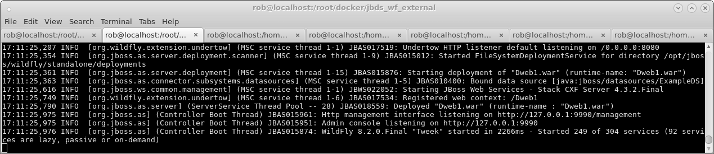
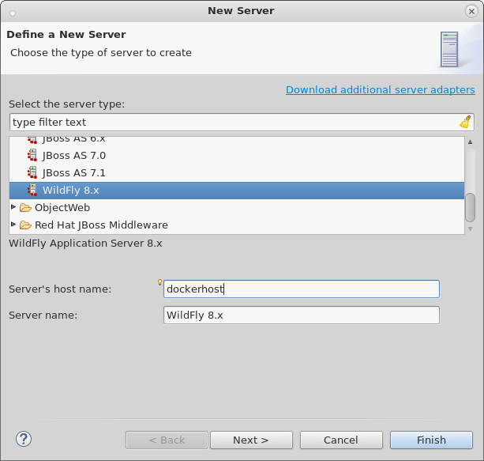
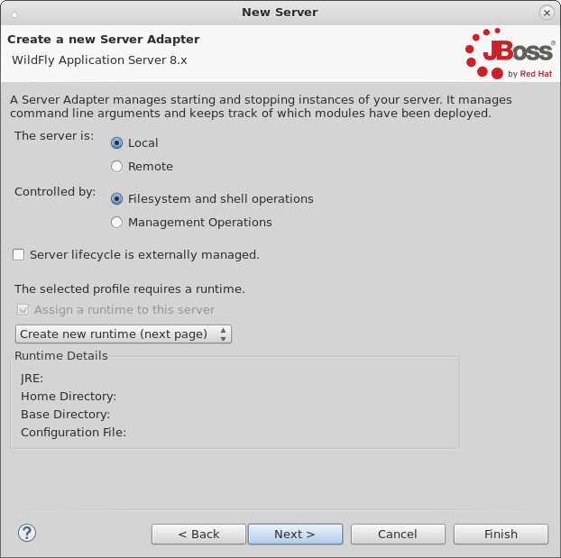
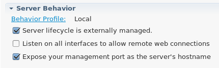
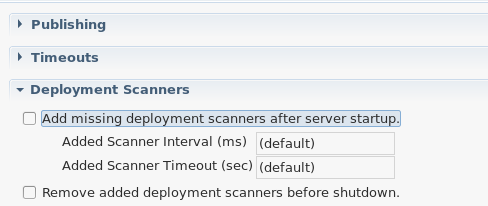
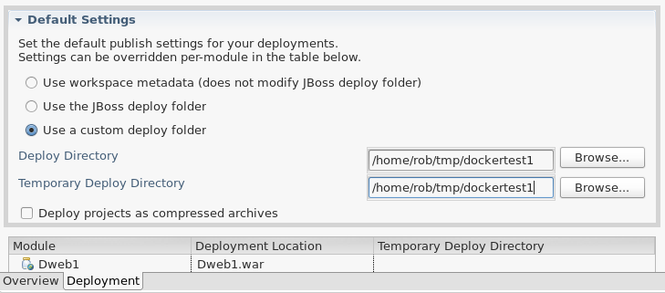

= Docker and WildFly Part 1 - Deployment via Docker volumes
:page-layout: blog
:page-author: robstryker
:page-tags: [jbosstools, devstudio, server, docker, wildfly]

So you've heard the buzzwords and all the hype around link:http://www.docker.com[Docker],
but you haven't had the chance to play around with it yet or see if it fits your needs. 
You're already an avid user of JBoss Tools, and are fairly familiar with starting and stopping
your local or remote Wildfly installation, and deploying web applications to it. 

If this describes you, and you're interested in trying out Docker, then this blog is targeted to you. 

== Docker Installation

Docker's installation method differs based on your platform. You'll want to 
review link:https://docs.docker.com/installation/#installation[Docker's Installation] guides
for your respective platforms. 

To make things unified across the various platform, we recommend you go and map `dockerhost` to
the ip of where your docker instance is running. 

By default on Linux that will be `127.0.0.1`, so you would add the following line to your `/etc/hosts` file:

   127.0.0.1 dockerhost

But on OSX and Windows it will be a unique IP you can get by running `boot2docker ip` (i.e. `192.168.59.122`). In that case
the following should be added:

   192.168.59.122 dockerhost
 
From now on you can use `dockerhost` in all your applications and get to it no matter what OS you are running on.

== Running the default wildfly image

Wildfly has published their docker images for public consumption. 
You can browse them at the link:https://registry.hub.docker.com/u/jboss/wildfly/[docker registry],
or go to link:http://www.jboss.org/docker/[http://www.jboss.org/docker/] for more information. 

These images are JBoss' standard Docker images and they do not expose more features than just
the bare minimum for production and reuse. This first blog will show how to use them as-is, but going
forward we will show how to configure them to be a bit more useful for development use cases. 

To make sure your docker installation has worked, and that Wildfly can
start without any errors, you can do the following:

 docker run -it -p 8080:8080 jboss/wildfly

This command will run the Docker image for jboss/wildfly in its default state, no customizations and
map port 8080 on your `dockerhost` to 8080 of the running jboss/wildfly container. 

Once this is run, the command will not only start up your container, but also launch the server
in standalone mode, and connect a terminal to it so you can see the output. 

You should also now be able to see WildFly default startup page on http://dockerhost:8080.

Assuming you see the console output, and the server runs with no errors and you can access
the welcome browser via `dockerhost` then you're set up and ready for the next step. 

To terminate the container, you can simply press `Ctrl+C`. If, for some reason, 
your image has frozen, and `Ctrl+C` isn't working, you can also run the following
commands to kill it forcefully. 

First list running containers:

....
[root@localhost docker]$ docker ps
CONTAINER ID        IMAGE                  COMMAND                CREATED             STATUS              PORTS                    NAMES
f70149043400        jboss/wildfly:latest   "/opt/jboss/wildfly/   58 seconds ago      Up 58 seconds       0.0.0.0:8080->8080/tcp   ecstatic_darwin     
....

Here I only have one container running; you might have more. But to
kill any container, you execute `docker kill f70149043400`, replacing
the given hash with your value from `CONTAINER ID` column.

== Externally Managed Local Server With Deployment Folder Mapping

Since the Docker image in this example does not have SSH enabled, and the Wildfly server 
is not exposing the Management port, we will need to configure JBoss Tools to use *custom filesystem deployments*. 
The way to do this is to map in a local folder from our host into our container. 

And since we start Wildfly via the Docker image, on the command-line. 
we'll want to configure our Server Adapter in JBoss Tools to be an *externally managed* server,
so it will not manage the start nor stop of the server.

=== Mapping a deployment folder

For this example, we'll make a temporary directory somewhere on our host, 
and tell our Docker container to treat that as the standalone/deployments folder inside the container. In this way, 
changes made to the folder can be visible in both the host and container.

WARNING: Mapping Folders may cause IO errors for SELinux!*  To ensure your container can actually read and write to the folder, 
you'll need to run `setenforce 0` to disable SELinux, or, alternatively, give Docker the permissions and exceptions in SELinux. 
See link:http://stackoverflow.com/questions/24288616/permission-denied-on-accessing-host-directory-in-docker[this] stackoverflow post for more information.

....
[root@localhost jbds_wf_external]$  mkdir /home/rob/tmp/dockertest1
[root@localhost jbds_wf_external]$  docker run -it -p 8080:8080 \
-v /home/rob/tmp/dockertest1:/opt/jboss/wildfly/standalone/deployments/:rw  jboss/wildfly
....

The ':rw' at the end is important, since without it the docker container cannot write to it, only read.

If you were to now place a .war file inside `/home/rob/tmp/dockertest1`, it will be picked up by the deployment scanner, 
and visible in a web browser. Take note of the folder, since we'll use that in the configuration of the Server Adapter.

=== Making your Server Adapter

The final step of this example is to create your Wildfly 8.2 server adapter in JBoss Tools, 
and to create and deploy a web application to your temporary folder, which in my case is
`/home/rob/tmp/dockertest1`

First, we'll open the `Servers View` and create a new `Wildfly 8.x` server adapter.
Since we're exposing our container's ports on `dockerhost`, we need to set the host to 
`dockerhost`. 

The server should still be marked as `Local` and Controlled by `Filesystem and shell operations` 
as shown below. 

Since we're hacking a Local Filesystem server adapter to work for Docker, we'll still need a local
runtime in this example, so point it to any locally installed WildFly server you have. 

In link:https://issues.jboss.org/browse/JBIDE-19388[JBIDE-19388] we are looking at ways to avoid requiring this step.
 
=== Configuring your Server Adapter

Once your server is created, you'll find it in the `Servers View`, where we can double-click
it to open the `Server Editor`.  From here, we can make what configuration changes we'll need. 
First, we'll need to make sure the server is *Externally Managed*.  This means 
JBoss Tools will not attempt to start and stop it from Eclipse, it is
expecting you the user handles that via Docker. 

Next, we'll need to disable the tooling for keeping deployment scanners in sync with
the locations JBoss Tools expects to be deploying. Since we've already mapped the folder
in via the Docker command line, we won't need any additions to the deployment scanners at all. 

And finally, on the `Deployment` tab of the Server Editor, we'll want to 
mark the default deploy folder to be a *Custom* location, and choose the folder
that we previously mapped in via Docker's command line, as shown below:

Once all this is done, we can save the editor, and our server adapter is configured properly. 

=== Make a Web Project

In this example, we can create a very simple web project by browsing to
`File -> New -> Dynamic Web Project`, Once the web project is created, we can
create a simple `index.html` in the `WebContent` folder. 

=== Starting the Server

Now that everything's set up in Eclipse, we can start our Docker container as we mentioned before:

 docker run -it -p 8080:8080 -v /home/rob/tmp/dockertest1:/opt/jboss/wildfly/standalone/deployments/:rw  jboss/wildfly

=== Starting the Server Adapter

In Eclipse, we can now right-click our server, and select `Start`. This
shouldn't launch any commands, since we marked the server as `Externally Managed`. 
The server adapter is configured to check `dockerhost:8080` to see if the server is 
up or not, so it should quickly move to a state of `[Started, Synchronized]`. 

=== Deploying the Web Application

We can now right-click on our index.html project, and select 
`Run As -> Run On Server` and follow the on-screen directions to deploy
our web application.  We should then notice the Eclipse internal browser
pop up and display the content of our index.html files. 

Congratulations - you just used JBoss Tools to deploy a local running Docker hosted WildFly server.

== What could be better ?

The default docker image is restricted by default. This means
it does not have the Management port exposed, nor JMX nor file system access via SSH.

All this means that currently you have to go through some setup to use them from existing tools,
but luckily we are doing two things:

. we will post more blogs explaning how to enable some of these features to use todays tools (not just JBoss Tools)
with 'raw' docker.
. we are working on making the steps simpler when using Docker 'raw'

== Conclusion

In this first example, we've seen how to install and configure the default
Wildfly Docker images. 

To summarize, here are the steps needed:

. Start Docker with 8080 mapped and with `/opt/jboss/wildfly/standalone/deployments` mounted as volume
. Configure server to run on `dockerhost`, be *externally managed* and Custom deploy to the volume above

In future examples, we'll see how to extend those images for Management or SSH/SCP usecases. 

 - Rob Stryker 
