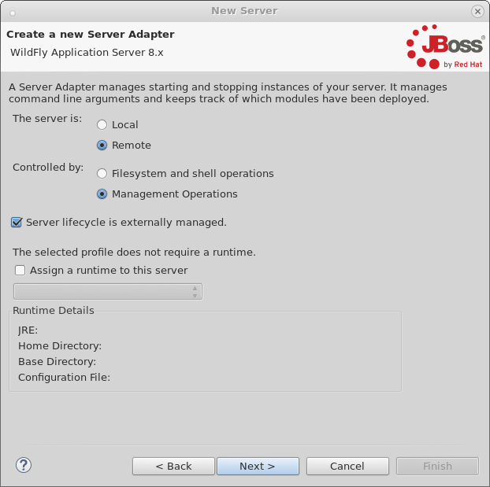
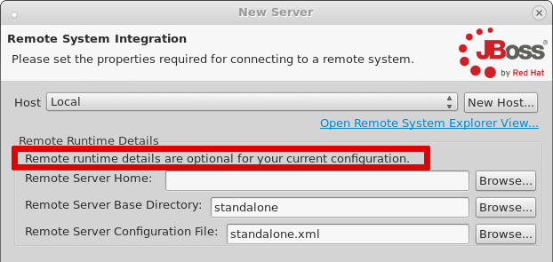
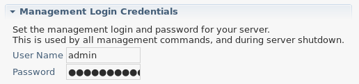

= Docker and WildFly Part 2 - Deployment over management API
:page-layout: blog
:page-author: robstryker
:page-tags: [jbosstools, devstudio, server, docker, wildfly]

If you've already link:2015-03-02-getting-started-with-docker-and-wildfly.html[gotten started] with trying out 
Docker and JBoss Tools, and want to see what other options are available, this blog post will  
explain how to run Wildfly in a Docker container and configure it for management tasks and
managed deployments. 

== Customizing your Dockerfile

Since the default `jboss/wildfly` Docker configuration doesn't expose the management port by default, we'll need
to customize it, and this means writing your very first `Dockerfile`. Our goals here are 
to add a management user to the Dockerfile, and also to expose the management ports when
running the container. 

First, you'll want to make a folder on your filesystem that you can play around in. 
I'll name mine `docker_jbds_wf_mgmt` - 
Inside this folder, we'll make a new file named `Dockerfile` and give it the following content:

....
FROM jboss/wildfly:latest

USER jboss
RUN /opt/jboss/wildfly/bin/add-user.sh admin Admin#70365 --silent
CMD ["/opt/jboss/wildfly/bin/standalone.sh", "-b", "0.0.0.0", "-bmanagement", "0.0.0.0"]
....

You can see that we're extending the original `jboss/wildfly` container. 
In the above `RUN` command, we're also adding a management user. Feel free
to customize the password as you wish.  

WARNING: Exposing actual or sensitive passwords in a publicly accessible Dockerfile is dangerous.
Make sure to only use example credentials in publicly available Dockerfiles.

Finally, we're making sure that when the Docker container runs
`standalone.sh`, it is also making sure to bind the management port to 
all possible hosts, helping to expose it for use. 

=== Building your new Dockerfile

You can give your new configuration any name you want when building it. 
I'll build mine here, and give it the name `wildfly-mgmt` :

 docker build --tag=wildfly-mgmt .

=== Running your new Dockerfile

To run your new configuration, run the following command, replacing the last
parameter with what name you chose when building the Dockerfile. 

 docker run -it -p 8080:8080 -p 9990:9990  wildfly-mgmt

Note that, unlike the previous post, we do not need to launch with custom volume mappings.
All we need is the addition of the management port.

==  Configuring a Server in JBoss Tools

image::images/20150226_docker/local_fs_0.png[]

When creating the server remember to set the host to be `dockerhost` ( at least on OSX and Windows ) as shown above. 

Since we've configured the server to be remote, and for communication with the server
to be handled over the management port, we mark it as `Remote` and 
controlled by `Management Operations` in the second page of the New Server wizard. 
We also don't require a runtime here, though we may need one later when creating 
a functional web project with classes. For now, we won't create one. You'll also
note that we have marked that the `Server lifecycle is externally managed`, 
which means we won't be starting or stopping the server via JBoss Tools, since
you'll be controlling that via Docker on your own. 

On the next page, you'll note that our remote runtime details are optional. 
Since the server is configured only for management operations, we have no real need
to know where the filesystem is located or how to access it. We can safely ignore
this page and just proceed through it. 

Now, your server is created, but we still need to set the management credentials. 
First, double-click your Server in the `Servers View` to open the `Server Editor`. 
Then, set your credentials as you did in your `Dockerfile` as shown below. 
You'll note that some default values are already there, and so you'll need to 
delete them and set your own values. 

== Creating Your Web Project

In this example, we can create a very simple web project by browsing to
`File -> New -> Dynamic Web Project`, Once the web project is created, we can
create a simple `index.html` in the `WebContent` folder.

=== Starting the Server

Now that everything's set up in Eclipse, we can start our Docker container as we mentioned before:

 docker run -it -p 8080:8080 -p 9990:9990  wildfly-mgmt

=== Starting the Server Adapter

In Eclipse, we can now right-click our server, and select `Start`. This
shouldn't launch any commands, since we marked the server as `Externally Managed`. 
The server adapter is configured to check over the management port at `dockerhost:9990` 
to see if the server is up or not, so it should quickly move to a state of `[Started, Synchronized]`. 

=== Deploying the Web Application

We can now right-click on our index.html project, and select 
`Run As -> Run On Server` and follow the on-screen directions to deploy
our web application.  We should then notice the Eclipse internal browser
pop up and display the content of our index.html files. 

== Conclusion

In this second example, we've seen how to install and configure a
Wildfly Docker image customized for management operations in JBoss Tools. 

To summarize, here are the steps needed:

. Create your own 'Dockerfile` that uses the existing `jboss/wildfly` configuration, but also adds  a management user and starts server with the management port exposed
. Start Docker with 8080 and 9090 mapped
. Configure the server to run on `dockerhost`, using Remote management settings and have lifecycle *externally managed*

As you hopefully noted, this kind of setup is much more straightforward (no messing with paths); unfortunately it
does have a downside since all publishes are full publishes over the management API. Because of this, incremental updates will not work in this case.

In a future example, I hope that we'll see how to create an image customized for SSH access, 
which will allow starting and stopping the server and support incremental updates. 

Rob Stryker 
