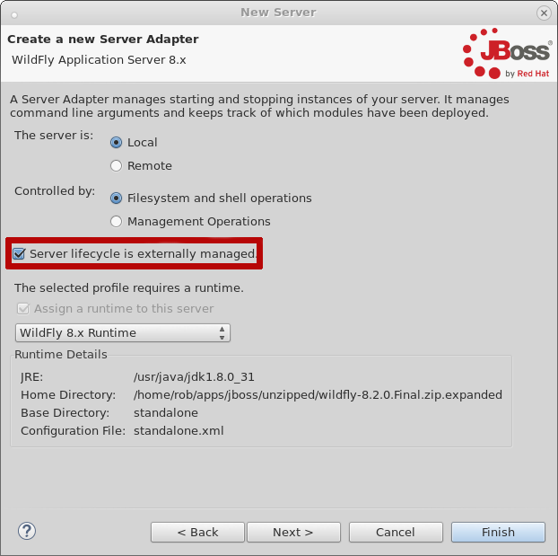
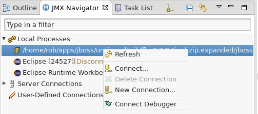

= Debugging an Externally launched WildFly
:page-layout: blog
:page-author: robstryker
:page-tags: [jbosstools, devstudio, server, wildfly]

Debugging externally-launched Java applications has always been possible in Eclipse via the `Remote Java Application` launch configuration type, so long as you manually add the host and debug port to the launch configuration.  A few years ago, you may have link:http://docs.jboss.org/tools/whatsnew/core/core-news-3.3.0.M3.html[seen an enhancement] we here at JBoss Tools provided, making it easier to connect your sourcecode in Eclipse to an externally-launched process.

Well, history tends to repeat itself, and more enhancements are in the pipeline that make this even easier. We expect the enhancements in this blog to be present in JBoss Tools 4.3.0.Alpha2, so be prepared ;) You can track the progress at link:https://issues.jboss.org/browse/JBIDE-19397[JBIDE-19397], or try it out by installing our link:https://tools.jboss.org/downloads/jbosstools/mars/4.3.0.Nightly.html[nightly build].

While the changes you'll read here today apply to all running java applications, I'll be focussing on debugging an externally launched WildFly for this article.

== The JMX Navigator

JBoss Tools has shipped a JMX Navigator for several years. Changes in the past year have brought with it an enhancement to the JMX Navigator in our most recent release. An extension to the JMX Navigator can now also auto-detect locally running processes, and allow a user to browse their JMX tree.

Not only can we can automatically detect all running java processes, we can also see which ones have been run with the proper debug flags such that a remote debugger can connect to it.

== How can this be used with WildFly?

WildFly has the ability to be launched with the `--debug` flag. This will expose the port `8787` for a debugger to connect to. But if you didn't know the port, and your startup was taking longer than you'd like, or it was scrolling too fast for your liking, and your google is broken, you could simply right-click the new process in the JMX Navigator and select `Connect Debugger`.  This is an incremental improvement over our past work, because it's been trimmed down from a right-click action on a project, followed by a dialog, to just the right-click action on the process directly.

== This sounds too easy... show me

Alright, I'll show you.

=== Set up your environment

First, in JBoss Tools, go ahead and make yourself a new server adapter for WildFly. You can use any of the configuration options you want, really. It shouldn't make a difference at all.

The only thing you must do, though, is when creating your server adapter, make sure you check `Server lifecycle is externally managed`.




Once this is done, we can make a simple Dynamic Web Project with a Servlet. To do this, select `File -> New -> Dynamic Web Project` and follow the wizard's instructions. After that, right-click your project, and select `File -> New -> Servlet`. A stub file will be generated for you, but we'd like to have it respond something, so let's go ahead and change the doGet method as follows:

```
	protected void doGet(HttpServletRequest request, HttpServletResponse response)
			throws ServletException, IOException {
		String ret = "Hello World: " + System.currentTimeMillis();
		response.getOutputStream().write(ret.getBytes());
	}
```

Let's also go ahead and set a breakpoint here, just so we can see when it gets hit later on.


=== Start the Server via Command Line

In a terminal, you can browse to your WildFly installation and simply run the following:

     ./standalone.sh --debug

=== Deploy the project

In your project, browse to your servlet's java file and select it in the Package Explorer, Project Explorer, Navigator, or whichever other view you prefer. Right-click on it, and select `Run as -> Run on Server...` to deploy it.

This action will attempt to start your server, so if you didn't make sure to check the `Server lifecycle is externally managed` checkbox during creation, you may run into problems. If you did, though, your server adapter is configured to take no action during 'start'.

In the terminal, you should see some output indicating the module was published.

```
06:12:01,896 INFO  [org.jboss.as.server.deployment] (MSC service thread 1-16) JBAS015876: Starting deployment of "DWS.war" (runtime-name: "DWS.war")
06:12:01,947 INFO  [org.wildfly.extension.undertow] (MSC service thread 1-14) JBAS017534: Registered web context: /DWS
06:12:02,009 INFO  [org.jboss.as.server] (DeploymentScanner-threads - 1) JBAS018565: Replaced deployment "DWS.war" with deployment "DWS.war"
```

You should also notice that the internal web browser has opened up to your servlet in JBoss Tools, and shows some content... but your breakpoint wasn't hit. Your remote debugger hasn't been connected.

=== So connect the debugger!

If it's not already open, go ahead and open your JMX Navigator view. You should see a few entries already under `Local Processes`, since Eclipse is running, and so is WildFly.




You can just go ahead and click `Connect Debugger`. Now, if you switch to the browser that was opened previously and refresh the page, your breakpoint should be hit, and it should browse to your servlet's code.

To detach the debugger, you can right-click the same entry again and simply click "Disconnect Debugger".


== Can't you already launch a server with a debugger attached?

Yes, you can. But not all developers will want the debugger connected at all times.
They may have custom startup scripts, or personal preferences such that they prefer
to always launch via command line, but still wish for convenient access
to the debugger.   When a server is launched in debug mode from inside
eclipse, you cannot disconnect the debugger without also stopping the server.
This enhancement allows you to keep the two actions separate, which, we hope,
makes our tools more useful for a wider range of individuals.

== Conclusion

While small enhancements like this might seem small or incremental,
they add up to lots of changes that make your development experience faster,
smoother, and more flexible for a wider range of developers and all their
divergent personal preferences. We hope you like it.

Rob Stryker
