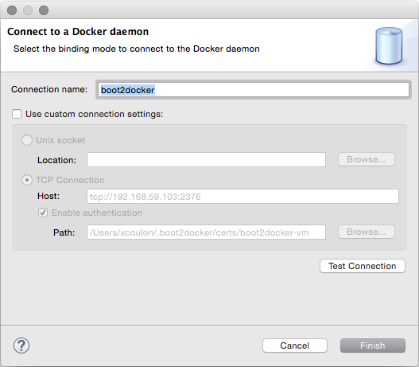
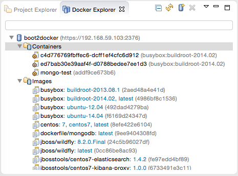
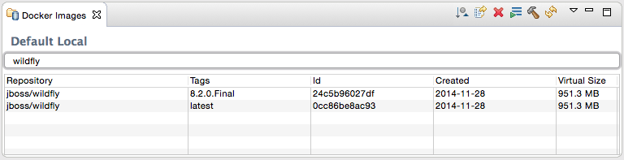
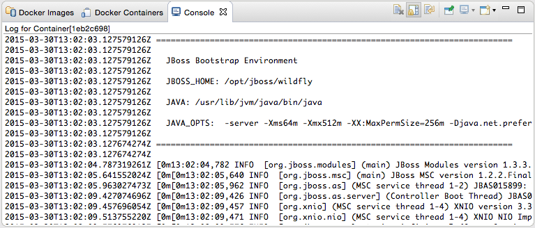
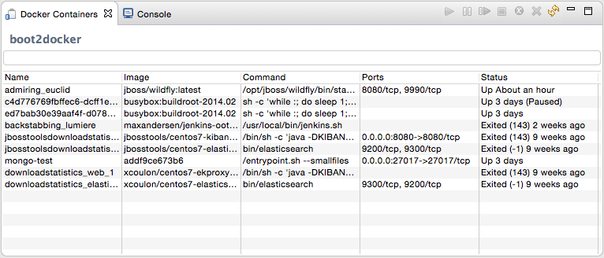
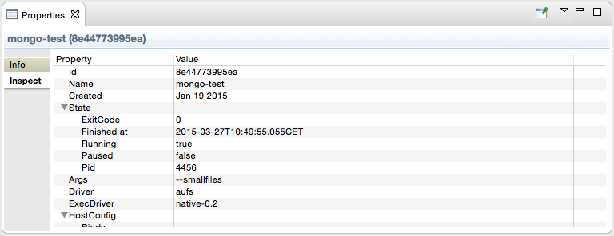

= Upcoming Docker Tooling for Eclipse
:page-layout: blog
:page-author: xcoulon
:page-tags: [jbosstools, docker, eclipse]

JBoss Tools and Eclipse Linux Tools team members from Red Hat are currently busy working on
Docker tooling for Eclipse and even though the code is not public yet (more details on that at
the end of this blog entry), I thought it would be interesting to share our progress on the project.

The Docker tooling is aimed at providing at minimum the same basic level features as the command-line
interface, but also provide some advantages by having access to a full fledged UI.

== Docker Explorer

The *Docker Explorer* provides a wizard to establish a new connection to a Docker daemon.
This wizard can detect default settings if the user's machine runs Docker natively or in a VM using Boot2Docker.
Both Unix sockets on Linux machines and the REST API on other OSes are detected and supported.
The wizard also allows remote connections using custom settings.

The *Docker Explorer* itself is a tree view that handles multiple connections and provides users
with quick overview of the existing images and containers.

Built-in filters can show/hide intermediate and 'dangling' images as well as
stopped containers.

== Managing Docker Images

The *Docker Images view* lists all images in the Docker host selected in the
Docker Explorer view. This view allows user to manage images, including:

- Pulling images from the https://registry.hub.docker.com/[Docker Hub Registry] (other registries will be supported as well)
- Uploading images to the https://registry.hub.docker.com/[Docker Hub Registry]
- Building images from a Docker files
- Running an image

A wizard let the user input all the arguments to create a new container from an image.
When the container is started, all the logs can be streamed into the Eclipse Console:

== Managing Docker Containers

The *Docker Containers* view lets the user manage her containers. The view toolbar
provides commands to start, stop, pause, unpause, attach and kill containers.

This view also provides a filter to show/hide stopped containers.
Users can also attach an Eclipse console to a running Docker container to follow
the logs and use the STDIN to interact with it.

== Info and Inspect on Images and Containers

We also integrate with the Eclipse Properties view to provide users with info and 'inspect'
data about a selected container or image.

== Where is the code ?

Roland Grunberg and Jeff Johnston from Red Hat started this project and are currently
in the process of getting the code accepted to Eclipse.org as part of the
http://www.eclipse.org/linuxtools/[Linux Tools project] (even if the tooling also runs on other platforms), which explains
why the code has not been made public yet.

Taking about code, we rely on the https://github.com/spotify/docker-client[open source Docker client
developed by Spotify] to handle the low-level communication with the Docker daemons
and I should thank the Spotify developers who maintain this library.
They've been very kind to quickly review and merge the pull requests
that we've submitted and it's been a pleasure to contribute to their project.
Open source collaboration FTW :-)

== What's next ?

There is still some work and the screenshots showed above may still
evolve as we add more features, but we hope that this blog entry will give
you a taste of what's coming soon in Eclipse with regards to Docker tooling.

While the code will be hosted in http://www.eclipse.org/linuxtools/[Linux Tools project]
at Eclipse.org, we intend to also ship it as part of
JBoss Developer Studio 9 and JBoss Tools 4.3 later this year.

We also created a https://issues.jboss.org/browse/JBIDE/component/12321304[JIRA component] to track this work-in-progress in the scope of JBoss Tools, including https://issues.jboss.org/browse/JBIDE-19496[some] https://issues.jboss.org/browse/JBIDE-19498[issues] with mockups.

Beyond this basic Docker tooling we are looking at integrating launching servers
and even native https://eclipse.org/cdt/[CDT] builds on docker containers, but this will be the subject of future posts on this blog ;-) 

As usual, feel free to provide us with feedback on our http://community.jboss.org/community/tools?view=discussions[forum], on https://issues.jboss.org/browse/JBIDE/component/12321304[JIRA] or on irc://irc.freenode.org/jbosstools[IRC].
Questions, comments and suggestions are always welcome!

Stay tuned! +

/Xavier +
http://twitter.com/xcoulon[@xcoulon]
