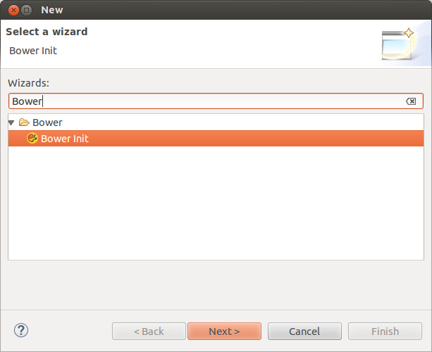
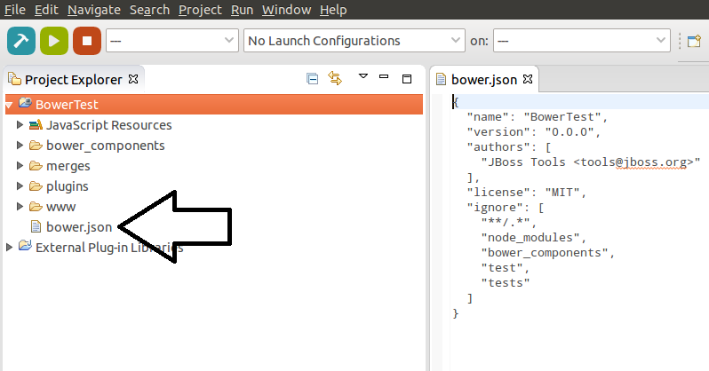
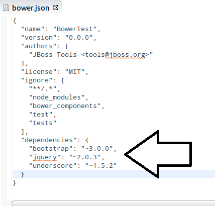
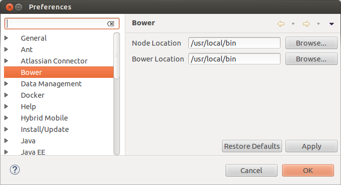
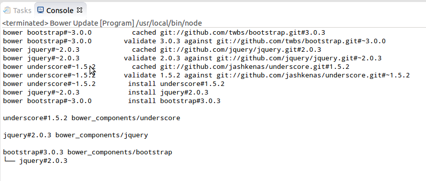
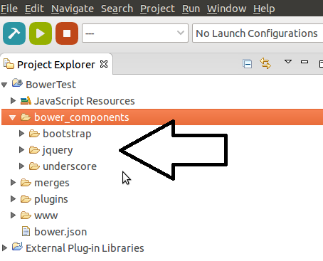
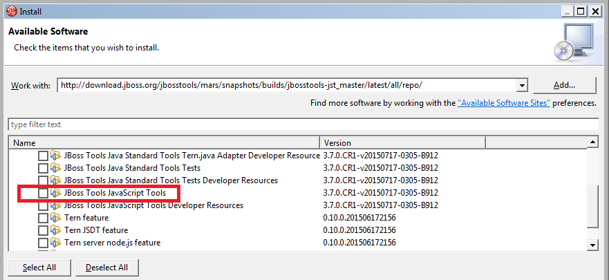

= Bower support is coming to JBoss Tools
:page-layout: blog
:page-author: ibuziuk
:page-tags: [bower, javascript, jbosstools, devstudio]

In this article I'm happy to introduce brand new JBoss Bower Tools:

image::images/20150721_bower/jbosstools-bower.png[Bower JBoss Tools]

http://bower.io/[Bower] is a front-end package manager which works by fetching and installing frameworks, libraries, assets. It offers a generic, unopinionated solution to the problem of front-end package management, while exposing the package dependency model via an API that can be consumed by a more opinionated build stack. Bower provides declarative dependency management (dependencies are declared and tracked in a manifest file, `bower.json`).

== Pre-Requirements

JBoss Bower Tools fall back on *native*  Node.js and Bower calls. Hence, the following software must be pre-installed:

* Node.js
* npm
* Bower

TIP: Installation instructions for *Node.js* and *npm* can be found https://docs.npmjs.com/getting-started/installing-node[here]. Bower is a command line utility which is installed via npm command `npm install -g bower`

== Quick Start Guide

For now only *http://bower.io/docs/api/#init[init]* and *http://bower.io/docs/api/#update[update]* commands of Bower API are supported. In order to initialize Bower one need to select *File -> New... -> Other...* and choose *"Bower Init"* wizard:

This wizard helps to create `bower.json` file depending on set of preferences:
 
image::images/20150721_bower/bower-init-wizard-page.png[Bower Init wizard page]

After pressing *"Finish"* button `bower.json` will be created under specified directory:

In order to add new dependencies one need to specify them in `bower.json`:

For updating dependencies user should right-click on the `bower.json` -> *Run As...* -> *Bower Update*

TIP: In most cases *Bower* and *Node.js* will be detected in the system automatically. However, if the detection failed warn dialog will be shown for specifying location in preferences:

*"Bower Update"* launch shortcut makes a native call which will install required packages or update them to the newest version according to `bower.json`:

Specified packages will be created under `bower_components` folder after *"Bower Update"* execution:

Basically, that is all - one can now use those packages for future front-end development.

== Demo 
Here is a short demo https://vimeo.com/133675030[video] which describes a basic use case of JBoss Bower Tools:

video::133675030[vimeo, width=640, height=400]

== How to give it a go ?
Bower support will be available in `4.3.0.Beta2` release and above. You can also use our nightly http://download.jboss.org/jbosstools/mars/snapshots/builds/jbosstools-jst_master/latest/all/repo/[update site] in order to try Bower Tools (`JBoss Tools JavaScript Tools` category) before the official release:

   
== Conclusion
We are trying our best to make our tools as good as possible. User feedback is what we are seeking for now. We look forward to hearing your comments, remarks and proposals. +
Have fun!

Ilya Buziuk +
https://twitter.com/ilyabuziuk[@ilyabuziuk]
