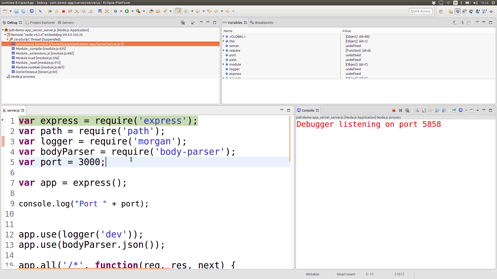
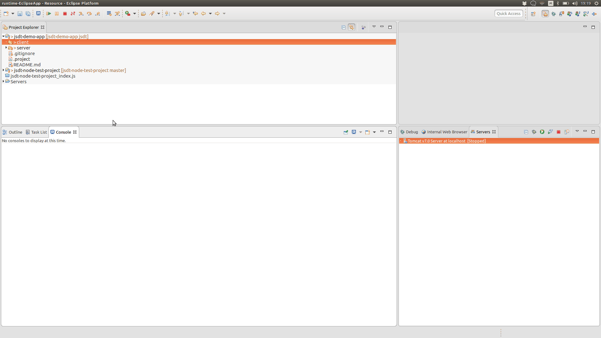
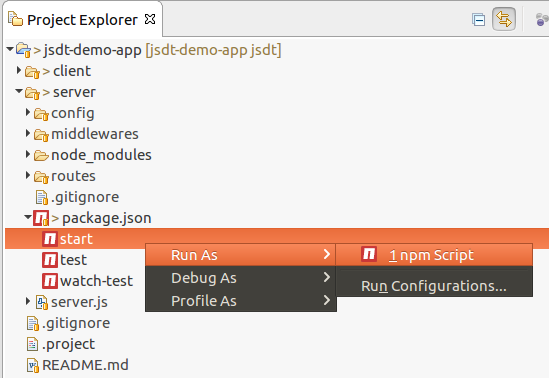
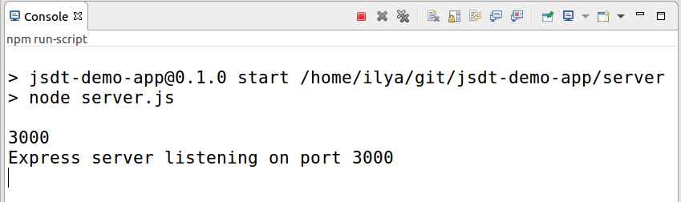

= JavaScript Tools - what is new in Neon.1? 
:page-layout: blog
:page-author: ibuziuk
:page-tags: [javascript, nodejs, eclipse, neon]

In this article we are happy to introduce new features and improvements that have been implemented as part of the https://eclipse.org/webtools/jsdt/[JSDT] project and now available in the https://eclipse.org/downloads/eclipse-packages/[Neon.1] release:
[square]
- Oomph installer for JSDT setup
- Node.js debugger improvements
- New JavaScript debugger
- "Quick Access" for Gulp / Grunt tasks
- npm scripts support

Overall, 41 https://bugs.eclipse.org/bugs/buglist.cgi?bug_status=RESOLVED&bug_status=VERIFIED&bug_status=CLOSED&chfield=resolution&chfieldfrom=2016-06-22&chfieldto=2016-09-28&product=JSDT&resolution=FIXED[bugzillas] have been resolved during the Neon.1 development cycle (some of the bugs have been waiting to be fixed for more than 5 years!) Also, we would like to shed some light on our plans for the Neon.2 release.

NOTE: In order to have all new JavaScript features available out-of-the-box, please, use *"Eclipse IDE for JavaScript and Web Developers" / "Eclipse IDE for Java EE Developers"* packages

== Oomph installer for JSDT setup
Want to contribute to JSDT project but do not know how? Think that environment setup is too difficult and comprehensive? Now you can easily setup JSDT using https://projects.eclipse.org/projects/tools.oomph[Oomph] within a few minutes! Here is a short demo video which explains how to do it:

video::jOT-GPaIqj8[youtube, width=640, height=400]

NOTE: More details about Oomph setup can be found on the following https://wiki.eclipse.org/images/6/6f/Oomph-setup-jsdt-development.pdf[link]

== Node.js Debugger Improvements
Node.js support was originally implemented as part of the Eclipse Neon release. In Neon.1 debugger facilities have been significantly improved. Previously in order to change the code during the debug session one should have saved the JavaScript file, right click on it → *V8 Debugging → Push Source Changes to VM*. Now saving the file is just enough - new changes will be applied automatically:

Also, there are a few important bug fixes that improve the debugging experience:
[square]
- https://bugs.eclipse.org/bugs/show_bug.cgi?id=491735[Bug 491735] - Terminating V8 debugger process should also kill main Node process
- https://bugs.eclipse.org/bugs/show_bug.cgi?id=497685[Bug 497685] - Cannot set a breakpoint in "node_modules" (Windows specific)
- https://bugs.eclipse.org/bugs/show_bug.cgi?id=497424[Bug 497424] - Source not found for main .js file inside node_modules

NOTE: More details about Node.js support in Eclipse can be found in the article https://www.eclipse.org/community/eclipse_newsletter/2016/may/article3.php[Neon and Node.js: A magical friendship!] 

== New JavaScript Debugger
Now there is a possibility to debug JavaScript using *Chrome / Chromium* browser. Basically, in order to debug JavaScript one should  simply right click on the html file → *Debug As.. → Chrome / Chromium Debugger*:

video::l1FmC7aQzbk[youtube, width=640, height=400]

There is also a possibility of debugging JavaScript for applications running on servers using *Chrome / Chromium Debugger* menu item: 

video::fXf5zZDnfIY[youtube, width=640, height=400]

NOTE: *"Chrome / Chromium debugger"* menu enabled on the server adapters will work only for maven projects in which JavaScript files are located in the *"webapp"* folder. However, one can always tune the source mapping logic for particular project manually and run Chrome / Chromium with the debugging port enabled. More details about manual debugger setup can be found in the following https://youtu.be/7oQz1Ja1H08[video]

== "Quick Access" for Grunt / Gulp tasks

Now it is possible to execute tasks via *"Quick Access"* - just press *Cntrl + 3* / *⌘ + 3* and choose *Run As Grunt / Gulp task*:

== npm scripts support
All npm scripts defined in the *package.json* can be now executed via *Run As.. -> npm Script* context menu:

The output of the script command will be reflected in the "Console" view:

== Neon.2 Agenda
In the next release we are going to switch to the https://github.com/google/closure-compiler[Closure] compiler which is more tolerant and has better performance in comparison with currently used http://esprima.org/index.html[Esprima] parser. Moreover, we are going to return broken JavaScript search facilities back to JSDT. Actually, most of the work in the search direction is already done:

video::2gWZSYBPios[youtube, width=640, height=400]

Other plans are coupled with polishing Node.js / JavaScript debuggers and making the whole feature set smooth, stable and complete. If you want to have some particular bug fixed in Neon.2, please, speak up on the https://dev.eclipse.org/mailman/listinfo/wtp-dev[wtp-dev] mailing list or let us know on twitter, youtube, stackoverflow etc. 

== Thank you!
Thank you to the contributors who made the Neon.1 release happen:
[square]
* Patrik Suzzi
* Esteban Dugueperoux, Obeo
* Victor Rubezhny, Red Hat
* Gorkem Ercan, RedHat
* Angel Misevski, RedHat
* Shane Bryzak, RedHat

We would like to express special gratitude to the community for their feedback! We look forward to hearing your comments, remarks and proposals about new Neon.1 release. +
Have fun!

Ilya Buziuk +
https://twitter.com/ilyabuziuk[@ilyabuziuk]
