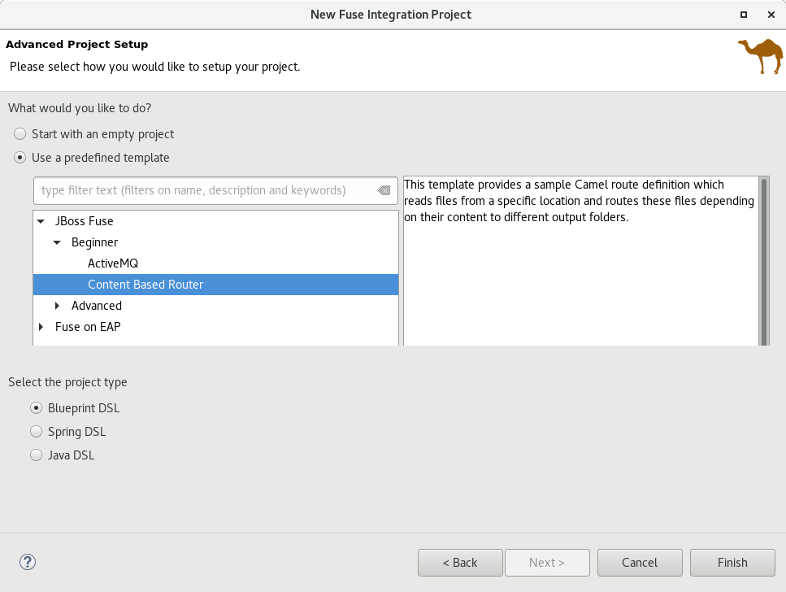

= JBoss Fuse Tooling released for Eclipse Mars 
:page-layout: blog
:page-author: lhein
:page-tags: [fuse, camel, integration, jbosstools, devstudio, jbosscentral]

We are happy to announce the release of http://tools.jboss.org/features/apachecamel.html[Red Hat JBoss Fuse Tooling] for Eclipse Mars.
It is available now in the JBoss Tools Integration Stack 4.3.2 / Developer Studio Integration Stack 9.0.2. 

== What's in there?

Let me highlight the most important changes only. You can see a full list of changes in the *What’s New* section for the release.

=== New Fuse Integration Project wizard
One of our main objectives for this release was improving the usability and making the tooling easy to use. The project wizard was one of the things we wanted to improve.
In the new version of the wizard you are now able to specify a runtime you want to develop for *OR* an http://camel.apache.org[Apache Camel] version to be used from the list of supported versions.

Another improvement is the replacing of the archetype selection with a more user friendly list of project templates which are now more use case oriented. At the moment we have just a few templates available but we will add new templates in future. (see above screenshot)

=== Updated Visual Camel Editor
We are happy to show you the new Camel Editor :D

image::images/fuse/8.0.0.GA/camel_editor.png[width="640", height="400", caption="The revamped Camel Editor"]

We've got a new diagram layout and new icons together with a search field inside the palette which allows easy lookup of palette items without the need to browse any drawers. The new layout improves the readability of your route. Another change has been made to allow showing all routes of a Camel Context file inside one editor. For those of you who liked the "only one route" approach more we added a "Go Into" button on the route's button pad.

You maybe also recognized a new tab in the editor from the above screenshot. We added the "Configurations" tab which can be used to handle elements which are not part of the route itself, like beans, global endpoint definitions and data formats. At the moment we have support for handling global endpoints and data formats. If you installed the SAP Tool Suite you can also add SAP Server definitions. More types will be added in future releases.

For more information on this tab please have a look http://tools.jboss.org/blog/EclipseFuseTooling-NewGlobalConfiguration.html[here].

=== Other
There have been some improvements in the validation of Camel files. Please have a look http://tools.jboss.org/blog/eclipse-fuse-tooling-new-validation.html[here] for more information.

*We hope you enjoy the improvements and are looking forward to your feedback. Have fun!*

*Lars Heinemann*

