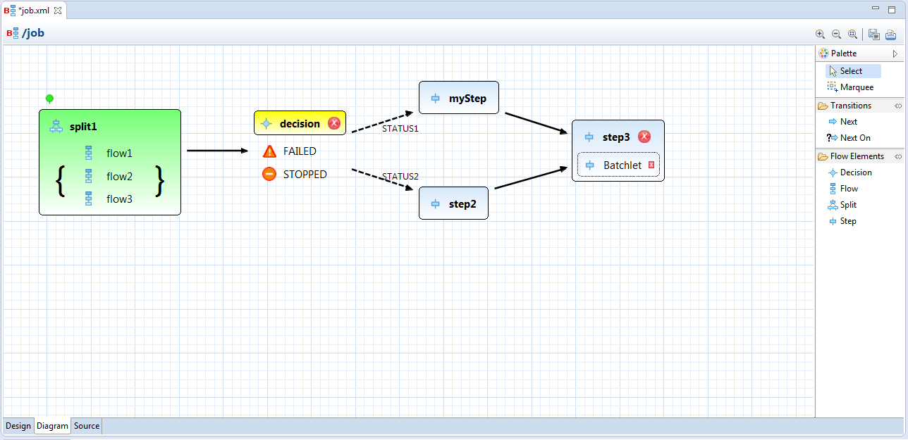
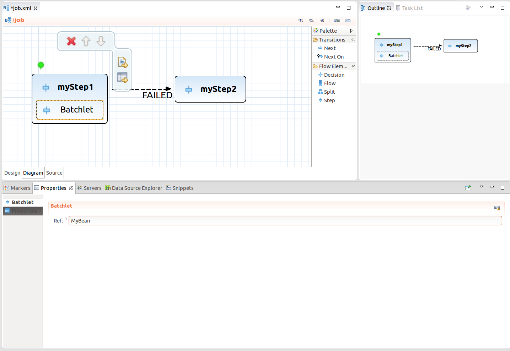

= Visual Editor for JEE Batch
:page-date: 2015-07-14
:page-layout: blog
:page-author: tmilata
:page-tags: [batch, devstudio, javaee, jbosscentral, jbosstools]

The JavaEE part of the Tools now contains support for JSR-352 batch files. I'd like to show you the main features of the new *visual* editor available in JBoss Tools 4.3 and Developer Studio 9.

It extends the *tree-form* editor previously developed by the JBoss Tools team. There are now 3 ways to edit the batch XML files, represented by the 3 editor tabs:

* *Source* (XML text editor)
* *Design* (tree-form editor)
* *Diagram* (visual editor)

== Focus on Structure
The goal of the *Diagram* tab is to *visualize* the *flowchart-like* structure of batch jobs. Don't bother editing the XML by hand and tracking down paths in your batch's workflow. Instead, you can manipulate batch elements directly with your mouse.

Just select the proper objects from the palette, place them in the diagram and *draw transitions* among them. The editor visualizes all `step`, `flow`, `split` and `decision` elements, transitions using `next` attribute and `next on` elements and also terminating elements (`fail`, `stop`, `end`). If you need to edit elements *nested* inside a `flow`, just double-click its icon to switch the contents of the editor to the flow internals.

You also don't need to reorder XML elements to set an element as a start. Just use _Set as Start_ action.

== Properties View
The diagram is useful for displaying structures but sometimes we would like to different things like to assign a Java bean to a batchlet. That's when the *Properties View* comes in handy. Its content is changed according the current selection in the diagram and it serves for filling in various form data.

Tip: Use kbd:[Ctrl+Space] to get content proposal.

== Edit Anywhere
The diagram editor is integrated with the tree-form editor and the XML text editor in the way that all changes are propagated immediately between these three views. Use any of the editor tabs and you'll see the changes reflected in the other tabs.

== Content Assist
The editor is aware of the batch nature of your project and provides content proposal. It helps to fill in names batch artifacts such as jobs or flows, specific Java classes (your subclasses of `ItemReader` `ItemWriter` etc.) or exception classes. You may refer to your beans also by their name defined by the `@Named` annotation.

== Get It Now
Just download the latest 9 release of JBoss Developer Studio or 4.3 version of JBoss Tools to get started. To quickly create a new file, try e.g. the wizard for creating batch files by selecting menu:File[New > Other > Batch > Batch Job XML File].

Enjoy using the editor and give us some feedback!

Tomáš Milata +
http://twitter.com/tomas_milata[@tomas_milata]
