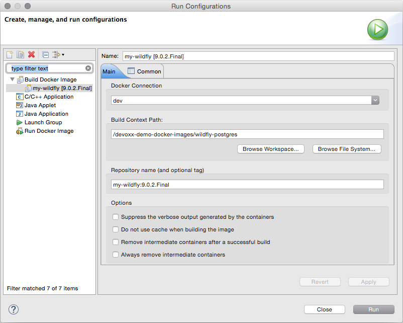
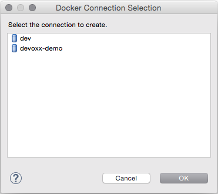
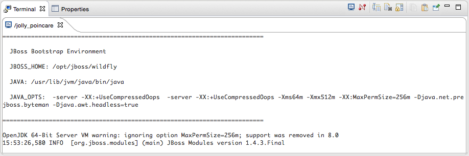

= Ho Ho Ho... Maintenance release for Mars is in Beta!
:page-layout: blog
:page-author: akazakov
:page-tags: [release, jbosstools, devstudio, jbosscentral]
:page-date: 2015-12-22

Just in time for Christmas, http://tools.jboss.org/downloads/jbosstools/mars/4.3.1.Beta1.html[JBoss Tools 4.3.1.Beta1] and http://tools.jboss.org/downloads/devstudio/mars/9.1.0.Beta1.html[JBoss Developer Studio 9.1.0.Beta1] are ready for download. This is the first beta for our maintenance Mars release.

image::/blog/images/jbosstools-jbdevstudio-blog-header.png[]

CAUTION: Remember that since JBoss Tools 4.3.0 we require Java 8 for installing and using of
JBoss Tools. We still support developing and running applications using older Java runtimes. See more in link:2015-06-23-beta1-for-mars.html#java-8-to-run-eclipse-older-runtimes-ok-for-builds-deployment[Beta1 blog].

== What is New? 

Full info is at http://tools.jboss.org/documentation/whatsnew/jbosstools/4.3.1.Beta1.html[this page]. Some highlights are below.

== Docker Tools

==== Run Image Launch Configuration

When running an image, a launch configuration is created, based on the selected image.
This is useful when users want to try tweaking a previous run for various reasons
(e.g. binding in new volumes or changing command parameters, etc.)

Running a container from an image can now be also done via a launch configuration.

==== Docker Machine Support

Docker Machine is now supported for the creation of a new connection.
Simply click the "Search..." button and you will be prompted to select an active Docker Machine connection, if one exists.

==== TM Terminal Support for Interactive Shells

Containers created with a pseudo TTY allocated (-t) will open within a TM Terminal.
This is much more fully featured interaction when compared with the previous standard console.
In particular, the Terminal view recognizes the color code on logs and displays messages in appropriate colors.

== Improvements on the Importer wizard

The Import wizard that you can access via _File > Import Projects from Folder..._, _File > Import... > General > Projects from Folder_ or _File > Import... > Git > Projects from Git (auto-import)_ allows more user control. You can now see a proposal for the import (what will be imported and how) and select which sub-projects to import or not.

Performances have also been highly improved, and importing a Maven project will now suggest installation of m2e connectors when necessary.  

== Credential Framework

A new feature has been added to safely store your credentials for various domains in a central location. As our tools grow, it has become more likely that at least some credentials will be re-used by several different features. Having a central place to store, for example, your Red Hat Access credentials or JBoss.org credentials, for re-use by our server adapters or download-runtime features helps to prevent you from having to constantly type the same usernames and passwords in multiple locations. It also helps to ensure that if you change your password on some remote server, you only need to update one location in eclipse. 

image:../documentation/whatsnew/general/images/credentials1.png[Credentials Preference Page]

== OpenShift 3

More than 80 issues have been fixed in this release of the OpenShift tooling, mostly targetting OpenShift 3 support.
OpenShift 3 was introduced as a techpreview feature in JBDS 9.0.0.GA but will graduate to a supported feature in the upcoming JBDS 9.1.0.GA release.
More details for all improvements you can find http://tools.jboss.org/documentation/whatsnew/jbosstools/4.3.1.Beta1.html#openshift[here]. 

==== Deploy Workspace Projects
You can now deploy existing workspace projects to OpenShift 3 instances. You can either create a new OpenShift application, using an OpenShift 3 connection and then select the workspace project to deploy, or you can start by right-clicking on a project and use the `Configure...` > `Deploy to OpenShift...` menu.

image:../documentation/whatsnew/openshift/images/deploy-workspace-project.png[width=600]

==== New OpenShift 3 Server Adapter

A prototype for a new OpenShift 3 server adapter is now available. It's goal is to allow incremental deployment of workspace resources directly into the deployed node on OpenShift, bypassing the whole build step. Its capabilities are currently limited and require a number of manual steps to set it up, but we should streamline its usage in the next Beta. Currently only Node and PHP based applications are supported.

image:../documentation/whatsnew/openshift/images/openshift3-new-server.png[width=600]

==== OpenShift Explorer Improvements

The explorer is now listening to server side events, so it can automatically refresh itself.
A new `Edit...` menu is available in the OpenShift Explorer, allowing you to edit any resource (except Builds) as JSON in a text editor.

image:../documentation/whatsnew/openshift/images/edit-resources.png[width=600]

==== Search for Docker Images
When deploying a Docker image, searching for a docker image has never been easier, simply click on the `Search...` button and find your favorite image from the the selected Docker registry:

image:../documentation/whatsnew/openshift/images/search_docker_images.png[width=800]

==== Expose Additional Ports from the Docker Image

It is now possible to expose ports to a deployment, other than just those explicitly exposed on the docker image (they still need to be exposed by the image though).

image:../documentation/whatsnew/openshift/images/expose-service-ports.png[width=450]

== What is Next

We are working on the next Beta build which we are planning to release in January.

_Merry Christmas!_

Alexey Kazakov
