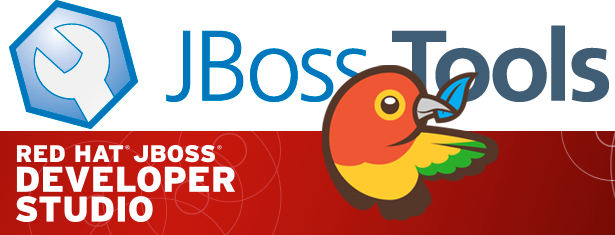
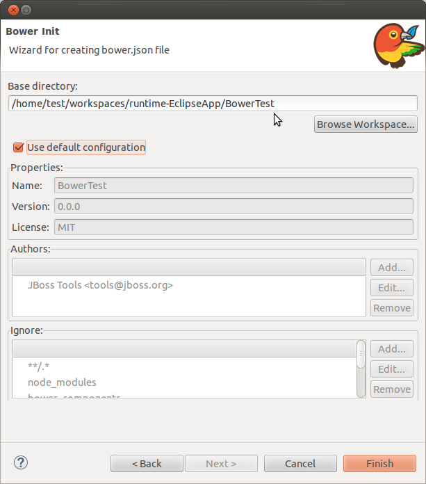

= Beta2 brings some Bower to Mars
:page-layout: blog
:page-author: akazakov
:page-tags: [release, jbosstools, devstudio, jbosscentral]
:page-date: 2015-07-25

Today a new beta is available from our download and update sites!

CAUTION: Remember that since Beta1 we require Java 8 for installing and using of
JBoss Tools. We still support developing and running applications using older Java runtimes. See more in link:2015-06-23-beta1-for-mars.html#java-8-to-run-eclipse-older-runtimes-ok-for-builds-deployment[Beta1 blog].

== Installation

JBoss Developer Studio comes with everything pre-bundled in its installer. Simply download it from our https://www.jboss.org/products/devstudio.html[JBoss Products page] and run it like this:
 
    java -jar jboss-devstudio-<installername>.jar

JBoss Tools or Bring-Your-Own-Eclipse (BYOE) JBoss Developer Studio require a bit more:

This release requires at least Eclipse 4.5 (Mars) but we recommend
using the http://www.eclipse.org/downloads/packages/eclipse-ide-java-ee-developers/marsr[Eclipse 4.5 Mars JEE Bundle] since then you get most of the dependencies
preinstalled. 

Once you have installed Eclipse, you can either find us on the Eclipse Marketplace under "JBoss Tools" or "JBoss Developer Studio".

NOTE: We are now using Eclipse Marketplace feature of having just one market place entry for all old versions.
 
For JBoss Tools, you can also use our update site directly if you are up for it.

    http://download.jboss.org/jbosstools/mars/development/updates

Note: Integration Stack tooling will become available from JBoss Central at a later date.

== What is new ? 

Full info is at http://tools.jboss.org/documentation/whatsnew/jbosstools/4.3.0.Beta2.html[this page]. Some highlights are below.

=== Bower

We've added support for easy setup and invocation of Bower using your locally installed `bower` command line tool on Windows, OS X and Linux.

We provide a Bower Init wizard for getting started.

Once your project has a `bower.json` file you can now easily run bower update 
by right-clicking on the file and selecting menu:Run[As... > Bower Update].

We are working on contributing this and additional Javascript integration to Eclipse JSDT. We will keep you posted!

=== OpenShift v3

We continue to work on improving OpenShift v3 tooling and this release has a few new features and important bug fixes but overall OpenShift v3 tooling is still in very early stages.

==== Manage your OpenShift v3 Projects

You can now create and delete OpenShift v3 projects.

image:../documentation/whatsnew/openshift/images/manage-projects.png[]

image:../documentation/whatsnew/openshift/images/manage-projects-wizard.png[]

If you try to create a new application, but you have no project yet, the tools will prompt you to create one first.
Once you are done you can always get back and manage your OpenShift projects via a link in the application wizard.

==== Manually Trigger Builds

You can manually trigger builds when selecting your Build Configs in the OpenShift Explorer.

image:../documentation/whatsnew/openshift/images/start-build.png[]

Once you triggered you should see a new build appear in the Builds category in the OpenShift Explorer. 
You can see its state next to its name or in the Properties view. 
Refreshing the Explorer will show you when the build completes.

==== Port Forwarding

Assuming that your application exposes ports you can now forward those to your local machine with JBoss Tools 4.3.0.Beta2.

image:../documentation/whatsnew/openshift/images/port-forwarding-wizard.png[] 

More details of new OpenShift v3 features are at link:../documentation/whatsnew/jbosstools/4.3.0.Beta2.html#openshift[Whats New].

=== Java EE Batch Tooling

The batch tooling now has hyperlink support for `@BatchProperty` to navigate between classes and their relevant job `.xml` files.

image:../documentation/whatsnew/batch/images/4.3.0.Beta2/openon.gif[]

There are more news at link:../documentation/whatsnew/jbosstools/4.3.0.Beta2.html#batch[Whats New].

=== Exploded nested jars

In WildFly 8.2 there is now support for hotloading resources from exploded jars inside deployments, i.e. a jar inside your `WEB-INF/libs`.

This allows you to have faster reload times for module web applications using resources from nested jars. 

Thanks to patch from https://developer.jboss.org/people/vsevolodgolovanov[Vsevolod Golovanov] we now support this when you are using our server tools. Thanks Vsevolod!
 
=== Deploy Hybrid project to FeedHenry

You can now take a hybrid mobile project created with Thym and deploy it to a FeedHenry cloud.

image:../documentation/whatsnew/aerogear/images/1.2.0.Beta2/NewApplicationWiz.png[]

Enjoy!

Alexey Kazakov
