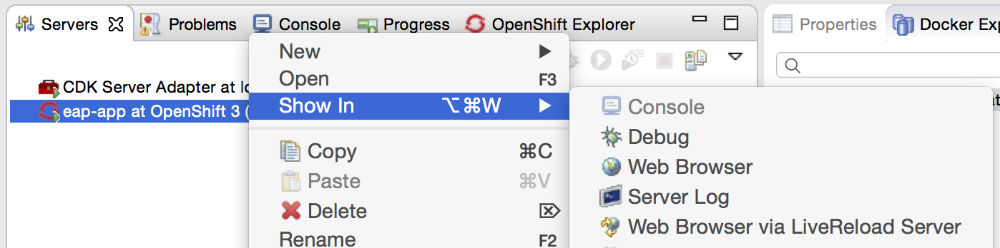
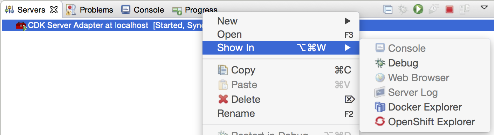
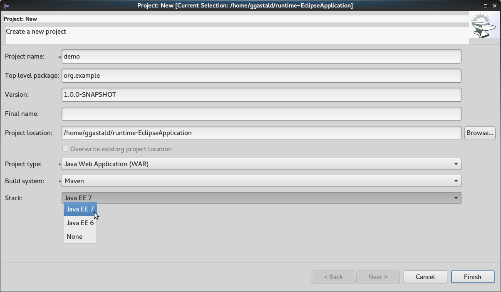

= Beta2 for Eclipse Mars.2
:page-layout: blog
:page-author: akazakov
:page-tags: [release, jbosstools, devstudio, jbosscentral]
:page-date: 2016-02-02

The second Beta of link:/downloads/jbosstools/mars/4.3.1.Beta2.html[JBoss Tools 4.3.1] and link:/downloads/devstudio/mars/9.1.0.Beta2.html[JBoss Developer Studio 9.1.0] for our maintenance Mars release is available.

image::/blog/images/jbosstools-jbdevstudio-blog-header.png[]

CAUTION: Remember that since JBoss Tools 4.3.0 we require Java 8 for installing and using of
JBoss Tools. We still support developing and running applications using older Java runtimes. See more in link:2015-06-23-beta1-for-mars.html#java-8-to-run-eclipse-older-runtimes-ok-for-builds-deployment[Beta1 blog].

== What is New?

Full info is at link:/documentation/whatsnew/jbosstools/4.3.1.Beta2.html[this page]. Some highlights are below.

== Eclipse Mars.2

JBoss Tools and JBoss Developer Studio are now targeting the latest Eclipse Mars.2 as a running platform with many issues fixed comparing to the previous Mars.1 release.

== OpenShift 3

More than 60 issues targeting OpenShift 3 support have been fixed in this release.
The OpenShift 3 integration was introduced as a technology preview feature in JBDS 9.0.0.GA but will graduate to a supported feature in the upcoming JBDS 9.1.0.GA release.

=== Incremental publishing
The OpenShift 3 server adapter now respects the auto-publish settings as declared in the server editor,
giving the user the option to automatically publish on workspace changes,
build events, or only when the user requests it.
The server adapter is also able to incrementally deploy the server's
associated project with a quick call to rsync, ensuring minimal over-the-wire
transfers and a fast turnaround for testing your project.

=== Support for Java EE projects
Experimental support for Java EE projects (Web and EAR) is now available.
When the workspace project associated with the OpenShift 3 server is a Dynamic
or Enterprise Application project, the server adapter builds an exploded version of the archive to a temporary
local directory and replaces the version deployed on the remote OpenShift
pod. That `Pod Deployment Path`, is now inferred automatically from the image stream tags on the remote Pod.
A `.dodeploy` marker file is created for the remote server to redeploy the module if necessary (for EAP/WildFly servers supporting it).

=== Support for LiveReload
The new tooling includes link:/features/livereload.html[LiveReload] support for OpenShift 3 server adapters.
This is accessible from the `Show In > Web Browser via LiveReload Server` menu. When a file
is published to the server adapter, the Browser connected to the LiveReload server instance will automatically refresh.

This is particularly effective in conjunction with the Auto Publish mode for the OpenShift 3 server adapters, as all it takes to reload a web
resource is saving the file under edition (Ctrl+S, or Cmd+S on Mac).

=== Simplified OpenShift Explorer view
Previously, the OpenShift 3 resources representation exposed a large amount of unnecessary information about OpenShift.
The explorer view is now simplified and specific (and made much more robust) and focuses on an application-centric view.

image:../documentation/whatsnew/openshift/images/simplified-openshift3-view.png[width=750]

Everything that is no longer displayed directly under the OpenShift Explorer
is accessible in the Properties view.

=== Red Hat Container Development Kit server adapter

The Red Hat Container Development Kit (CDK) server adapter now provides menus to quickly access the Docker Explorer and the OpenShift Explorer.
Right-click on a running CDK server adapter and select an option in the `Show In` menu:

== Forge Tools

=== Forge Runtime updated to 3.0.0.Beta3

The included Forge runtime is now 3.0.0.Beta3. Read the official announcement  http://forge.jboss.org/news/forge-3.0.0.beta3-is-here[here].

=== Stack support

Forge now supports choosing a technology stack when creating a project:

In addition to setting up your project, choosing a stack automatically hides some input fields in the existing wizards, such as the JPA Version in the `JPA: Setup` wizard:

== What is Next

We are approaching the final release for our first maintenance update for Eclipse Mars.2. It's time to polish things up and prepare a release candidate.

Enjoy!

Alexey Kazakov
