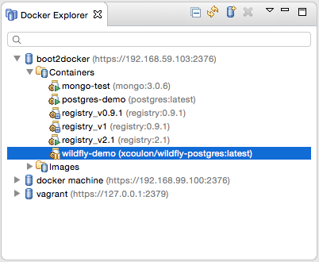
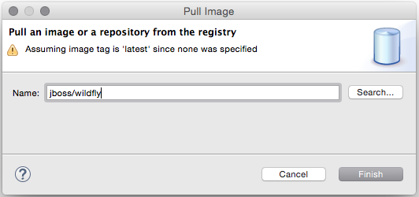
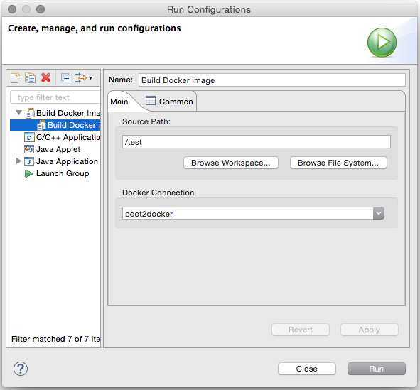

= CR1 for Eclipse Mars - more Docker, OpenShift and WildFly 10
:page-layout: blog
:page-author: akazakov
:page-tags: [release, jbosstools, devstudio, jbosscentral]
:page-date: 2015-09-22

We are happy to announce http://tools.jboss.org/downloads/jbosstools/mars/4.3.0.CR1.html[JBoss Tools 4.3 CR1] and http://tools.jboss.org/downloads/devstudio/mars/9.0.0.CR1.html[Red Hat JBoss Developer Studio 9 CR1] for Eclipse Mars are now available.

Note: Integration Stack tooling will become available from JBoss Central at a later date.

image::/blog/images/jbosstools-jbdevstudio-blog-header.png[]

CAUTION: Remember that since Beta1 we require Java 8 for installing and using of
JBoss Tools. We still support developing and running applications using older Java runtimes. See more in link:2015-06-23-beta1-for-mars.html#java-8-to-run-eclipse-older-runtimes-ok-for-builds-deployment[Beta1 blog].

== What is new ? 

The full details of what is new is available on http://tools.jboss.org/documentation/whatsnew/jbosstools/4.3.0.CR1.html[this page]. Some highlights are below.

=== WildFly 10 and EAP 7 Server Adapters

New server adapters for JBoss EAP 7 and WildFly 10 have been added to the toolset, allowing you to enjoy all the past benefits, but with all the newest runtimes.

image::images/cr1-for-mars/wildfly10.png[width="500"]

=== Quick Access to Launch LiveReload

Users can now launch LiveReload from the 'Quick Access' menu, or using the Ctrl+3 (or Cmd+3) keyboard shortcut.

This will first display the dialog to create and start a LiveReload server.
Then, this will open the current element (a selected file in the Project Explorer, a selected module in the Servers view or the content of the active editor)
in the browser, without even having to use the 'Open With>Web Browser via LiveReload Server' contextual menu.

image::images/cr1-for-mars/livereload_quick_access.png[width="500"]

=== OpenShift 3

We have made great progress in the OpenShift 3 Eclipse Tooling, but a few features are still missing, like deploying an existing workspace project, or editing existing build configurations.
We have some ideas to provide an even better OpenShift Explorer user experience.

OpenShift 3 tooling is provided as a TechPreview feature, available from the JBoss Central Software/Updates page.
Once we are fully satisfied with the quality of its feature set, OpenShift 3 tooling will mature to a Supported feature in the upcoming months, and will then be installed by default in JBDS.

But despite the fact that OpenShift 3 is still in TechPreview status in this release there are many improvements.
Such as enhancements in the Application wizard or a link to the online documentation from the connection wizard for OpenShift 3. Hopefully that should help you get started with OpenShift 3 in Eclipse:

image:../documentation/whatsnew/openshift/images/openshift3-getting-started.png[width="500"]

Improvements in OpenShift Explorer:

image:../documentation/whatsnew/openshift/images/openshift-menus.gif[]

Easy setup for 'oc' binary and log streaming:

image:../documentation/whatsnew/openshift/images/stream-logs.gif[]

Integration with Docker tooling:

image:../documentation/whatsnew/openshift/images/deploy_image_menu.png[width="500"]

And other http://tools.jboss.org/documentation/whatsnew/jbosstools/4.3.0.CR1.html#docker[features] + almost a hundred fixed bugs.

=== Java EE Batch Tooling

Quick Fixes for validation problems in Batch Job XML source editor.

image:../documentation/whatsnew/batch/images/4.3.0.CR1/qf.png[]

The Quick Fixes open a pre-set New Batch Artifact wizard to create the missing artifact.

=== New Maven Red Hat GA repository
In the Maven Repository Configuration wizard, accessible from `Preferences` > `JBoss Tools` > `JBoss Maven Integration` > `Configure Maven Repositories...`,
the predefined `Red Hat TechPreview All` Maven repository has been replaced with the new,
official `Red Hat GA` (GA: General Availability) repository, for released Red Hat JBoss Middleware artifacts.

It is recommended you replace the old `TechPreview All` repository with the new `GA` one, in your Maven settings.xml.

=== Offline Support for Project Examples in JBoss Central

In the updated link:4.3.0.Beta1.html#central[JBoss Central page], you now have access to more than 200 project
 examples. All these examples and their dependencies can now be cached locally via the
 Groovy Offline script, available from `Preferences` > `JBoss Tools` > `Project Examples` > `Offline Support`.

=== Eclipse Mars.1 with better Docker tooling

This version of JBoss Tools targets Eclipse Mars.1 which besides many bug fixes has some noteworthy improvements such as a better Docker tooling.
We worked on the Docker tooling to make it rock in JBoss Tools with OpenShift support - so we wanted to highlight these improvements.

==== Running/paused/stopped Docker containers

New icon decorators in Docker Explorer View show the state of the docker containers. This makes it clearer if a container is running, paused or stopped.

==== New Dialog to Search and Pull Images

There is an updated Pull Image wizard which can be launched from the Docker Images view or from the Docker Explorer view (a new context menu entry is available on the connection node and on the Images node):

The wizard detects the tag in the image name and if none is specified, the image tagged `latest` will be pulled.
If the user needs to search a specific image name, he or she can click on the `Search...` button which will open the `Search` wizard:

image:../documentation/whatsnew/docker/images/docker_mars1/docker_search_image_wizard1.png[width="500"]

followed by a second page that displays all the tags for the selected image.

==== New Launcher to Build a Docker Image

We have also added a new launcher to build images from a Dockerfile.

You can find more details about this and other new stuff in Docker tooling http://tools.jboss.org/documentation/whatsnew/jbosstools/4.3.0.CR1.html#docker[here].

== What is Next

With CR1 out we are heading towards a final release.

Have fun!

Alexey Kazakov