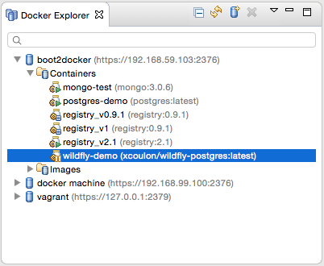
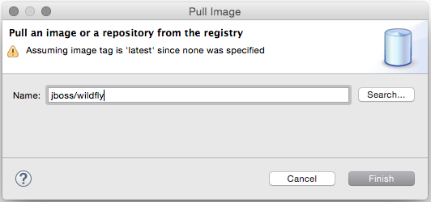
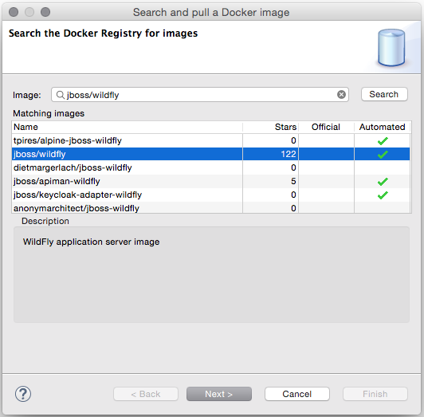
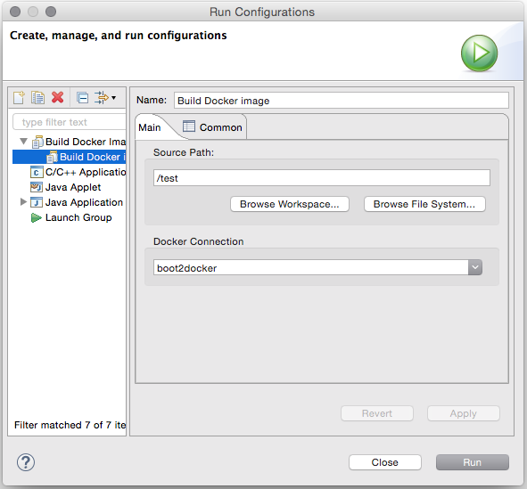

= Updates in the Docker Tooling
:page-date: 2015-10-07
:page-layout: blog
:page-author: xcoulon
:page-tags: [docker, eclipse, jbosscentral]

As Eclipse Mars.1 is landed a few weeks ago, let's take a look at the main new features that we`ve
worked on since our first release in June.

== Improved Docker Explorer View

We've added icon decorators on the containers to show their state. This makes it
clearer if a container is running, paused or stopped.

== New Dialog to Search and Pull Images

We've worked on the workflow to pull and search images from Docker Hub.
 The updated 'Pull Image' wizard can be launched from the 'Docker Images' view
 or from the 'Docker Explorer' view (a new context menu entry is available on the
connection node and on the 'Images' node)

The wizard detects the tag in the image name and if none is specified, the image tagged `latest`
will be pulled.

If the user needs to search a specific image name, she can click on the 'Search...' button
which will open the 'Search' wizard:

followed by a second page that displays all the tags for the selected image:

image::images/docker_mars1/docker_search_image_wizard2.png[Search Image Tags Wizard]

Even though this wizard can only search from Docker Hub, users can nonetheless pull images
from other third-party registries. In that case, image name needs to be prefixed with the
registry host and port, such as `192.168.59.103:5000/centos:7`.

== New Launcher to Build a Docker Image

Finally, we`ve also added a new launcher to build images from a Dockerfile.

The `source path` is a directory in the workspace or on the file system and the
'Docker Connection' combo box specifies on which Docker daemon the image will
be built.

As always, feedback, feature requests and bug reports are welcome. Since this
tooling is developped at Eclipse.org, you can join us on
mailto:linuxtools-dev@eclipse.org[our public mailing-list] or use
https://bugs.eclipse.org/bugs/buglist.cgi?cmdtype=runnamed&list_id=12650485&namedcmd=docker%20issues[Bugzilla]
to report any bug or feature request.

Have fun ! +
Xavier Coulon +
http://twitter.com/xcoulon[@xcoulon]
