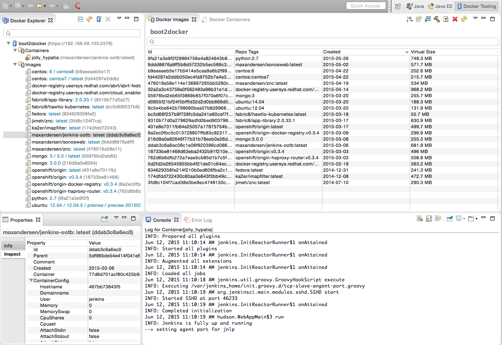
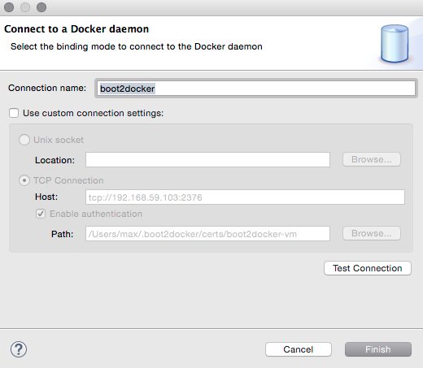
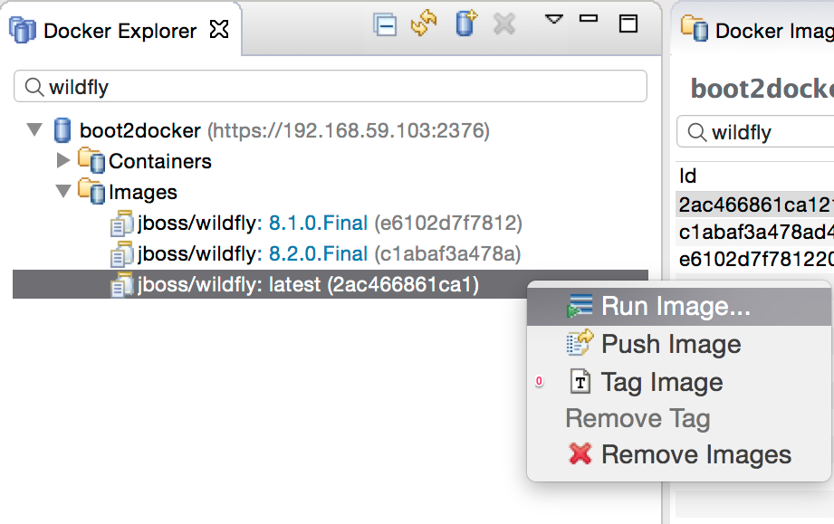
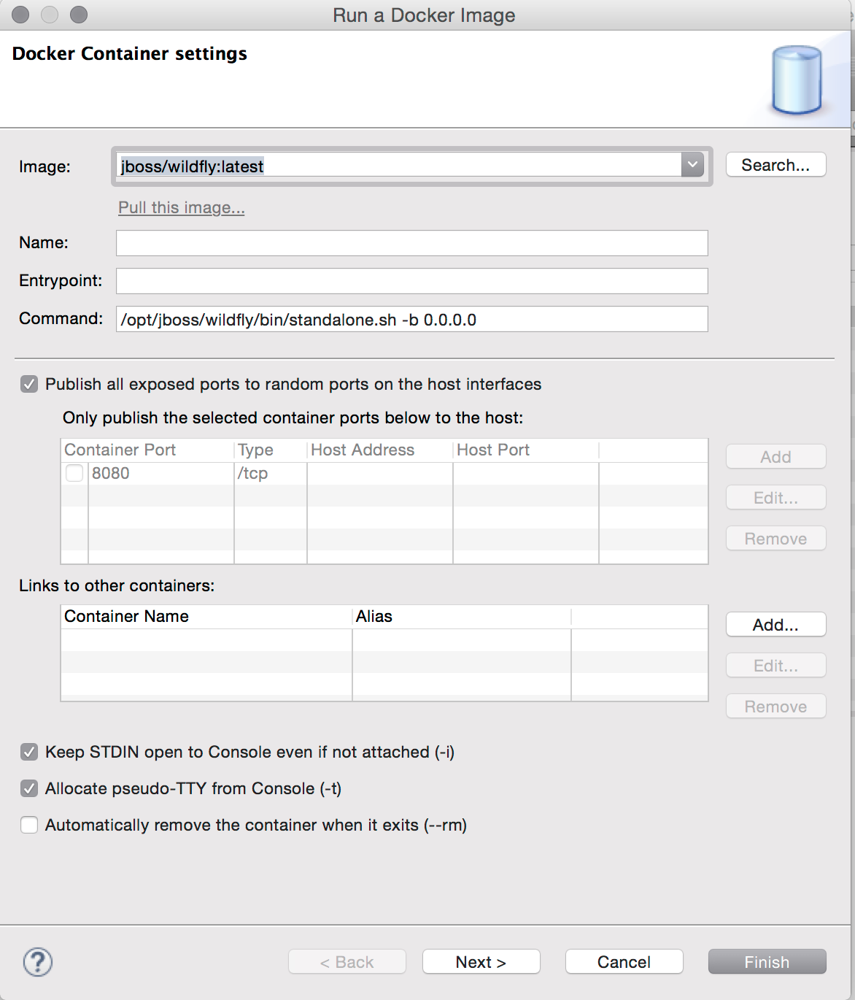
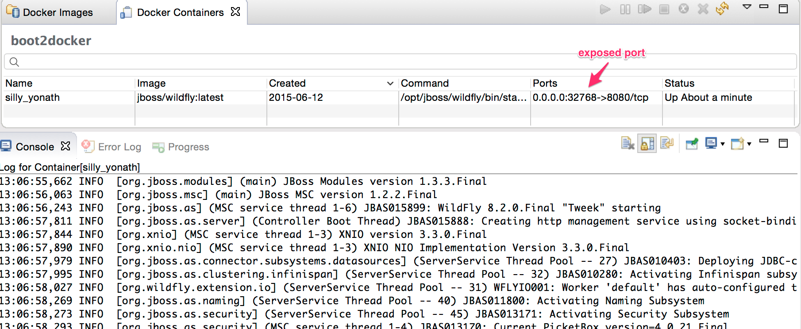
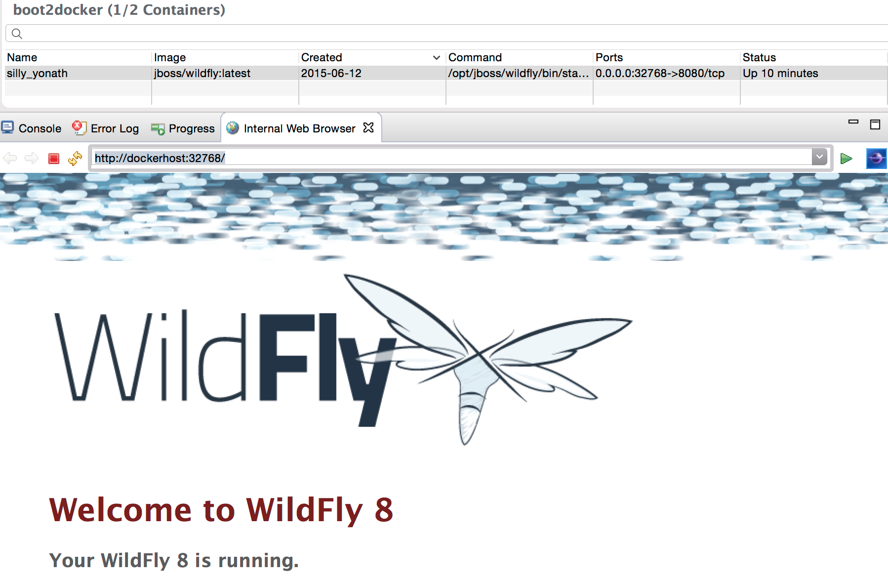
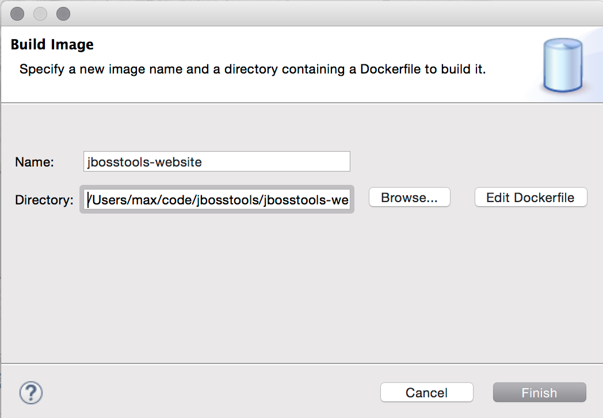
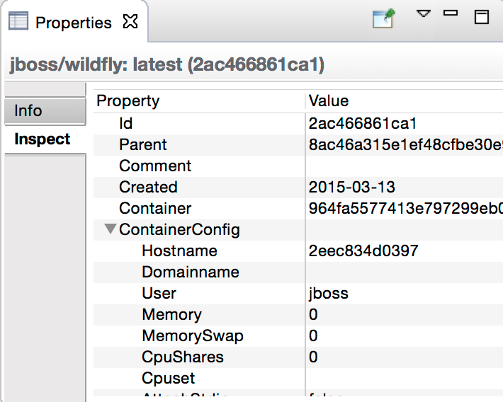

= Eclipse for Docker has arrived on Mars
:page-layout: blog
:page-author: maxandersen
:page-tags: [docker, jbosscentral]
:page-date: 2015-06-26

Eclipse Mars has arrived, and with it comes a brand new Docker tooling for it.

NOTE: This blog is a cross-post from
http://www.eclipse.org/community/eclipse_newsletter/2015/june/[Eclipse
Newsletter: Landed On MARS] where you can read about more things
included in recent released Eclipse Mars.

== Goals

We wanted to have a way to easily start/stop and deploy
Docker containers directly from Eclipse.

We wanted something that would run on all three major platforms:
Windows, Linux and OS X.

We wanted something that would work together with existing Docker
command line tools, but also utilized provide better overview and
easier/faster access to common operations, from a visual perspective.

We wanted it to be released with Eclipse Mars.

...and that is what we got now.

This article runs through how to get it installed, the main features and what the future plans are.

== Where do I get it ?

With Eclipse Mars released, you can get it from the Eclipse Mars
updatesite, the feature is named `Docker Tooling`.

If you want to try the latest greatest builds you can use `Linux Tools`
project nightly builds update site at
`http://download.eclipse.org/linuxtools/updates-docker-nightly/`

To use the plugins, it is assumed that Docker is already installed.
You can see https://docs.docker.com/installation/#installation[Docker's Installation guide] on how
to do this on various platforms. 

== Views and Perspectives

Once you have installed the Docker tooling, you will get access to three new views:

Docker Explorer :: a tree view listing all connected Docker instances, with image and containers. 
Docker Containers :: a table view listing containers for selected Docker connection
Docker Images :: a table view listing images available in the selected Docker connection

The easiest way to get to see these are by opening the _Docker Tooling_ perspective.

In the screen above, the Docker tooling are connected to a locally running Docker deamon named `boot2docker`.

== Connect

To configure this you click the `Add Connection...` button in the `Docker Explorer` view.

This will start a wizard that will try to detect your default Docker
connection setup, dependent on your operating system.

In Linux it will use standard unix sockets and if on Windows or OSX, it will look for the following
environment variables: `DOCKER_HOST`, `DOCKER_TLS_VERIFY` and `DOCKER_CERT_PATH`.

If neither of these are detectable, you can click `Use custom connection settings` and provide the connection info.

When you have the connection working you can get started using Docker images.

== Pull individual images

To pull an image, you use the `Pull Image` in the Docker Image view.

image::images/dockerarrived/docker_pull_image.png[Pull Image]

Here, I'm simply pulling the https://registry.hub.docker.com/u/jboss/wildfly/[jboss/wildfly] image, a image amongst many available at http://hub.docker.com.

== Run

To run the image, the easiest way is to right-click on the image in the Docker Explorer.

Here, I've initially filtered the list to just show images matching `wildfly` and then using right-click to choose the `Run Image...` action.

From within this dialog you can also search in Docker Hub for other images by clicking `Search...`.

image::images/dockerarrvied/docker_search.png[Docker search]

In this example, I'm only going to focus on running using the defaults, but in the Run Image wizard you can also configure
ports, links, volumes, environment variables etc.

By default, we enable interactive and tty mode to allow you to interact with the docker container in the console (i.e. if the image asks for input).

When you click `Finish`, the container will start and show output in a Console and the Docker Containers view will show which ports are used.

In here, the port at 8080 (the web server) is mapped to 32768 on the docker daemon.

To show this I just need to goto http://dockerhost:32768 to access it. `dockerhost` is the IP of the docker daemon.

== Build

If you have a `Dockerfile` you can build it via the `hammer` icon on the Image view. This will start the Build wizard.

Once built, the image will show up and be possible to use for <<Run,running>>.

== Properties

You can view properties for all the various parts: connection, image and container, including getting a tree view of what `docker inspect` would show.

== Future

For Eclipse Mars we added all of the above base features and you can use it in your day-to-day work with Docker.
 
For Eclipse Mars SR1, we will work on getting some of the rough edges fixed, like 'Run' and 'Build' should be available in the context menu and not only in the views menu.
 
Work also started in Eclipse CDT to support using Docker images to build binaries for an OS other than the one you are running on.
The vision for this would allow running on Windows or Mac, but target native deployment on multiple various Linux architectures.

Furthermore in http://tools.jboss.org[JBoss Tools] we are working on better integrating Docker with Eclipse server adapters, to ease deployment of your web applications to a Docker container. You can see how server deployment works with the current Docker tooling by leveraging http://tools.jboss.org/blog/2015-03-02-getting-started-with-docker-and-wildfly.html[docker volumes] and http://tools.jboss.org/blog/2015-03-03-docker-and-wildfly-2.html[remote deployment] support.

If you have suggestions or find bugs, please open these in the https://bugs.eclipse.org/bugs/enter_bug.cgi?product=Linux%20Tools[Linux Tools project under Docker].

Have fun!

Max Rydahl Andersen +
http://twitter.com/maxandersen[@maxandersen]