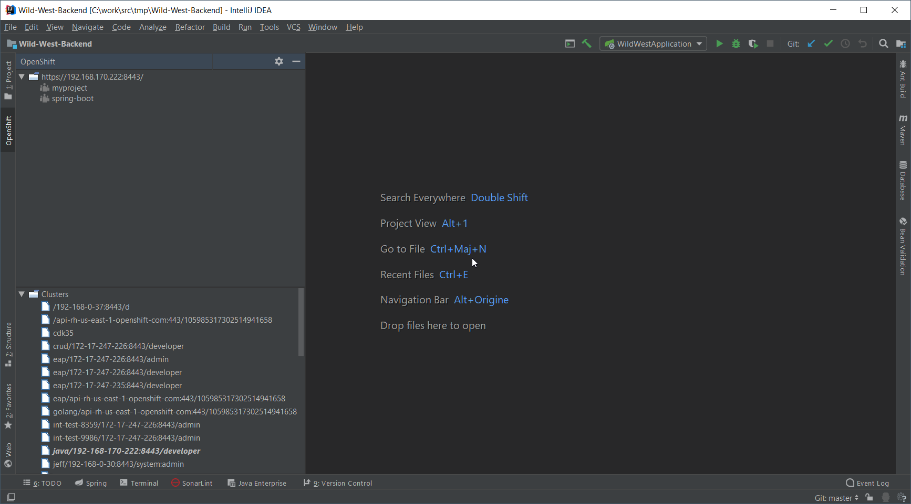
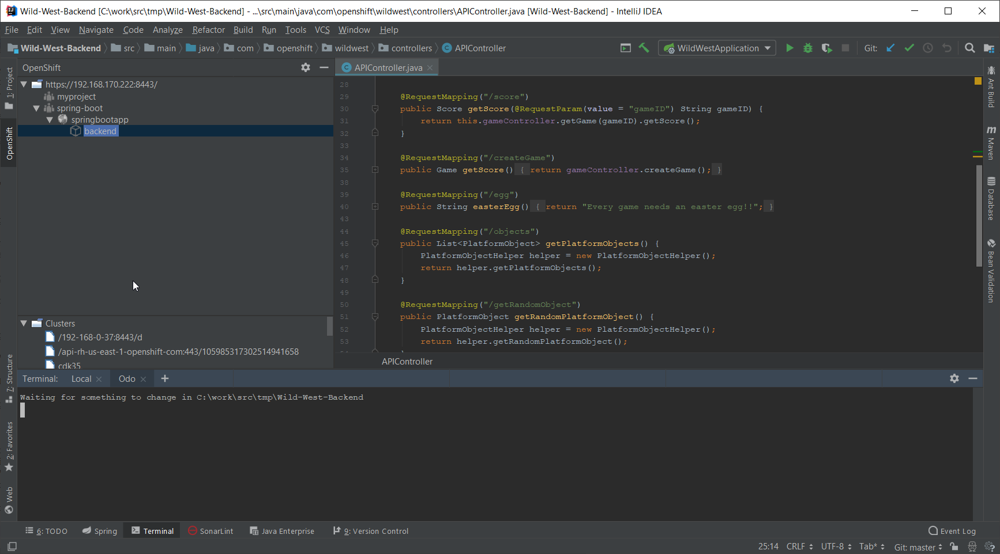

= Announcing IntelliJ OpenShift Connector
:page-layout: blog
:page-author: jeffmaury
:page-tags: [release, jbosstools, intellij]
:page-date: 2019-03-11

We are extremely pleased to announce that the preview release of the Red Hat OpenShift Connector
for JetBrains products (IntelliJ IDEA, WebStorm,....) is now available. You can download the
OpenShift Connector plugins from the link:https://pluins.jetbrains.com[JetBrains marketplace]
or install it directly from the plugins gallery in JetBrains products.

This article provides describes the features and benefits of the plugin and provides installation details.
It also provides a demo of how using the plugin improves the end-to-end experience of developing
and deploying Spring Boot applications to your local OpenShift cluster.

== Benefits of using the extension

link:https://www.openshiftcom[Red Hat OpenShift] is a container application platform that brings
the power of Kubernetes and containers to the enterprise. Regardless of the applications architecture,
OpenShift lets you easily and quickly build, develop, and deploy in nearly any infrastructure, public or private.

Therefore, whether it’s on-premises, in a public cloud, or hosted, you have an award-winning platform
to get your next big idea to market ahead of your competition.

Using OpenShift Connector, you can interact with Red Hat OpenShift using a local instance of OpenShift
clusters such as link:https://developers.redhat.com/products/cdk/overview/[minishift/Red Hat Container Development Kit].
Leveraging the OpenShift Application Explorer view, you can improve the end-to-end experience of developing applications.

The extension enables you to perform all this directly using JetBrains products ((IntelliJ IDEA, WebStorm,....)
and removes the complexity of memorizing some fairly complicated CLI commands.

== Developer use-case

Therefore, once the OpenShift Connector is installed, OpenShift view is enabled on the Explorer panel.
Then, you can access the view and connect to a running OpenShift cluster and perform the required operations.

== Installation

First, you will need to install any JetBrains product ((IntelliJ IDEA, WebStorm,....) 2018.1 or later.

To install the plugin, bring up the plugins configuration dialog: `File -> Settings -> Plugins`:


In the search bar, enter `OpenShift`  and click on the `OpenShift Connector by Red Hat` item:

image::images/ij-openshift-connector1.png[]

Click the `Install` button:


Once the plugin has been downloaded, click the `Restart IDE` button.

Once the IDE has been restarted, mouse over the Views icon in the bottom left area:


Select the `OpenShift` item:


== The extension in action

=== Connecting to your OpenShift instance

. Start the local OpenShift instance using link:https://developers.redhat.com/products/cdk/overview/[minishift/Red Hat Container Development Kit]
. You then need to log in to the running OpenShift cluster: right click on the cluster URL tree node and select `Log in to cluster`.


Enter `developer` in the `Username` field and any value in the `Password` field and press the `OK` button:


=== Import the project to be deployed

Before we work with our local cluster, first import our application source code. We will use a simple
Spring Boot application whose source code is located at `https://github.com/openshift-evangelists/Wild-West-Backend`.

In order to import the application, use the `File -> New -> Project from Version Control -> Git`:


Enter `https://github.com/openshift-evangelists/Wild-West-Backend` in the `URL` field and press
the `Clone` button.

=== Create a project for the application

In the `OpenShift` view, right click on the cluster node (the one with the URL) and select `New Project`:


Enter `spring-boot` in the `Project name` and press the `OK` button:



=== Create the application

In the `spring-boot` node, right click and select `New Application`:


Enter `springbootapp` in the `Application name` field and press the `OK` button:


=== Deploy the component

In the `springbootapp` node, right click and select `New Component`:


Enter `backend` in the `Name` field:


Press the `Browse` button:


Select the `Wild-West-Backend` project and press the `OK` button:


In the `Component type` field, select the `java` item:


Press the `OK` button. A new terminal window will be displayed and the component
will be deployed to your local cluster.


WARNING: On IntelliJ IDEA 2018.3 or 2018.3 based JetBrains products, the terminal window will be
automatically closed when the underlying command process is terminated. We are working for a 
workaround but we recommanded to use previous versions until the plugin will be updated.

Once deployed, the component will appear in the `OpenShift` view:


=== Testing the component

Let's try to test the deployed application in a browser. In the `OpenShift` view, right click
the `backend` node and select `Open in Browser`:


As no URL has been set up for our component (to allow external access to our application),
press the `OK` button:


As our application is exposing several ports, we need to select one: choose the `8080` one
and press the `OK` button. The following brower window should be displayed:


Don't worry, the error message is displayed because our application has no mapping
for the root. Append `/egg` in the URL bar in the browser window and press the
`ENTER` key:


=== Inner loop

In the following scenario, we will modify locally the application source code and
verify that the modification is broadcasted immediatly to the cluster.
Let's switch our application in `watch` mode so that every local modification is sent
to the cluster:

In the `OpenShift` view, right click the `backend` node and select `Watch`:



Now, in the `Project` view, open the `src/main/java/com/openshift/wildwest/APIController.java` file:


Modify the `egg` method:

```java
	@RequestMapping("/egg")
	public String easterEgg() {
		return "Every game needs an easter egg!!";
	}
```

with the following content:

```java
	@RequestMapping("/egg")
	public String easterEgg() {
		return "A change from inside my ide";
	}
```

Refresh the browser window and you should see the following output:

== Demo

You can see a video capture of this demo:

video::kCESA7a5i3M[youtube]


Enjoy!

Jeff Maury