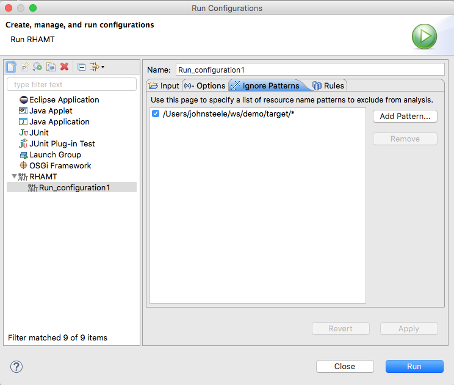
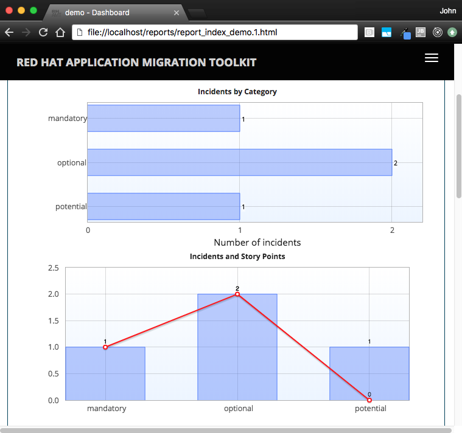
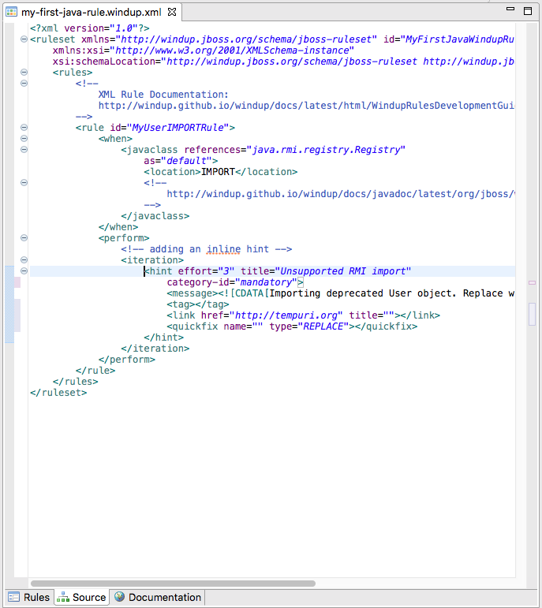
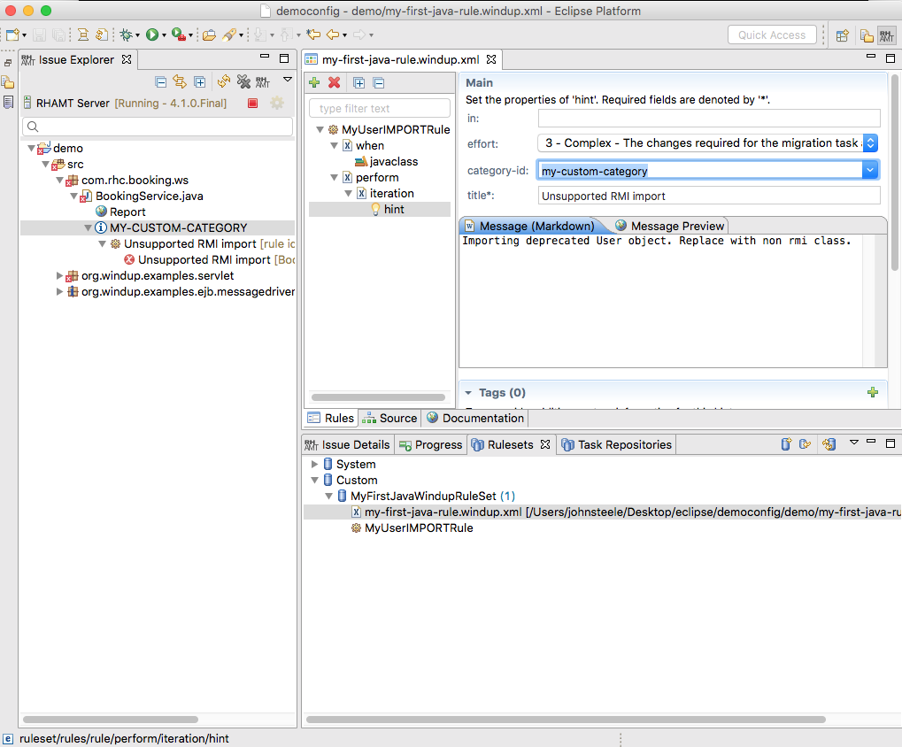

= RHAMT Eclipse Plugin 4.1.0.Final has been released!
:page-layout: blog
:page-author: josteele
:page-tags: [rhamt, windup, redhat-rhamt, release, jbosstools, devstudio, jbosscentral]
:page-date: 2018-07-17

Happy to announce version 4.1.0.Final of the Red Hat Application Migration Toolkit (RHAMT) is now available.

== Getting Started

Downloads available through JBoss Central and from the link:http://download.jboss.org/jbosstools/photon/stable/updates/rhamt/[update site].

== RHAMT in a Nutshel

RHAMT is an application migration and assessment tool. The migrations supported include application platform upgrades, 
migrations to a cloud-native deployment environment, and also migrations from several commercial products to the 
Red Hat JBoss Enterprise Application Platform.

== What is New?

==== Eclipse Photon

The tooling now targets Eclipse Photon.

==== Ignoring Patterns

Specify locations of files to exclude from analysis (using regular expressions).

==== External Report

The generated report has been moved out of Eclipse and into the browser.

==== Improved Ruleset Schema

The XML ruleset schema has been relaxed providing flexible rule structures. 

==== Custom Severities

Custom severities are now included in the Issue Explorer.

==== Stability

A good amount of time has been spent on ensuring the tooling functions cosnsitantly across Windows, OSX, and Linux.

{blank}

You can find more detailed information link:https://access.redhat.com/documentation/en-us/red_hat_application_migration_toolkit/[here].

Our goal is to make the RHAMT tooling easy to use. We look forward to your feedback and comments! +

Have fun! +
John Steele +
link:https://github.com/johnsteele/[github/johnsteele]

