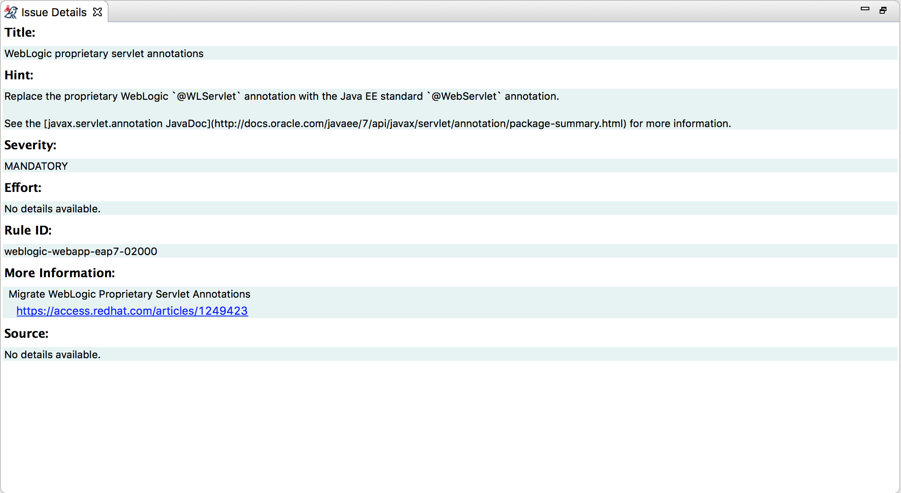

= Windup Eclipse Plugin has been released!
:page-layout: blog
:page-author: josteele
:page-tags: [release, windup, jbosstools]
:page-date: 2017-02-17
:blank: pass:[ +]

We are happy to announce the *first* release of the Windup Eclipse Plugin. It is available now through JBoss Central, and from our update site at `http://download.jboss.org/jbosstools/neon/stable/updates/windup/composite/`.

== What’s Windup?

Windup is a command line tool used to aid the process of migrating Java applications. Here’s a few examples:

* You want to move your application from one application server to another, for example:
** WebLogic to EAP
** WebSphere to EAP

* You want to upgrade from one version of a technology to another, for example:
** Hibernate 3 to Hibernate 4
** EAP 6 to EAP 7

* You want to change technologies, for example:
** Seam 2 UI controls to pure JSF 2 UI Controls

And here’s an example of how you’d run Windup using the CLI:

`$ ./windup --input /path/to/jee-example-app-1.0.0.ear --output /path/to/output --source weblogic --target eap:7`

The output of running Windup from the command line is an HTML report,
which can then be used to help analyze how much effort the migration
will take, as well as provide assistance with solving the individual problems.

== What do the Windup Eclipse plugins do?

As previously mentioned, the output of running Windup from the command line is an HTML report, which is not very useful for the engineer responsible for making the changes in the code.

That’s where the Eclipse plugins come into play. Once you’ve run Windup from within the IDE, all the source files needing to be changed will be automatically marked, and can be easily organized, searched, and in many cases, fixed using quick fixes.

Let me give you a quick walkthrough of some of the key components. You can find more detailed information link:https://access.redhat.com/documentation/en/red-hat-jboss-migration-toolkit/3.0/single/windup-eclipse-plugin-guide/[here].

=== Windup Perspective
We’ve created a dedicated perspective containing all the the views necessary to use Windup.

=== Run Configuration Dialog
Think of this as a GUI for your command line arguments. Instead of needing to dig deep into Windup documentation, and then having to tediously type paths, and other various arguments, this dialog simplifies the process of telling Windup what to analyze and how.

image::images/windup/run_configuration.png[Run Configuration]

=== Issue Explorer View
The Issue Explorer gets populated with all the migration issues.

{blank}
{blank}
You can customize how the issues are organized.

image::images/windup/issue_explorer_grouping.png[Issue Explorer Grouping]

{blank}
{blank}
The context menu is dynamic, and will vary per issue.

{blank}
{blank}
Some issues have quick fixes available. Quick fixes can be previewed prior to being applied.

=== Issue Details View
The Issue Details View provides more detailed information about migration issues, for example, hints on how to fix them, external documentation that might help with choosing the best solutions, etc.

=== Report View

You may need to refer back to the generated HTML report, and for that reason, we make it readily available here.

== Demo

Here is a short https://www.youtube.com/watch?v=E4RWNZ7PMeM[video] which demonstrates the basic usage:

video::E4RWNZ7PMeM[youtube, width=640, height=400]

== Conclusion

We are trying our best to make the Windup tooling as good as possible. Users' feedback is what we are seeking for now. We are looking forward to hearing your comments / remarks! +

Have fun! +
John Steele +
link:https://github.com/johnsteele/[github/johnsteele]
