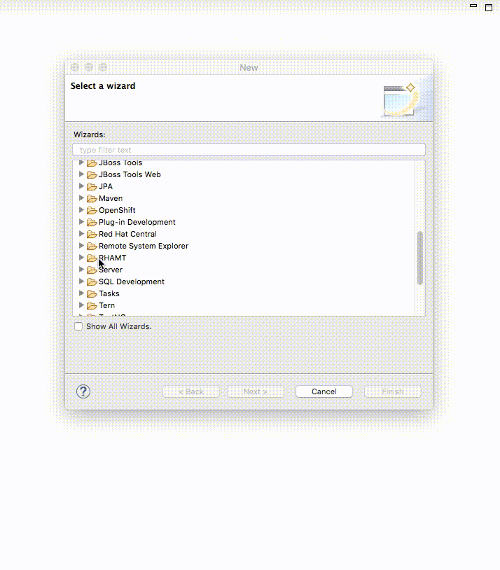
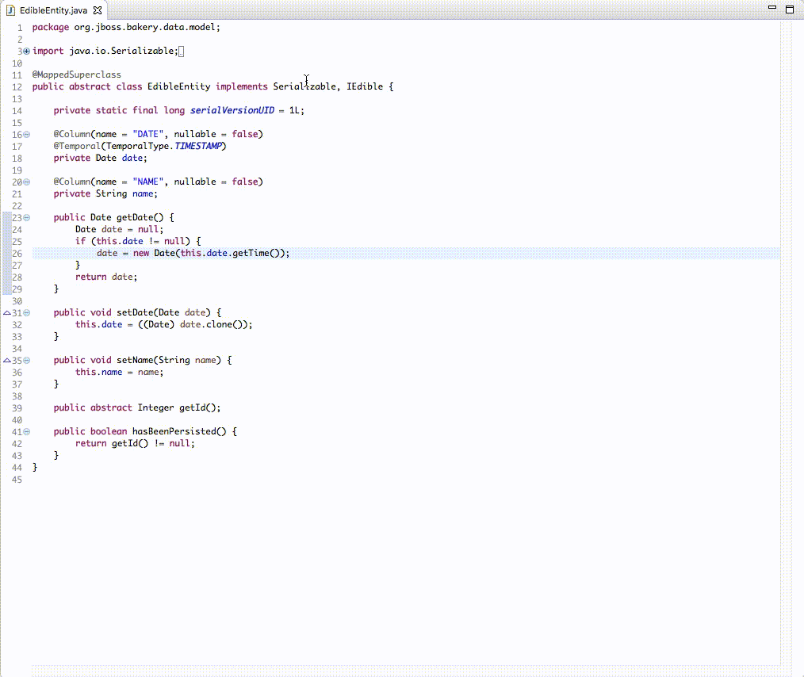
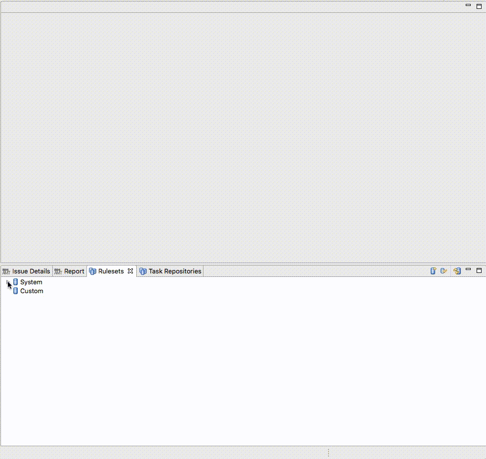
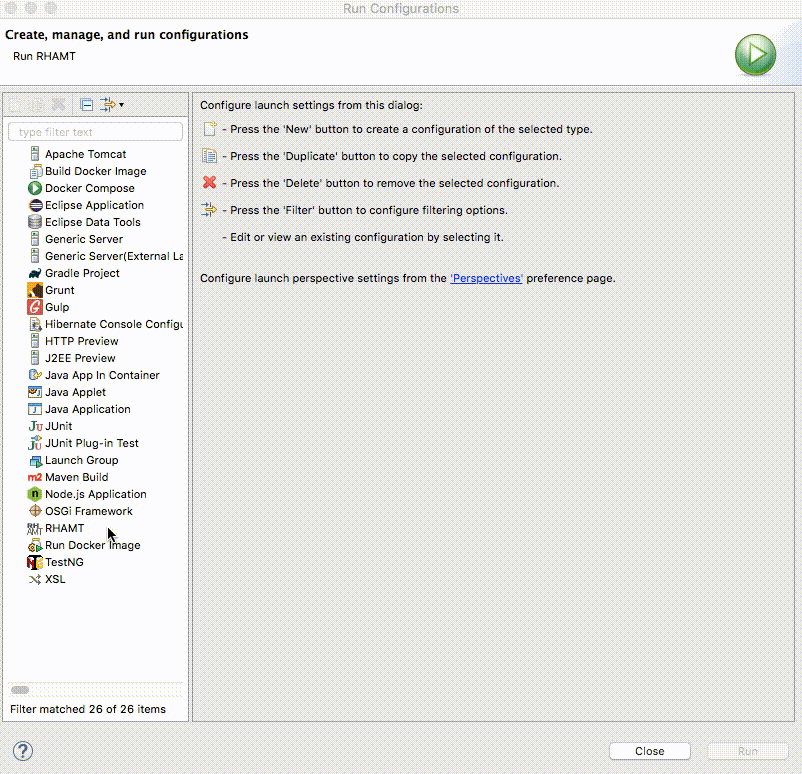
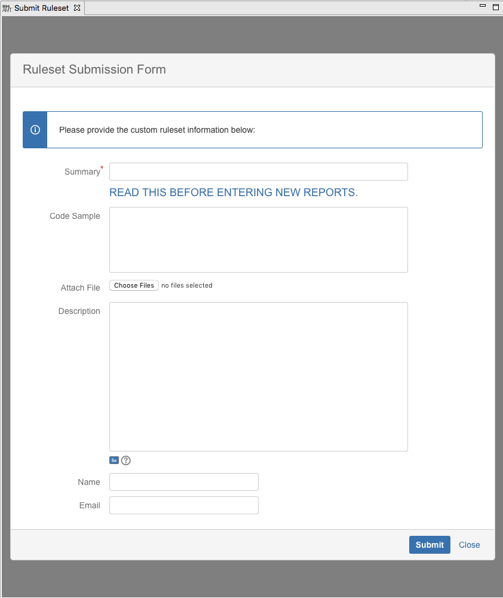

= RHAMT Eclipse Plugin 4.0.0.Final has been released!
:page-layout: blog
:page-author: josteele
:page-tags: [release, rhamt, windup, jbosstools]
:page-date: 2017-12-15
:blank: pass:[ +]

We are happy to announce the latest release of the Red Hat Application Migration Toolkit (RHAMT) Eclipse Plugin. 

== Getting Started

It is now available through JBoss Central, and from the update site link:http://download.jboss.org/jbosstools/oxygen/stable/updates/rhamt/[here].

== What is RHAMT?

RHAMT is an automated application migration and assessment tool.

Example ways to RHAMT up your code:

* Moving your application from WebLogic to EAP, or WebSphere to EAP
* Version upgrade from Hibernate 3 to Hibernate 4, or EAP 6 to EAP 7
* Change UI technologies from Seam 2 to pure JSF 2.

An example of how to run the RHAMT CLI:

`$ ./rhamt-cli --input /path/to/jee-example-app-1.0.0.ear --output /path/to/output --source weblogic --target eap:7`

The output is a report used to assess and prioritize migration and modernization efforts.

== The RHAMT Eclipse Plugin - What does it do?

Consider an application migration comprised of thousands of files, with a myriad of small changes, not to mention the tediousness of switching between
 the report and your IDE. Who wants to be the engineer assigned to that task? :)
Instead, this tooling marks the source files containing issues, making it easy to organize, search, and in many cases automatically fix issues using quick fixes.

Let me give you a quick walkthrough.

=== Ruleset Wizard

We now have quickstart template code generators.

=== Rule Creation From Code

We have also added rule generators for selected snippets of code.

=== Ruleset Graphical Editor
Ruleset navigation and editing is faster and more intuitive thanks to the new graphical editor.

image::images/rhamt/ruleset_editor.gif[Graphical Editor]

=== Ruleset View
We have created a view dedicated to the management of rulesets. Default rulesets shipped with RHAMT can now be opened, edited, and referenced while authoring 
your own custom rulesets.

=== Run Configuration
The Eclipse plugin interacts with the RHAMT CLI process, thereby making it possible to specify command line options and custom rulesets.

=== Ruleset Submission
Lastly, contribute your custom rulesets back to the community from within the IDE.

{blank}

You can find more detailed information link:https://access.redhat.com/documentation/en-us/red_hat_application_migration_toolkit/[here].

Our goal is to make the RHAMT tooling easy to use. We look forward to your feedback and comments! +

Have fun! +
John Steele +
link:https://github.com/johnsteele/[github/johnsteele]
