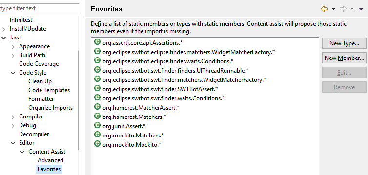

= Working Efficiently with JUnit in Eclipse - Update
:page-date: 2016-04-15
:page-layout: blog
:page-author: apupier
:page-tags: [eclipse]

I just wanted to add a few updates and my two cents to this old but still useful and accurate link:http://www.codeaffine.com/2012/11/26/working-efficiently-with-junit-in-eclipse-2/[blog post] (which is a must read of course!). Some elements were already mentioned in comments and I think all of that is worth providing a new detailed article.

== Favorites - static import

There were mentions of adding static imports for JUnit Assert methods. I recommend also to add some others for these popular frameworks:

* link:http://hamcrest.org/JavaHamcrest/[Hamcrest] Matcher
* link:http://joel-costigliola.github.io/assertj/[AssertJ]
* link:http://mockito.org/[Mockito]
* link:https://www.eclipse.org/swtbot/[SWTBot]

Please check out the below screenshot for what to add to your favorites:

== Improvements for Method Templates

There is no more need to type twice kbd:[Ctrl+space] to have the JUnit 4 Template proposals. Even better, when you start typing "test", the JUnit 4 Template is listed first.

== Test Failures - How to easily compare results

Did you ever noticed the little icon on top right corner of JUnit view?

Click on it! You will get a nice dialog comparing the actual and expected results:

== MoreUnit - Avanced Test Development Toolbox

link:https://github.com/MoreUnit/MoreUnit-Eclipse[MoreUnit] is a plugin helping you to create and maintain Unit Tests. Some of its nice features are:

* Wizard to create test stubs, including Mock support
* Navigate between test class and class under test using Ctrl+J
* Refactoring: renaming classes/methods also renames the corresponding test code

If you have tests in another projects - for instance you are an Eclipse RCP developer and use fragments for your unit tests - you can specify this folder from the MoreUnit Preferences page.

== Infinitest - Continuous testing

link:https://infinitest.github.io[Infinitest] is a useful plugin to respect the link:https://en.wikipedia.org/wiki/Fail-fast[Fail fast] principle. It continuously executes tests in the background each time you save a file.

If there are test failures:

* The bottom-left status bar is turning red
* Problem Markers are created to spot failing tests easily

As some tests might be time consuming or requiring some external configuration or UI interactions, you can filter those by providing a infinitest.filters file at the root of the project. The same file will be used in other supported IDEs by Infinitest.

== Eclemma - Spot untested code

After you wrote your tests, I recommend to launch the link:http://eclemma.org/[Eclemma] Coverage tests. You can use kbd:[Alt+Shift+E,T]. It will show you a nice overview of possible missing test coverage in your code.

Note: Don't focus too much on the percentage but have a deeper look to uncovered or partially covered lines. Make sure that these lines are not critical ones.

== For Eclipse RCP Developer

If you're an Eclipse RCP developer, I will be happy to see you assisting to link:https://www.eclipsecon.org/france2016/session/fast-unit-tests-eclipse-plugins-possible-architectures-and-available-tooling[presentation] at link:https://www.eclipsecon.org/france2016[my talk at EclipseCon France] (Toulouse, June 7-9). I will talk about possible architectures and available tooling to have fast Unit tests while developing Eclipse plugins. I'm looking forward sharing my experience and continue discussions later on.

== And You?

Do you have some other Tips, Tricks and best practice to share?

If you are using a different IDE, do you know about killer features enabling you to efficiently write unit tests but which are missing in Eclipse? Please share them!
