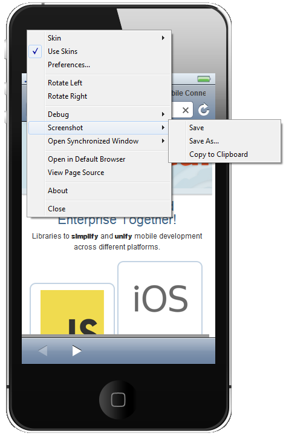

= BrowserSim/CordovaSim What's New in 4.1.0.Alpha2
:page-layout: whatsnew
:page-component_id: browsersim
:page-component_version: 4.1.0.Alpha2
:page-product_id: jbt_core 
:page-product_version: 4.1.0.Alpha2

== BrowserSim
=== New Skins

BrowserSim got iPad and iPad Mini skins.

image::images/4.1.0.Alpha2/ipad-skins.png[New iPad Skins]

related_jira::JBIDE-13685,JBIDE-13684,JBIDE-13416[]

=== Screenshots

We added the ability to easily take screenshots of BrowserSim. By default, they are stored in the user's home directory, but this can be changed via Menu > Preferences > Screenshots Location.

related_jira::JBIDE-14038[]

== Weinre

Now you can inspect your page's source with Weinre. It is available via *Menu > Tools > Weinre*.

http://people.apache.org/~pmuellr/weinre/docs/latest/Home.html[Weinre] is a debugger for web pages. It is similar to WebKit Web Inspector, but can run on devices with limited debug functionallity such as BrowserSim. To do this it requires a Weinre server to work. The default server for BrowserSim is http://debug.phonegap.com/[debug.phonegap.com]. You may change this setting in *Menu > Preferences > Weinre*.

image::images/4.1.0.Alpha2/weinre.png[Weinre with BrowserSim]

related_jira::JBIDE-13338[]