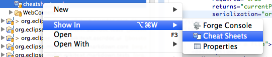

= Project Examples 4.1.0.Beta1 What's New
:page-layout: whatsnew
:page-component_id: examples
:page-component_version: 4.1.0.Beta1
:page-product_id: jbt_core 
:page-product_version: 4.1.0.Beta1

== Opening cheatsheet on import project 	

Project examples plugin can now open a .cheatsheet.xml or cheatsheet.xml when a project is imported.

For now this feature must be enabled manually using the *Window>Preferences>JBoss Tools>Project Examples* preferences page.

image::images/OpenAction.png[]

related_jira::JBIDE-14332[]

== Show in Cheat Sheets view. 	

There is now a new action in the "Show in" context menu: the Show in Cheat Sheets action.

This allow you to easily re-open or test a cheatsheet.xml found in examples.

The action is enabled for the Java, J2EE, JBoss and PDE perspectives.

See http://screencast.com/t/gK5JggVU[a screencast] of this in action.

related_jira::JBIDE-14334[]

== New cheatsheet commands 	

We have added new context sensitive parameterized commands for open file, show type etc. The commands can be used when creating cheatsheets.

[cols="1,2"]
|===

|getProjectForCheatsheet
|Used to store currentProject so you can refer to it in other commands

|openFileInEditor(path,fromLine,toLine)
|Used to open a file in an editor and highlight lines of a text from fromLine to toLine

|===

These commands can be used like any other command in a cheatsheet. Example of this working in a project can be found at helloworld-cheatsheet

See http://screencast.com/t/gK5JggVU.

related_jira::JBIDE-14333[]
