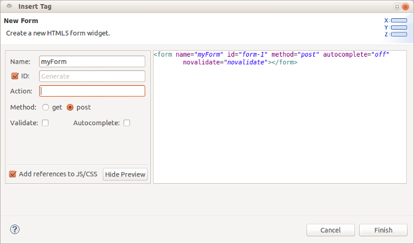
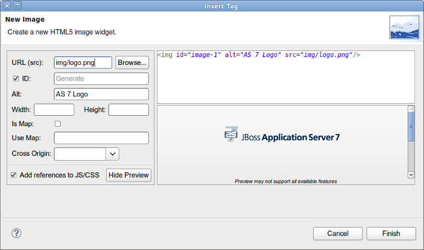
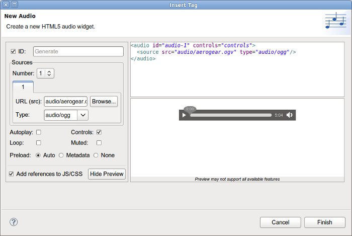
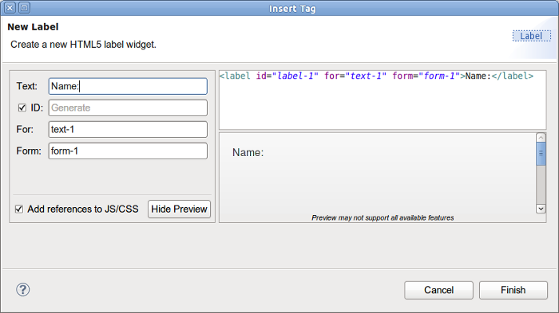

= JST / JSF / HTML Editor What's New in 4.1.0.Beta2
:page-layout: whatsnew
:page-component_id: jst
:page-component_version: 4.1.0.Beta2
:page-product_id: jbt_core 
:page-product_version: 4.1.0.Beta2

== jQuery Mobile
=== jQuery Mobile Palette

A few new HTML5 widget wizards are now available in jQuery Mobile Palette for HTML5 files:

image::images/4.1.0.Beta2/palette.png[]

* Form:

related_jira::JBIDE-14463[]

* Image:

related_jira::JBIDE-14466[]

* Video:

image::images/4.1.0.Beta2/video.png[]

related_jira::JBIDE-14467[]

* Audio:

related_jira::JBIDE-14468[]

* Label:

related_jira::JBIDE-14469[]

== JSF 2.2

=== JSF 2.2 face-config.xml editor

JBoss Tools XML editor now supports Faces Config 2.2:

image::images/4.1.0.Beta2/jsf22.png[]

related_jira::JBIDE-14439[]