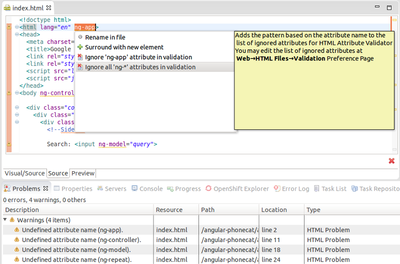
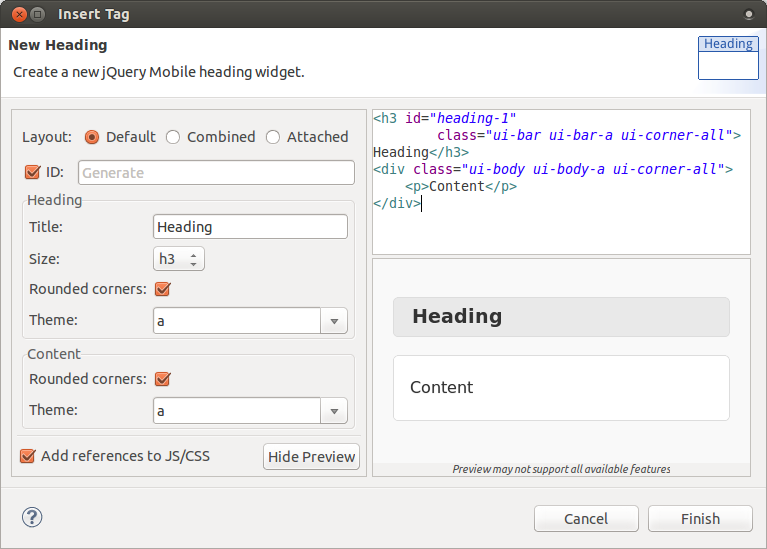

= JST/JSF/HTML Tools What's New in 4.2.0.Beta1
:page-layout: whatsnew
:page-component_id: jst
:page-component_version: 4.2.0.Beta1
:page-product_id: jbt_core 
:page-product_version: 4.2.0.Beta1

== Non-standard HTML attribute validation (e.g. ng-*)

It's now possible to ignore non-standard HTML attributes. JBT team contributed that feature to Eclipse Luna (Milestone 6). This is typically needed when developing Angular JS applications as the HTML validator considers Angular JS ng-* attributes as invalid html (which is actually correct since the proper syntax to be 100% compatible with the html5 spec is to use data-ng-*).

related_jira::JBIDE-16622[]

== Drop without dialog from Palette

When a widget from Palette view is dragged and dropped the corresponding New Widget wizard is open. Since JBoss Tools 4.2.0.Beta1 if you holding *Ctrl* (for Linux and Windows) or *Alt/Option* (for Mac) when the widget is dropped to the HTML Editor then the code snippet is inserted without any dialog.

related_jira::JBIDE-16636[]

== New Heading wizard for jQeury Mobile Palette 1.4

New Heading widget (introduced in jQuery Mobile 1.4) is now available in HTML5 Palette view.

related_jira::JBIDE-16486[]