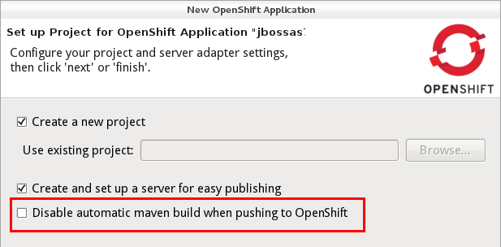
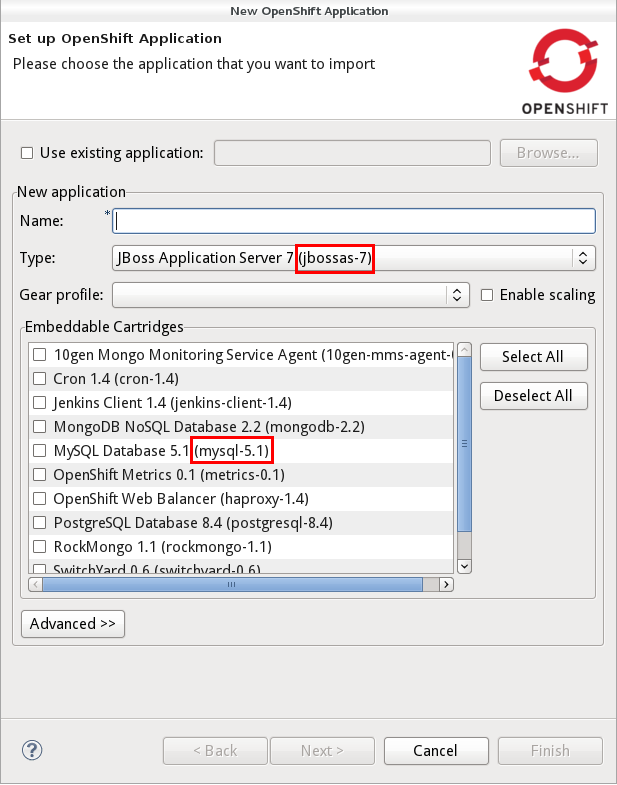
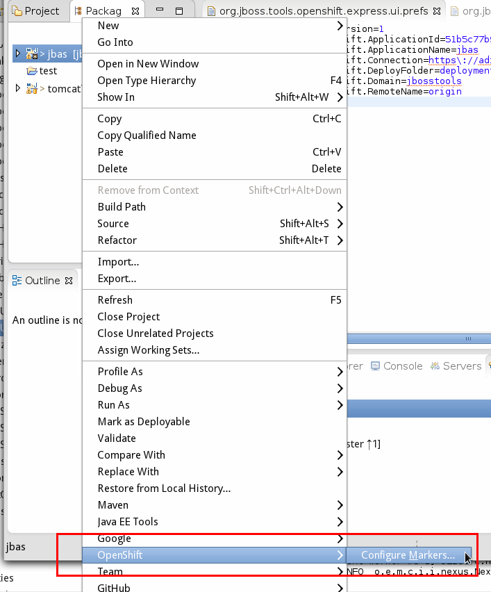
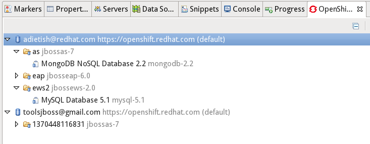

= OpenShift What's New in 2.5.0.Beta2
:page-layout: whatsnew
:page-component_id: openshift
:page-component_version: 2.5.0.Beta2
:page-feature_jbt_only: true
:page-product_id: jbt_core 
:page-product_version: 4.1.0.Beta2

== Application Wizard
=== Use your own Source Template 	

OpenShift online now allow you to start an application with your very own git repository for the intial applicaiton. OpenShift tools now allow you to specify a github url in the wizard under "Advanced" and OpenShift will clone it to your application git repository and use it instead of the default template.

image::images/advanced-source-code.png[]

related_jira::JBIDE-14588[]

=== Disable automatic Maven Build

When pushing a maven project to OpenShift, OpenShift will build the source in the git repository that you pushed. This is very useful when you push source code but it's not when you push an application that you have already built as an jar,war or ear. If you rather would publish this artifact directly you no longer need the automatic builds but just need the artifact put into the deployments folder. We therefore allow you to tell the application wizard not to trigger the maven build on OpenShift when pushing. If you check this option the wizard will create a marker that gets pushed along with your war and code and tells OpenShift not to launch the maven build.

You can enable the Maven builds again by manually changing the marker files or use the Configure > Configure Marker... menu.

related_jira::JBIDE-13882[]

=== Cartridge Command Line Names

We added the cartridge id in parenthesis nex to the human understandable cartridge names so that you also have the identifier that you would use on the rhc command line.

related_jira::JBIDE-14631[]

=== Jenkins URL and Credentials

When you create an application there are cases where OpenShift will give you additional information about your new cartridge. For example when you create a jenkins instance on OpenShift. The log that will now be shown upon successful creation and will show you the url and the credentials that you need to operate it. Prior verions only showed this for embedded cartridges. Beta2 will also show these when you create applications.

image::images/creation-log.png[]

related_jira::JBIDE-14945[]

== Marker Wizard
=== Edit your Markers

OpenShift is using markers to enable or disable features. The switch to disable the maven build that we discussed above is one of these markers. The markers are files that you add to the <project>/.openshift/markers directory. In Beta2 we allow you to add and remove these markers by invoking a wizard from the Project- or Package-Explorer.

We show you all markers that already exist in the markers directory and all the ones that you may eventually want to add. The markers that we currently know about are:

[cols="1,2"]
|===
|File | Effect

|disable_auto_scaling
|Will prevent scalable applications from scaling up or down according to application load.

|enable_jpda
| Will enable the JPDA socket based transport on the java virtual machine running the JBoss AS 7 application server. This enables you to remotely debug code running inside the JBoss AS 7 application server.

|force_clean_build
|Will start the build process by removing all non essential Maven dependencies. Any current dependencies specified in your pom.xml file will then be re-downloaded.

|hot_deploy
| Will prevent a JBoss container restart during build/deployment. Newly build archives will be re-deployed automatically by the JBoss HDScanner component.

|java7 
|Will run JBoss AS7 with Java7 if present. If no marker is present then the baseline Java version will be used (currently Java6).
|===

image::images/configre-markers-wizard.png[]

related_jira::JBIDE-14845[]

===Verbose Cartridge Names
The OpenShift Explorer lists your applications and cartridges. Along with the application and cartridge it shows you the type. So far we were showing shorthand names and changed this for Beta2: the Explorer is now using verbose labels for cartridges and decorate them with the shorthand (rhc command line identifier) name.

related_jira::JBIDE-14687[]

== Application Logs
=== Tail Files pattern fixed
In order to inspect your application logs you pick "Tail Files" in the context menu of your application in the OpenShift Explorer or in the Servers view. JBoss Tools will then prompt you to provide the file pattern and options for the tail command. So far there was an issue that prevented you from limiting the output. The console was always showing the same number of lines. Fixed with Beta2.

related_jira::JBIDE-13894[]