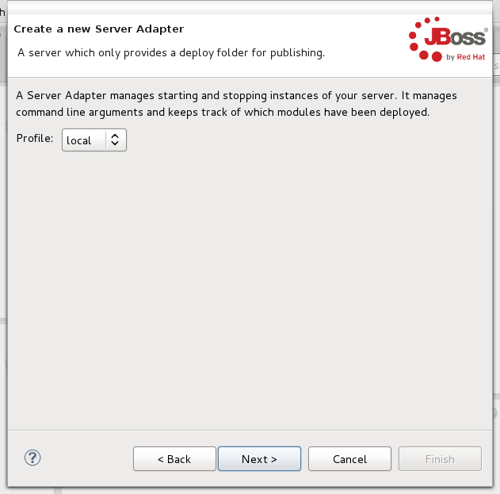
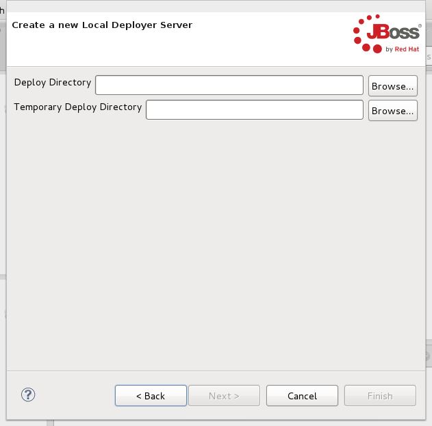
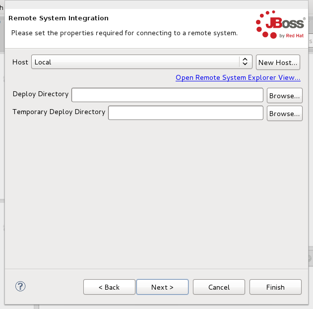
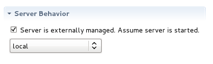
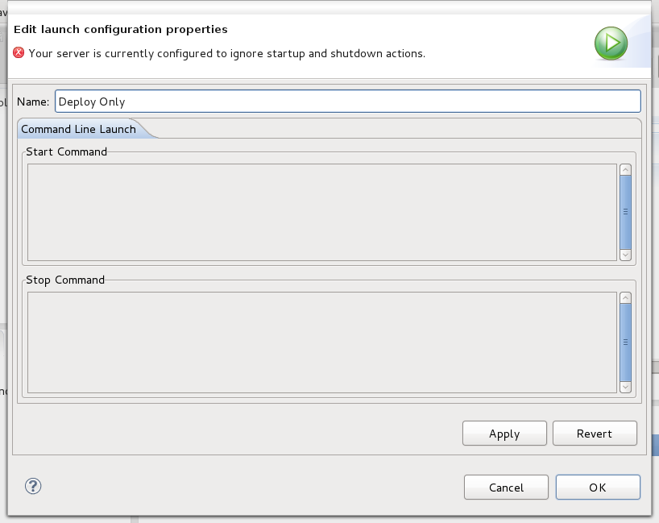
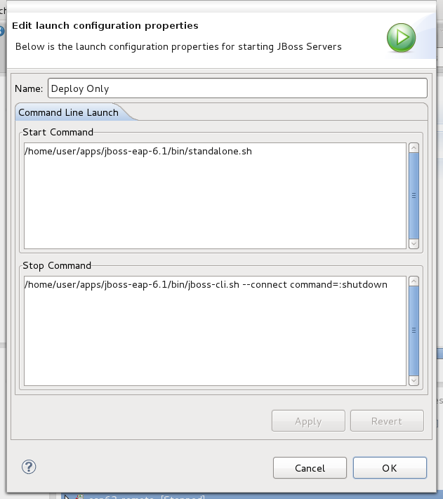
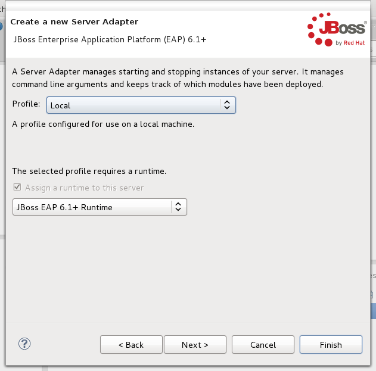
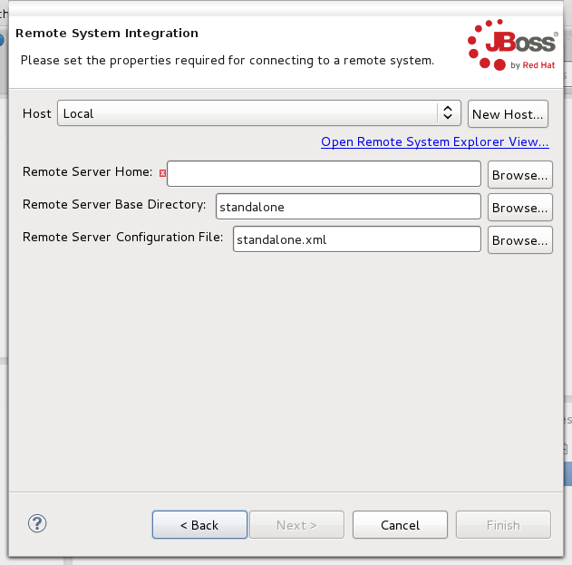
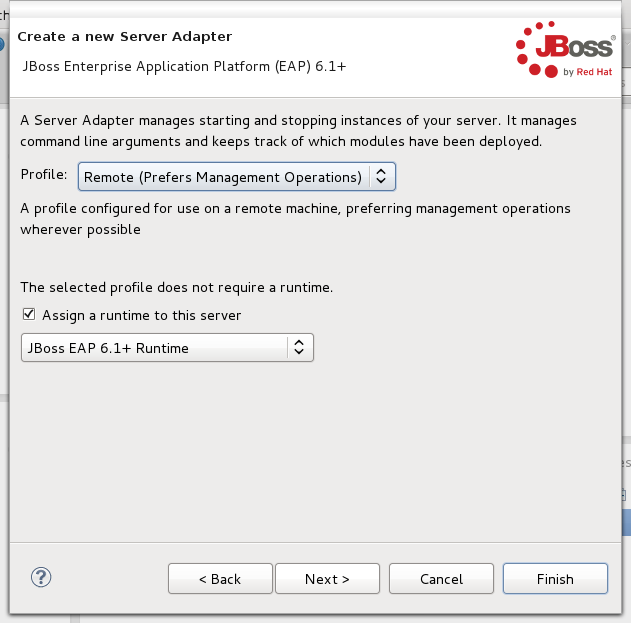

= Server What's New in 4.2.0.Beta1
:page-layout: whatsnew
:page-component_id: server
:page-component_version: 4.2.0.Beta1
:page-feature_jbt_only: true
:page-product_id: jbt_core 
:page-product_version: 4.2.0.Beta1

== Deploy-Only server now has optional start and stop script support

The Deploy-Only server has been enhanced to now allow optional start and stop scripts. 
It's creation workflow in the New Server Wizard has also been enhanced, to allow you 
to configure it for remote use before completing the wizard. Changes to the underlying 
implementation will allow Deploy-Only server to become more fully-featured in the future, 
as well. Maybe one day we'll even have to change it's name!

The Deploy-Only server currently has 2 profiles. One is for local use, and the other
is configured for use with a remote server. The first step of the New Server wizard is to 
select either one or the other of these profiles. 

When configuring the server for local use, only a deploy folder and a temporary deploy
folder are required. 

When configuring the server for remote use, you'll be asked to also provide a host
where the server resides. 

In the server editor, you can toggle whether or not you'd like to take
any action when starting or stopping the server. Depending on this option, 
you will either be allowed or forbidden from providing details on how to launch
or shutdown the server. If your server is set to take no action, you'll be required
to start and stop the server on your own. 

Above, you can see that the launch configuration will not allow changes, since your server
is not set to take any actions on launch or shutdown. Below, you can see that you may enter 
any arbitrary command to execute when launching your server or shutting it down. 

When attempting to shut down your server, the command you've entered will be executed on 
the local or remote system. If the shutdown command fails, though, the Deploy-Only server will attempt
to kill the process that was used to launch the server. Users configuring the Deploy-Only server to run
the launch or shutdown scripts of a JBoss server should be careful here, though. The JBoss and Wildfly shell
scripts wrap the actual launches, and terminating these shell scripts may not actually terminate the 
backing java command. 

related_jira::JBIDE-7515[]

== Server Adapters now with pre-configured profiles!

As shown above, the Deploy-Only server now has pre-configured "profiles", and this feature
is not exclusive to the Deploy-Only Server. JBoss, Wildfly, and EAP adapters also benefit from
this enhancement. 

A profile is a set of functionality and pre-configured options that help you decide how you want
to run your server and what types of actions it should take for all the different types of functionality. 
While earlier server adapters still only have two such profiles (local and remote servers), any server
adapter based on JBoss AS 7 or later will have two additional options, specifically whether or not
to prefer "Management" tasks over the previously-used filesystem operations. 

A server set in a profile preferring management operations will connect to the server's management service
to perform actions such as shutdown, deployment, and determining the state of the server. A server not
preferring management operations will continue to, for example, run a shutdown command over ssh to terminate
the server, or send files over ssh to your remote server's deployment folder. 

Above, you can see how to select the profile you want to use. The UI controls for remote profiles
have been broken out into a separate page in the workflow, as you can see below. 

related_jira::JBIDE-9212[]

== Optional runtimes for remote servers!

You may have noticed above, but while selecting your server profile, you will see an option
to create or NOT create a local runtime for your server. Adding a local runtime to your 
server helps with finding things like default ports, and may be required for proper functioning
of some lesser-used functionality like the JMX explorer, but for most operations, a remote 
server no longer requires a local runtime to be present. 

Whether or not a profile requires a runtime is determined by how that profile functions. 
Servers configured for local use always (currently) require a local runtime, while remote servers
don't anymore. 

ted_jira::JBIDE-15162[]
