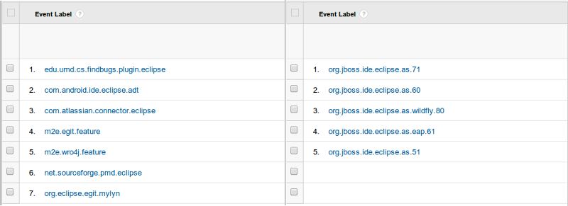
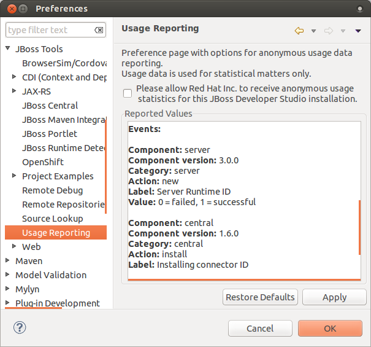

= Usage What's New in 4.2.0.Beta1
:page-layout: whatsnew
:page-component_id: usage
:page-component_version: 4.2.0.Beta1
:page-product_id: jbt_core 
:page-product_version: 4.2.0.Beta1

== Usage tracking for installs and server creation 

Usage reporting is now able to track two new user's events:

- Installs from JBoos Tools Central
- New server creation

All information which is going to be collected is reflected in Preferences:

related_jira::JBIDE-16424[]
related_jira::JBIDE-16800[]

As before JBoss Tools will not report any information without explicit user consent.